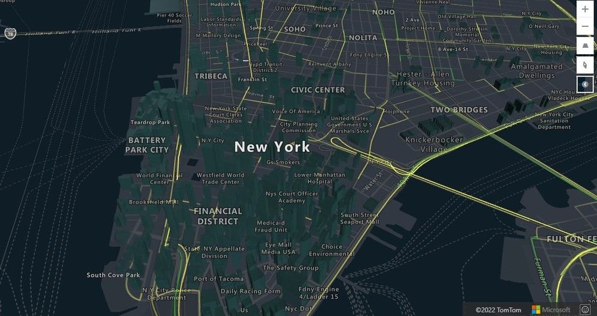
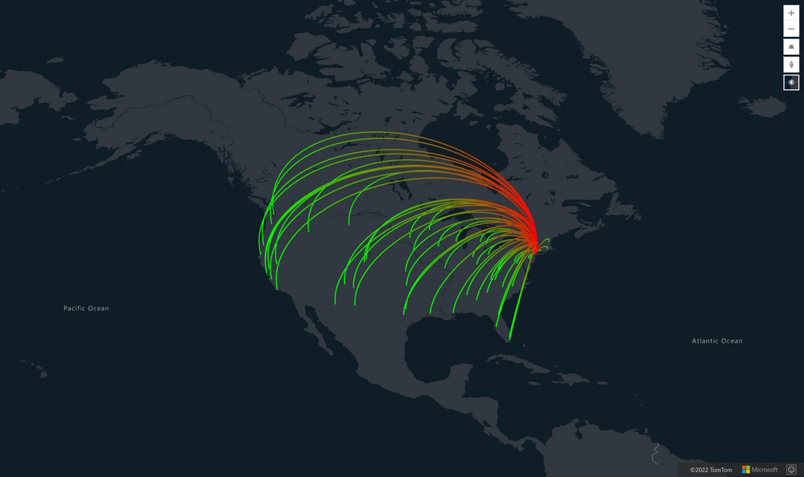

Enhancing your **Azure Maps** with a custom **WebGL layer** opens up a realm of possibilities for rendering dynamic 2D and 3D data. While Azure Maps provides a robust set of built-in features, there are times when you may require a more tailored solution. This is where the power of a custom WebGL layer shines.

[WebGL](https://www.khronos.org/webgl/), a cross-platform and royalty-free web standard, empowers you to harness low-level 3D graphics right in your web browser. By utilizing WebGL, Azure Maps gains a performance edge, surpassing the capabilities of standard HTML canvas rendering. However, it's important to note that WebGL's low-level nature adds complexity and may not always align with straightforward business solutions. 

To bridge this gap, Azure Maps' custom WebGL layer can be integrated with leading open-source 3D frameworks such as [Babylon.js](https://www.babylonjs.com/), [Deck.gl](https://deck.gl/), and [Three.js](https://threejs.org/). These frameworks simplify the management of 2D and 3D layers, making it more accessible to create high-performance, interactive graphics that come to life in real-time—ideal for simulations, data visualizations, animations, and 3D modeling.



To implement a custom WebGL layer, you'll utilize the `map.layer.add()` function, passing in a new `WebGLLayer`. This layer requires a renderer object, which you'll define by implementing the `WebGLRenderer` interface. You can also specify additional options, such as visibility at certain zoom levels:

```javascript
// Add the layer to the map with layer options.
map.layers.add(new atlas.layer.WebGLLayer("layerId", {
    renderer: myRenderer,
    minZoom: 10,
    maxZoom: 22,
    visible: true
}));
```

Azure Maps operates on the Spherical Mercator projection (EPSG: 3857), a system that converts the spherical shape of the globe into a 2D map, stretching it at the poles for a square representation. The map's camera matrix translates these Spherical Mercator coordinates into WebGL coordinates for your custom layer.



## 3D Frameworks

- **Babylon.js**: A comprehensive, real-time 3D engine developed by Microsoft, offering a user-friendly framework for game and rendering engine capabilities.
- **Deck.gl**: A WebGL-powered framework designed for the visual exploratory analysis of large datasets, allowing for the construction of intricate visualizations through layer composition.
- **Three.js**: A versatile, lightweight 3D library that's easy to use across different web browsers.

For those eager to dive into developing their custom WebGL layer, extensive [documentation](https://learn.microsoft.com/en-us/azure/azure-maps/webgl-custom-layer) is available, along with a plethora of [samples](https://samples.azuremaps.com/) showcasing the vast potential of Azure Maps. Explore these resources to kickstart your journey and unlock the full creative power of Azure Maps with custom WebGL layers.