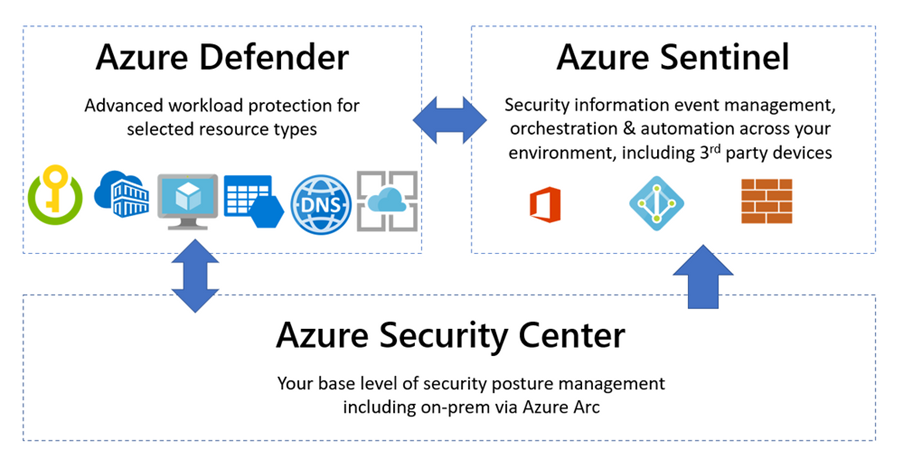
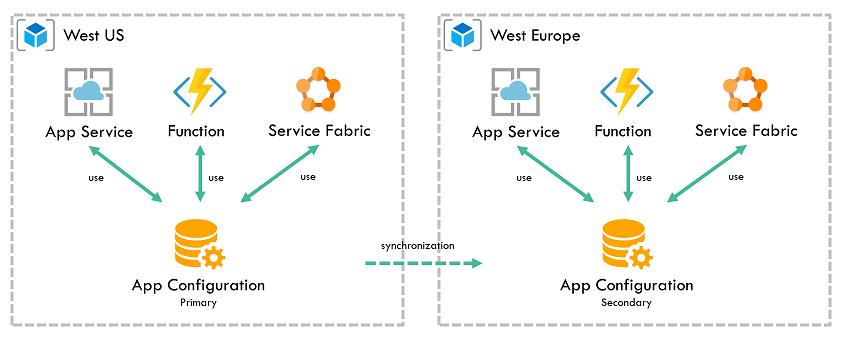

## Introduction

Azure Key Vault is a managed service that offers enhanced protection and control over secrets and keys used by applications, running both in Azure and on-premises.

## The Basics

### Service Tiers

Azure Key Vault is currently offered in two service tiers: Standard and Premium. Key Vault in Standard tier is limited to secrets and software-protected keys, while Key Vault in Premium tier additionally supports keys stored in [Hardware Security Modules](https://azure.microsoft.com/en-us/updates/akv-managed-hsm-public-preview/) (HSMs) and are FIPS 140-2 Level 3 validated.


Managed HSM is a new resource type under Azure Key Vault that allows you to store and manage HSM-keys for your cloud applications using the same Key Vault APIs, which means migrating from vaults to managed HSM pools should be very simple.

Service tier must be specified at Key Vault creation time and cannot be changed after Key Vault has been created.

To create Key Vault in Standard tier:
```powershell
New-AzureRmKeyVault -ResourceGroupName NavaTronRG
                    -VaultName NavaTronSoftHSM
                    -Location "West US"
                    -SKU standard
```

To create Key Vault in Premium tier:
```powershell
New-AzureRmKeyVault -ResourceGroupName NavaTronRG
                    -VaultName NavaTronHSM
                    -Location "West US"
                    -SKU premium
```

> **Warning** The `New-AzureRmKeyVault` cmdlet creates a Key Vault and grants the current user (one who invoked the cmdlet) **full access rights** to this newly created Key Vault and all future objects in it.

> **Information** The `New-AzureRmKeyVault` cmdlet requires you to provide both resource group name and location for the Key Vault being created. The Key Vault location **does not** need to match the location of the resource group in which it is being created. You can have a single resource group in any location contain multiple Key Vaults from multiple locations.

### Object Types

Azure Key Vault provides native support for [three object types](https://docs.microsoft.com/en-us/azure/key-vault/general/about-keys-secrets-certificates): **secrets**, **keys**, and **certificates**. Each object may have an unlimited number of versions.

#### Secrets

Secret is an opaque binary blob of up to 25 kilobytes in size. Key Vault provides no semantics for secrets; it merely provides a way for an application to store and retrieve secrets. Applications would typically store connection strings, passwords, symmetric encryption keys, and certificates as secrets in Key Vault.

Key Vault supports a contentType attribute that that may be used to help client application to interpret the value of the secret. This attribute can be up to 255 characters long.

Key Vault also supports several other attributes for secrets and different object types; see [Object Attributes](#object-attributes) for more details.

#### Keys

Key is an RSA cryptographic key (Key Vault also supports Elliptic Curve keys). Once created or imported, keys can be used to perform cryptographic operations (such as signing or decrypting data). Still, they cannot be exported back (except in protected form for backup purposes).

Key Vault supports two kinds of [keys](https://docs.microsoft.com/en-us/azure/key-vault/keys/about-keys):

* "Software" (or "soft") keys, which are processed in software by Key Vault but are encrypted at rest using a true HSM key. "Soft" keys can be generated by Key Vault or imported from an existing PFX file.
* HSM keys, which are processed by a FIPS 140-2 compliant HSM. Keys can be generated by HSM, imported from PFX file, or imported from a compatible on-premise Thales HSM. HSM keys are only available for Key Vaults in a Premium tier.

#### Certificates

Certificate is a virtual and compound object that encapsulates X.509 certificate and corresponding private key. The certificate object ties together a PFX or PEM container containing the certificate's private key (stored as a secret) and certificate's private key stored as a key and available for cryptographic operations.

Certificate object in Key Vault is associated with **certificate policy** and **certificate issuer**. Certificate policy contains information on how to create and manage the lifecycle of a certificate. It includes the following:

* Certificate properties (subject name, alternative names)
* Key properties (type, length)
* Secret properties (content type)
* Renew actions
* Issuer

A certificate issuer is an object containing information to communicate with the certificate authority to issue or renew a certificate.

### Object Attributes

Key Vault supports the following attributes for secrets, keys, and certificates:

| Attribute Name | Description |
| -------------- | ----------- |
| nbf, exp       | "Not before" and "not after" (expiration) dates. Key Vault will not allow retrieval of the secret or perform a cryptographic operation using the key if the current date and time fall outside of those values (that is, before `nbf` or after `exp`). |
| enabled        | A flag indicating whether Key Vault should allow retrieval of the secret or performing a cryptographic operation using the key. Note that operations outside of `nbf`/`exp` windows are always forbidden regardless of value of this flag. |

An application may associate up to 15 tags (key-value pairs) with each secret and key in addition to the above-predefined attributes. Both name (key) and value of each tag may be up to 256 characters.

### Addressing and Versioning

Key Vault objects can be referenced using the following URI format:

`https://{vault-name}.vault.azure.net/{object-type}/{object-name}/{object-version}`

Where:

* **vault-name** — name of a Key Vault. Provided by the user at Key Vault creation time, must be a globally unique string of 3-24 characters containing only (0-9, a-z, A-Z, -)
* **object-type** — type of the object being accessed, must be either secrets, keys, or certificates
* **object-name** — name of an object. Provided by the user at the object creation time, must be a locally unique string of 1-127 characters containing only (0-9, a-z, A-Z, -)
* **object-version** — optional identifier of an object version. Generated by the Key Vault for each version and is a 32-character hexadecimal string. If omitted, the most recent version of the object specified by 'object-name' is used.

### Permissions and Access Policies

With Key Vault, permissions can be controlled at Key Vault instance and at object type level. It is possible to grant a user, a group, or application a permission (or set of permissions) for all keys, or all secrets, or all certificates within a particular Key Vault instance. It is not possible to grant different sets of permissions for different keys, or different secrets, or different certificates within the same Key Vault instance. In other words, Key Vault does not support per-object access control.

> **Information** It is important to remember that whenever Key Vault is created using `New-AzureRmKeyVault` cmdlet, the user that created it gets full access to keys, secrets, and certificates. Therefore, for production workloads, it is necessary to revoke or at least severely limit that access.

Key Vault uses Azure Active Directory for authentication and authorization needs. Access to Key Vault objects can be granted, changed, and removed using `Set-AzureRmKeyVaultAccessPolicy` and `Remove-AzureRmKeyVaultAccessPolicy` cmdlets.

The following example grants particular user permissions to list secrets and create new keys in a particular Key Vault instance:

```powershell
Set-AzureRmKeyVaultAccessPolicy -VaultName NavaTronHSM
                                -UserPrincipalName user@navatron.com
                                -PermissionsToSecrets list
                                -PermissionsToKeys create
```
 
There could be scenarios when access should be granted based on the user's group membership. The example below demonstrates how to grant permissions to all members of a group called "NavaTronSecurityGroup" to get secrets and perform all operations with certificates:

```powershell
$group = Get-AzureRmADGroup -SearchString "NavaTronSecurityGroup"
Set-AzureRmKeyVaultAccessPolicy -VaultName NavaTronHSM
                                -ObjectId $group.Id
                                -PermissionsToKeys get
                                -PermissionsToCertificates all
```
 
Lastly, perhaps the most important step is to enable applications and services to access Key Vault objects. The following example demonstrates how to grant application called 'NavaTronServiceApplication' permissions to list secrets and to create new keys, backup existing keys, and compute digital signatures using existing keys:

```powershell
$sp = Get-AzureRmADServicePrincipal -SearchString "NavaTronServiceApplication"
Set-AzureRmKeyVaultAccessPolicy -VaultName NavaTronHSM
                                -ServicePrincipalName $sp.ServicePrincipalName
                                -PermissionsToSecrets list
                                -PermissionsToKeys create,sign,backup
```
 
There are two broad sets of PowerShell cmdlets to work with Key Vault:

`[Action]-AzureKeyVault[Subject]` and `[Action]-AzureRmKeyVault[Subject]`. It is important to understand that access is controlled differently for those two sets of cmdlets.

`AzureKeyVault` cmdlets perform actions using Key Vault REST API, and thus will be governed by permissions that user/principal has on the Key Vault object type (such as key, secret, or certificate) it tries to perform action on.

Contrary to that, `AzureRmKeyVault` cmdlets perform actions using Azure Resource Management API, and thus will be governed by the permissions that user/principal has on the subscription/resource group level. Because of this it is possible, for example, for a subscription co-administrator to gain access to all contents of any Key Vaults within the subscription: co-administrator has sufficient privileges to assign access policies on the Key Vault. High-assurance applications should consider creating Key Vaults in separate subscriptions with a limited number of administrators and stricter access controls.

## Logging

Azure Key Vault can be configured to write an [audit log](https://docs.microsoft.com/en-us/azure/key-vault/general/logging) of authenticated operations performed. Access logs are in JSON format and will be stored as blobs in the target storage account. The storage account has to be in the same subscription as the Key Vault.

Example below demonstrates how audit logging with a retention period of 60 days can be enabled for the Key Vault:

```powershell
$sa = Get-AzureRmStorageAccount -ResourceGroupName NavaTronRG -Name NavaTronKvLogs
$kv = Get-AzureRmKeyVault -VaultName NavaTronSoftHSM
Set-AzureRmDiagnosticSetting -StorageAccountId $sa.Id
                             -ResourceId $kv.ResourceId
                             -Enabled $true
                             -RetentionEnabled $true
                             -RetentionInDays 60
```
 
Once logging is enabled, all authenticated requests (both successful and failed) will be written to the blob storage to the container named `insights-logs-auditevent`. There could be a delay of up to 10 minutes between the event and its appearance in the log.

**[Azure Defender](https://techcommunity.microsoft.com/t5/azure-sentinel/visibility-of-azure-key-vault-activity-in-sentinel-azure-key/ba-p/2140751?_lrsc=968ca270-8ac3-40bf-9d87-e8c646ee204e)** for Key Vault monitors key vault activity and alerts when suspicious and malicious behavior is observed.



## Redundancy

Azure Key Vault provides redundancy by using **paired regions**. In case the primary region is having issues, the service fails over to the secondary one. Service degrades to "read-only" mode: existing secrets and keys will continue to be accessible for operations (e.g., reading a secret or performing a cryptographic operation using a key) but attempts to create new objects or to modify existing ones will fail until Key Vault in the primary region is recovered.

## Backup and Restore

Backup is a crucial part of Business Continuity and Disaster Recovery Planning, and Key Vault is not an exception. Secrets, keys, and certificates stored in the Key Vault **should be backed up**, and backups should be guarded closely.

Particular care should be taken when backing up keys. Key backup (no matter if "software" or true HSM) can be restored by the malicious user to the Key Vault under her control, and this will enable performing of any and all private key operations.

With Azure Key Vault, backup of a key can only be restored to the same geography from which it was originally backed up; backups and restores across different geographies are not possible.

Backup domains/geographies should be taken into account when planning application or service that needs to be deployed across multiple geographies. If such application requires high level of security assurance and opts in for Key Vault-generated keys (no matter if HSM or software), as opposed to keys generated elsewhere and imported into Key Vault, then there will be no way to replicate those keys across geographies because keys cannot be replicated across backup domains. This means that the application must be designed to support multiple keys for the operations it's doing. It must be designed to support multiple signers or multiple encryption keys or, more generally speaking, multiple roots of trust.

## Scalability and Service Limits

Compared to other Azure offerings, Key Vault comes with rather conservative service limits and no scale-out options. Applications must take those limitations into account. Please refer to the table below for current [Key Vault service limits](https://docs.microsoft.com/en-us/azure/key-vault/general/service-limits).

| Request Type | Max. transactions per 10 seconds per Vault per region | Max. transactions per 10 seconds per subscription |
| ------------ | ----------------------------------------------------- | ------------------------------------------------- |
| Create Key (HSM)                |     5                              |     25                                            |
| Create Key (Software)           |    10                              |     50                                            |
| Other Key Operations (HSM)      | 1.000                              |  5.000                                            |
| Other Key Operations (Software) | 1.500                              |  7.500                                            |
| Secret Operations               | 2.000                              | 10.000                                            |

From a practical point of view, those limitations wouldn't matter for the vast majority of the applications. If, however, the application reaches those limits, then it is possible to scale-out by adding more Key Vaults and adding necessary load balancing logic to the application because Key Vault does not provide this functionality out of the box.

## DevOps Pipelines

Use Azure Key Vault secrets during deployments:

**Azure Pipelines**
* [Use Azure Key Vault secrets in Azure Pipelines](https://docs.microsoft.com/en-us/azure/devops/pipelines/release/azure-key-vault)
* [Azure Key Vault task](https://docs.microsoft.com/en-us/azure/devops/pipelines/tasks/deploy/azure-key-vault)

**Terraform**
* [Use Azure KeyVault secrets during deployments](https://blog.azureandbeyond.com/2019/01/29/terraform-azure-keyvault-secrets/)

## Azure App Configuration

[App Configuration](https://azure.microsoft.com/en-us/services/app-configuration/) is **complementary to Key Vault**. They're typically used side by side to store and distribute application configuration data. While Key Vault is designed for secret management and operations, App Configuration is optimized for hierarchical and dynamic application settings.

Store configuration for all your Azure apps in a universally hosted location. Manage configurations effectively and reliably, in real-time, without affecting customers by avoiding time-consuming redeployments. Azure App Configuration is built for speed, scalability, and security.

Toggle specific features behind feature flags, and fix critical problems in real-time. The flexibility provided by avoiding costly redeployments gives you more control when it matters the most.



### Reduce configuration complexity across multiple environments

Modern programs, especially those running in a cloud, have several distributed components. Spreading configuration settings across these components leads to hard-to-troubleshoot errors during application deployments. Using a universal configuration store for all your settings helps eliminate these errors.

Make your apps more secure by keeping data separate from code. Storing configuration settings in a hosted environment helps keep data secure.