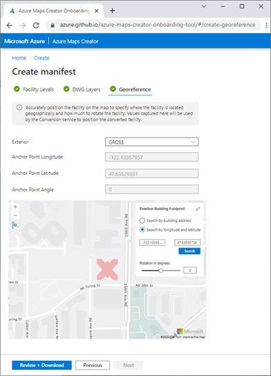
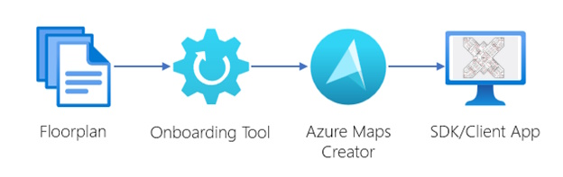
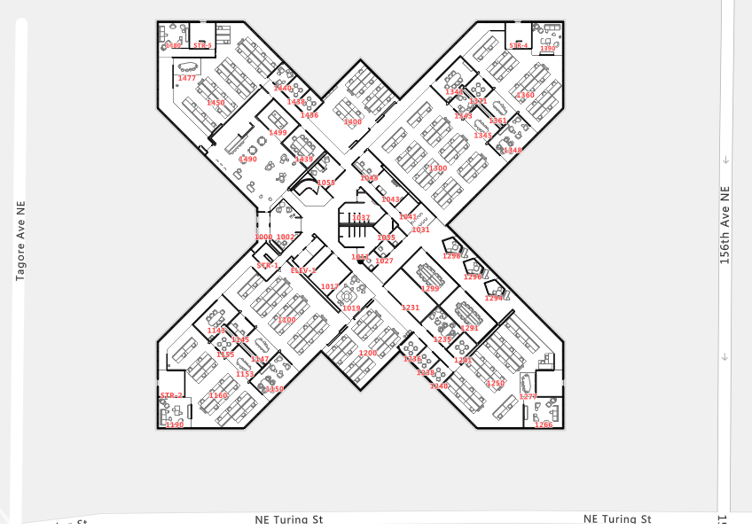

**Azure Maps Creator** is a powerful product that transforms your static floor plans into dynamic, interactive indoor maps for your business locations. It allows you to overlay technical building plans ontop of Azure Maps, enabling the visualization of IoT data such as temperature, occupancy, and other location-based services. The onboarding process is streamlined, requiring only the preparation and uploading of your **DWG floorplan** files (the native file format for Autodesk's AutoCAD software) into [Azure Maps Creator](https://aka.ms/azuremapscreator).

> **Important:** As of 2024, Azure Maps Creator has been deprecated and is no longer available. Microsoft has discontinued this service. If you're looking for indoor mapping solutions, please refer to the [Azure Maps documentation](https://docs.microsoft.com/azure/azure-maps/) for current alternatives and migration guidance.

## Onboarding simplified

The [Azure Maps Creator onboarding tool](https://azure.github.io/azure-maps-creator-onboarding-tool/) has been designed to make the process of integrating DWG floorplans straightforward. With the simplified [drawing package requirements](https://aka.ms/creator-drawingpackagerequirement), the tool facilitates the development of indoor maps without the need for expensive third-party services or the risk of exposing sensitive data. The onboarding steps are clearly outlined in the  documentation.

## Steps to onboard your indoor map

1. **Assign each DWG file to a facility level:** This step organizes the levels within your facility, enabling seamless floor transitions and wayfinding capabilities in your indoor map.
2. **Map DWG layers that will be converted:** Identify and map the DWG file layers that will be transformed into indoor map features, such as furniture or infrastructure components.
3. **Position Your Facility on the Map:** Place your indoor map accurately over a base map to ensure proper visualization and alignment.

After these steps, you'll have a drawing package ready for Azure Maps Creator. The final action is to upload this package, which will then allow you to utilize your custom indoor map.

## Azure Maps Creator

The simplified drawing package requirements and Azure Maps Creator onboarding tool are some of the many helpful additions we have made to Azure Maps Creator to offer an even better experience for our customers. It enables the transformation of static building floorplans into interactive experiences and smart spaces to enhance productivity, efficiency, and comfort. We are using it ourselves [How Microsoft uses Azure Maps Creator](/how-microsoft-uses-azure-maps-creator) and are excited to share this technology with you to see how you will use it for indoor mapping scenarios.

