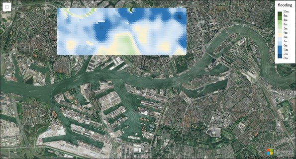

## Introduction

When you are living in the Netherlands you are used to that, nearly 26% of its land falling below sea level, and about 50% is just only exceeding 1 m (3.3 ft) above. The Dutch people have lived many centuries battling the water, not only from the sea but also from her rivers. To protect the land the Dutch have built many sophisticated protecting- and management systems to handle the water, like the [Delta Works](https://www.bing.com/search?q=Dutch%20Delta%20Works). Building only a dike or dam is not enough. Today we have won, but we know that we cannot rust, climate change (heavy rain showers) and sea levels are rising globally. Do we (or you) get wet feet in the future?

> **Important** The Azure Maps Elevation services and Render V2 DEM tiles have been retired and will no longer be available and supported after 5 May 2023. All other Azure Maps APIs, Services and TilesetIDs are unaffected by this retirement. For more details, see [Elevation Services Retirement](https://azure.microsoft.com/en-us/updates/azure-maps-elevation-apis-and-render-v2-dem-tiles-will-be-retired-on-5-may-2023/)

To start, we need to know which areas of land are almost below sea level so that we can plan and take additional actions. To make this visible we can use [Azure Maps](https://azure.microsoft.com/en-us/services/azure-maps/) and use the [Azure Maps Elevation Service](https://azure.microsoft.com/en-us/updates/azure-maps-elevation-service-is-now-generally-available/) to make a basic flood map. The Azure Maps Elevation Service provides pole-to-pole coverage with <4M absolute and <2m relative accuracy. The elevation data represents a digital terrain model (DTM), man-made entities (e.g., buildings) are artificially flattened, and elevation is measured to the ground surface.

## What do we need?

To get started you need a free [Azure subscription](https://azure.microsoft.com/en-us/free/) and an Azure Maps account. This provides us access to the Elevation API that we need to build the flood map. The Elevation API gives elevation back in meters for coordinates, with WGS84 longitude and latitude, on a map. We can use a Bounding Box, Points, and a Polyline as input. In the below picture you see an aerial photo of the harbor and city of Rotterdam. The flood map shows in blue all the land that is below sea level and is vulnerable, and in green land that is high enough.



## Azure Maps

We only need a single HTML file, that references the Azure Maps *Maps Control*, *Map Drawing Tools* libraries, and some basic HTML and JavaScript.

```html
<!-- Add references to the Azure Maps Map control JavaScript and CSS files. -->
<link rel="stylesheet" href="https://atlas.microsoft.com/sdk/javascript/mapcontrol/2/atlas.min.css"/>
<script src="https://atlas.microsoft.com/sdk/javascript/mapcontrol/2/atlas.min.js"></script>

<!-- Add references to the Azure Maps Map Drawing Tools JavaScript and CSS files. -->
<link rel="stylesheet" href="https://atlas.microsoft.com/sdk/javascript/drawing/0/atlas-drawing.min.css" />
<script src="https://atlas.microsoft.com/sdk/javascript/drawing/0/atlas-drawing.min.js"></script>
```

We need to initialize the map control and add additional layers to it to draw on, like the controls and the floodmap itself. First we initialize the map control:

```js
// Initialize a map instance.
map = new atlas.Map('myMap', {
    center: [4.2432838, 51.9022471], // City of Rotterdam
    zoom: 12,
    style: 'satellite',
    view: 'Auto',

    // Add authentication details for connecting to Azure Maps.
    authOptions: {
        authType: 'subscriptionKey',
        subscriptionKey: '<your key>'
    }
});
```

## Draw a flood map

Now that we have the basics we need only add a [BubbleLayer](https://docs.microsoft.com/en-us/azure/azure-maps/map-add-bubble-layer) layer to the map, which we need to draw the floodmap with.

```js
// Create a layer for rendering the elevation points.
layer = new atlas.layer.BubbleLayer(datasource, null, {
    color: [
        'interpolate',
        ['linear'],
        ['get', 'elevation'],
        400, '#006837',
        450, '#1a9850',
        500, '#66bd63',
        550, '#a6d96a',
        600, '#d9ef8b',
        650, '#ffffbf',
        700, '#fee08b',
        750, '#fdae61',
        800, '#f46d43',
        850, '#d73027',
        900, '#a50026'
    ],

    // Don't outline the bubbles.
    // This will make them blend together to create a heat map like visual.
    strokeWidth: 0
});
map.layers.add(layer);
```

The [DrawingManager](https://docs.microsoft.com/en-us/javascript/api/azure-maps-drawing-tools/atlas.drawing.drawingmanager) we not only use to draw the Bounding Box, but it gives us also the coordinates back we need for the [Elevation API](https://docs.microsoft.com/en-us/rest/api/maps/elevation).

The *Get Data* for Bounding Box API provides elevation data at equally spaced locations within a bounding box. A bounding box is defined by the coordinates for two corners (southwest, northeast) and then subsequently divided into rows and columns.

Elevations are returned for the vertices of the grid created by the rows and columns. Up to *2,000* elevations can be returned in a single request. The returned elevation values are ordered, starting at the southwest corner, and then proceeding west to east along the row. At the end of the row, it moves north to the next row, and repeats the process until it reaches the far northeast corner.

```js
var elevationBoundsUrl = 'https://{azMapsDomain}/elevation/lattice/json?api-version=1.0&bounds={bounds}&rows={rows}&columns={columns}';

var url = elevationBoundsUrl.replace('{bounds}', bounds).replace('{rows}', numRows).replace('{columns}', numColumns);

url = url.replace('{azMapsDomain}', atlas.getDomain());

processRequest(url).then(response => {
if (response.error) {
    alert(response.error.message);
    return;
}

var points = [];

// Loop through the elevations, create point features with an elevation property.
response.data.forEach(c => {
    points.push(new atlas.data.Feature(new atlas.data.Point([c.coordinate.longitude, c.coordinate.latitude]), {
        elevation: c.elevationInMeter
    }));

    // ...
```

Now we only need to overwrite the points to the data source, and we have a flood / elevation map.

```js
datasource.setShapes(points);
```

