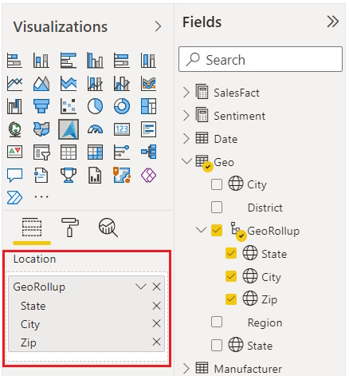
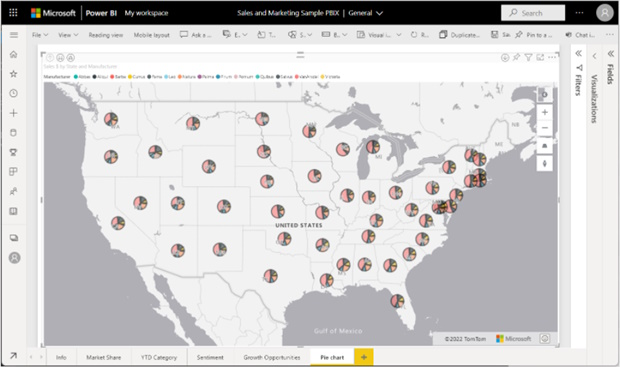

The **Azure Maps Power BI Visual** provides a rich set of data visualizations to enhance your data with location context. In the March release of Power BI, the Azure Maps visual introduces two new tools: **Geocoding capabilities** and a **Pie Chart layer**.

## Geocoding in Power BI

When dealing with data that has a location context, such as addresses or other geographic information, you might lack the precise point location (latitude-longitude) needed to plot these addresses on a map. The new geocode capabilities in the Azure Maps Power BI visual allow you to convert address data into location data directly within Power BI. The Azure Maps geocoder is flexible and can work with incomplete address information or spelling mistakes. Additionally, it supports regional geocoding for various levels, including country, state or province, city, county, postal code, and partial address data.

### The Location Field

In the **Location field**, you can add multiple data items. The more data you include, the better context the geocoder has, resulting in a more precise point. For example, the term "London" could refer to either "London, England" or "London, Ontario, Canada." By providing additional data, you improve the geocoder's ability to disambiguate requests and deliver better location results.

## Adding the Pie Chart Layer

Following the geocoder, the **pie chart layer** allows you to place pie charts at specific locations relevant to the data they represent. The pie chart visually displays numerical proportions for a given location. For instance:
- Understand the market share of different products in a region.
- Analyze the distribution of voters across districts.
- Identify which product category sells best in specific store locations.

In this month's release, you can now transform a **bubble layer** into a pie chart layer, enabling you to visualize data using this new representation.

### Rendering a Pie Chart

To create a pie chart, follow these steps:
1. Drag categorical data into the **legend field**.
2. Add numeric data related to your map.
3. The categorical data determines the number of pie slices, while the numeric data defines the proportion of each slice.

## Learn More

For detailed instructions on these new features, explore our **Power BI Azure Maps "How To" guides**:
- [Geocoder feature](https://docs.microsoft.com/en-us/azure/azure-maps/power-bi-visual-geocode)
- [Pie chart layer](https://docs.microsoft.com/en-us/azure/azure-maps/power-bi-visual-add-pie-chart-layer)

> This blog post was initially written by me for the [Azure Maps Tech Blog](https://blog.azuremaps.com).