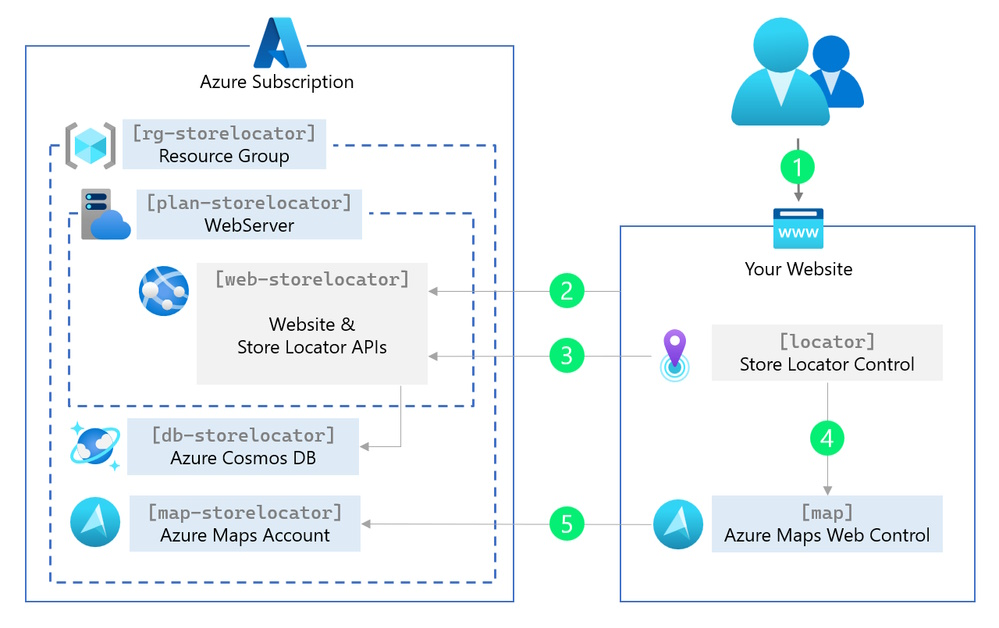

## Maximize Visibility

In today's digital age, the visibility of your business is paramount. Once you've captured customer interest online, the next crucial step is guiding them to your physical storefronts. [Azure Maps Store Locator](https://github.com/Azure-Samples/Azure-Maps-Locator) streamlines this journey, offering an interactive and intuitive experience that leads customers right to your doorstep.

## Simplifying Store Discovery

Creating a basic store locator using Azure Maps is already a straightforward task, involving the loading of store locations onto a map and potentially setting up a simple search functionality. However, for larger organizations managing thousands of locations and requiring advanced filtering options, a more sophisticated solution is essential. Fortunately, the Azure Maps Store Locator, combining the power of various Azure services, caters precisely to these needs.


## Enhance Your Locator Experience

Imagine a tool that effortlessly connects potential customers to the nearest branch of your business, tailored to their specific needs. Whether they're searching for a particular service or other points of interest, [Azure Maps Store Locator](https://github.com/Azure-Samples/Azure-Maps-Locator) is the user-friendly and adaptable tool you need. It's backed by a comprehensive management system, enabling you to create a rich locator experience.

## Feature-Rich Platform

Azure Maps Store Locator boasts a wide array of features to improve your location-based offerings:

- **Store Locator Backend**: Integrates REST APIs and a Store Locator Web Control for seamless management.
- **Autocomplete Search**: Quickly find store names, addresses, POIs, or zip codes.
- **Scalability**: Manages over 10,000 locations without a hitch.
- **Proximity Insights**: View nearby stores and distance metrics.
- **Location-Based Search**: Searches can be performed based on the user's current location.
- **Travel Time Estimates**: Provides estimated travel times for various modes of transport.
- **Comprehensive Store Details**: Access store information, directions, and more through interactive popups.
- **Dynamic Filtering**: Users can filter stores based on specific features.
- **Individual Store Pages**: Delve into what each store offers with detailed embedded maps.
- **Security**: Employs Microsoft Entra ID for secure access to the location management system.
- **Rich Data**: Store details include location, hours, photos, and the option to add custom features.
- **Accessibility**: Features speech recognition and other accessibility enhancements.
- **Effortless Deployment**: Easily deploy within your Azure ecosystem.

## Quick Setup Guide

Deploying Azure Maps Store Locator is straightforward:

1. **Azure Subscription**: Confirm you have an Azure subscription. If not, obtain one for [free](https://azure.microsoft.com/free/) at the official Azure website.
2. **Azure Shell Access**: Sign in to Azure Shell. [https://shell.azure.com/](https://shell.azure.com/)
3. **Deployment**: Run the provided PowerShell script to install the Azure Maps Store Locator.

```powershell
iex (iwr "https://samples.azuremaps.com/storelocator/deploy.ps1").Content
```



Integrating the store locator into your website requires some HTML and JavaScript to call the store locator backend REST APIs. Once implemented, the solution is yours to modify and tailor the source code in your Azure Maps Store Locator according to your specific needs.

The Azure Maps Store Locator empowers you to create and maintain an intuitive location-based search experience to delight your customers. Enhance your online presence today with the power of Azure Maps!

You find the Azure Maps Store Locator source code on [GitHub](https://github.com/Azure-Samples/Azure-Maps-Locator).

> This blog post was initially written by me for the [Azure Maps Tech Blog](https://blog.azuremaps.com).