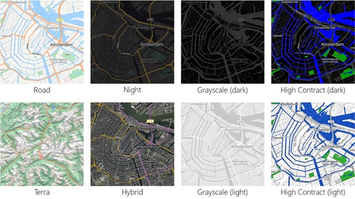
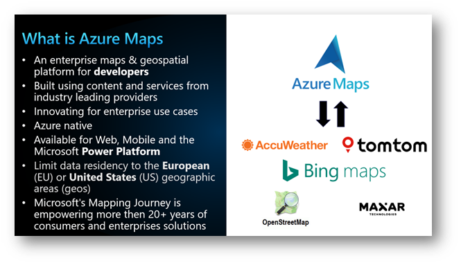

 
We are thrilled to announce the unification of **Bing Maps for Enterprise** (BME) with **Azure Maps**, marking a significant milestone in our geospatial services at Microsoft. [Azure Maps](https://azuremaps.com/) now boasts a robust stack of geospatial offerings, leveraging the powerful capabilities of Microsoft Maps, which also drives [Bing Maps](https://bingmaps.com/) (our consumer maps experience). Over the past year, our team has dedicated significant time and effort to combine the strengths of Bing Maps for Enterprise into Azure Maps, enhancing our global quality and coverage.

One of the major enhancements is the adoption of vector tiles in Azure Maps for a more responsive map experience. When utilizing Azure Maps in your solutions, you not only leverage the security and compliance advantages of Azure but also benefit from the extensive quality and coverage provided by [Microsoft Maps](https://www.microsoft.com/maps).

 
This unification ensures that users of Azure Maps receive a comprehensive mapping solution backed by the unparalleled strengths of Azure's infrastructure, Microsoft Maps' data quality and coverage, and many of the same advanced geospatial capabilities that Bing Maps for Enterprise customers depend on. We are excited about the opportunities this integration presents and look forward to continuing to deliver innovative mapping solutions to our customers worldwide.

 
Azure Maps has many of the same features that BME customers have come to rely on. Nevertheless, this unification also introduces exciting new features to Azure Maps, such as [weather APIs](https://learn.microsoft.com/rest/api/maps/weather), [private indoor maps](https://learn.microsoft.com/azure/azure-maps/about-creator), [multiple authentication methods](https://learn.microsoft.com/azure/azure-maps/azure-maps-authentication), [geolocation service](https://learn.microsoft.com/en-us/rest/api/maps/geolocation), and robust **privacy** and **compliance** benefits.

## Ready to Make the Move?

For customers that are using Bing Maps for Enterprise and are migrating over to Azure Maps, some development will be needed. To help you in this transition period, we have written [migration documents](https://learn.microsoft.com/en-us/azure/azure-maps/migrate-from-bing-maps) for our REST APIs and as well for the Azure Maps web control. Also, a good start is our [Azure Maps samples](https://samples.azuremaps.com) site where you can find not only samples for many scenarios, but also the source code.

More resources about Azure Maps can be found here:
*	[Azure Maps Documenation](https://docs.azuremaps.com)
*	[Azure Maps Samples](https://samples.azuremaps.com)
*	[Azure Maps Blog](https://blog.azuremaps.com)
*	[Microsoft Q&A for Azure Maps](https://learn.microsoft.com/en-us/answers/tags/209/azure-maps)

> This blog post was initially written by me for the [Azure Maps Tech Blog](https://blog.azuremaps.com).