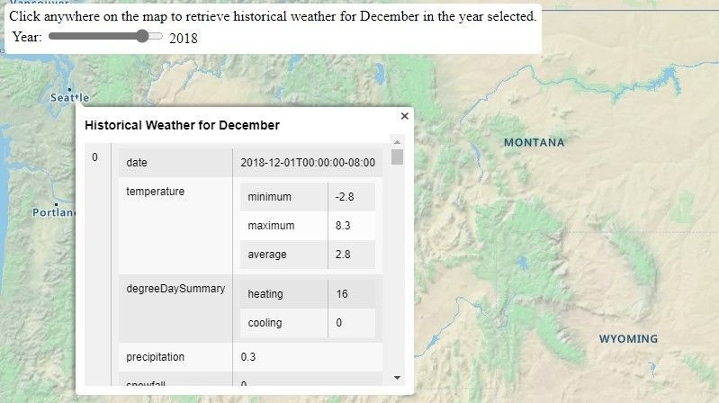
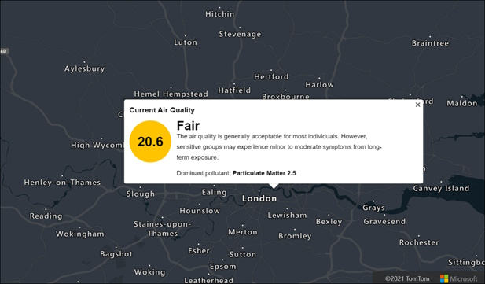

[Azure Maps Weather Services](https://docs.microsoft.com/rest/api/maps/weather), which became generally available in **April 2021**, has recently expanded its offerings with three new services: **Historical Weather**, **Air Quality**, and **Tropical Storms**. These additions empower developers and companies to enhance their capabilities when it comes to weather data.

## Historical Weather

The **Historical Weather API** provides actuals, normals, and records climatology data by day for a specified date range, up to **31 days** in a single API request. Depending on the location and feature, historical data may be available as far back as **5 to 40+ years**. The information includes:

* Temperatures
* Precipitation
* Snowfall
* Snow depth
* Cooling/heating degree day information

Historical Weather data enables customers to analyze past climatology information and make predictions about future weather conditions. It is valuable for various use cases, including forensics, weather studies, and business analytics. For instance, businesses can determine how past weather impacted logistics, sales, and other scenarios. By incorporating historical weather data into sales records, companies can even predict which products will sell better under specific weather conditions. Additionally, it helps optimize decisions such as changing to winter tires at the right time based on historical climate patterns.

## Air Quality

The **Air Quality API** provides detailed information about current and forecasted air pollutants and air quality concentration. Forecasted data is available by the hour (upcoming 1, 12, 24, 48, 72, and 96 hours) and by day (upcoming 1 to 7 days). The information includes:

* Pollution levels
* Air quality index values
* Dominant pollutants
* Brief statements summarizing risk levels and suggested precautions

If you’re developing an outdoor running or cycling app, you can use Air Quality information to warn users about air quality conditions in the next hour. Additionally, individuals can track the impact of air quality on their health. This data is relevant for various scenarios, including outdoor sensors, commuting, exercising, and indoor use with HVAC systems and air purifiers.

## Tropical Storms

The **Tropical Storms API** provides information on government-issued active and forecasted tropical storms. It includes details such as:

* Location coordinates
* Forecast
* Creation date
* Status
* Geometry
* Basin ID
* Window
* Wind speed
* Wind radii

Tropical storms, also known as hurricanes, cyclones, or typhoons depending on the region, can have significant impacts. Researchers, businesses, and public safety agencies can use this data for observational and forecast purposes. Whether monitoring current storms or researching past tropical storm events, the Tropical Storms API provides valuable insights.

All the [Azure Maps Weather APIs](https://docs.microsoft.com/rest/api/maps/weather/) can be found in the documenation.

> This blog post was initially written by me for the [Azure Maps Tech Blog](https://blog.azuremaps.com).