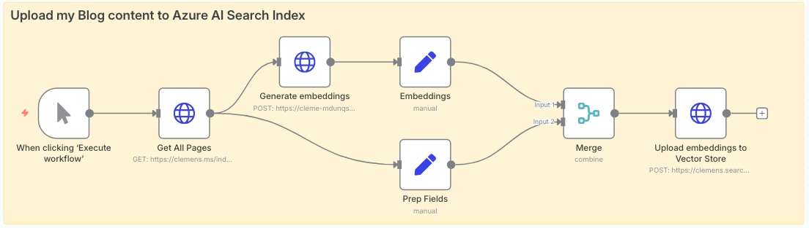
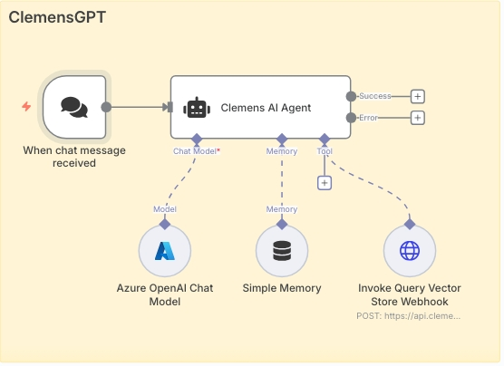
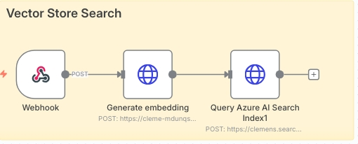

## Why I Built an AI Assistant for My Blog

I wanted my blog to do more than list posts. I wanted visitors to be able to ask natural questions about me, my work, and anything I’ve written, and get answers that cite the right articles without me hand. In my [previous post](/running-n8n-on-azure-to-power-a-ai-chat-agent/) I laid the infrastructure groundwork by running n8n on Azure as an orchestration layer. This article goes deeper into how I assembled the chat assistant itself and wired it to semantic search so it actually “**knows**” my content rather than doing a brittle keyword lookup.

## Structuring My Blog Data for Search and AI

I started by shaping the data. My site is a static [Hugo](https://gohugo.io) build, which is convenient because Hugo can emit not just HTML and RSS but also JSON. That gave me a clean content feed I could parse from n8n and index into [Azure AI Search](https://learn.microsoft.com/en-us/azure/search/search-what-is-azure-search). In `hugo.toml` I enabled JSON for the homepage and created a minimal contract for the assistant to consume. The output is a single `index.json` containing one object per page with normalized, plain-text content and the metadata I care about. The important detail is that the **id** and a stable **id_hash** are derived from the relative permalink, keeping updates idempotent when I re-publish.

This is the JSON template I use under `/layouts/index.json`:

```json
{{/* Homepage JSON output for Azure AI Search vector store */}}
[
    {{- $pages := where .Site.RegularPages "Draft" "!=" true -}}
    {{- range $index, $page := $pages -}}
      {{- if $index -}},{{- end }}
      {
        "id": {{ $page.RelPermalink | jsonify }},
        "id_hash": {{ $page.RelPermalink | md5 | jsonify }},
        "title": {{ $page.Title | jsonify }},
        "description": {{ $page.Description | default $page.Summary | jsonify }},
        "content": {{ $page.Content | plainify | jsonify }},
        "url": {{ $page.Permalink | jsonify }},
        "relative_url": {{ $page.RelPermalink | jsonify }},
        "date": {{ $page.Date.Format "2006-01-02T15:04:05Z07:00" | jsonify }},
        "publishDate": {{ $page.PublishDate.Format "2006-01-02T15:04:05Z07:00" | jsonify }},
        "lastmod": {{ $page.Lastmod.Format "2006-01-02T15:04:05Z07:00" | jsonify }},
        "categories": {{ $page.Params.categories | default slice | jsonify }},
        "tags": {{ $page.Params.tags | default slice | jsonify }},
        "featured": {{ $page.Params.featured | default false }},
        "draft": {{ $page.Draft }},
        "type": {{ $page.Type | jsonify }},
        "section": {{ $page.Section | jsonify }},
        "wordCount": {{ $page.WordCount }},
        "readingTime": {{ $page.ReadingTime }},
        "keywords": {{ delimit (union ($page.Params.tags | default slice) ($page.Params.categories | default slice)) "," | jsonify }},
        "searchable_content": {{ printf "%s %s %s %s" $page.Title $page.Description ($page.Content | plainify) (delimit ($page.Params.tags | default slice) " ") | jsonify }},
        "summary": {{ $page.Summary | plainify | jsonify }}
      }
    {{- end }}
]
```

The *content* value is plain-text and already stripped of markup; this matters for embeddings because you want consistent tokenization, not HTML noise. I also assemble a *searchable_content* field that concatenates headline signals with the body and tags. While the assistant relies on **vectors**, Azure’s semantic search benefits from lexical hints for re-ranking and captions, so giving it both worlds improves quality.

## Indexing with Azure AI Search and OpenAI Embeddings

With content ready, I defined an Azure AI Search index. The index has text fields for **title**, **content**, **URL** and **keywords**, plus a **vector** field that stores the embedding for each page. I use **cosine similarity** and **HNSW** for approximate nearest neighbor retrieval. The embedding model is OpenAI’s `text-embedding-3-small` hosted on [Azure AI Foundry](https://ai.azure.com/); it returns a **1536-dimension vector** which must match the index’s dimensions property. If these don’t match, Azure will reject documents at ingestion time, so it’s worth calling that out explicitly.

Here is the index definition I deployed:

```json
{
  "@odata.etag": "\"0x8DDD2B748AD9259\"",
  "name": "clemens",
  "fields": [
    { "name": "id", "type": "Edm.String", "key": true,  "searchable": false, "retrievable": true, "stored": true },
    { "name": "title", "type": "Edm.String", "searchable": true, "retrievable": true, "stored": true, "analyzer": "standard.lucene" },
    { "name": "url", "type": "Edm.String", "searchable": true, "retrievable": true, "stored": true, "analyzer": "standard.lucene" },
    { "name": "content", "type": "Edm.String", "searchable": true, "retrievable": true, "stored": true, "analyzer": "standard.lucene" },
    {
      "name": "vector",
      "type": "Collection(Edm.Single)",
      "searchable": true,
      "retrievable": false,
      "stored": true,
      "dimensions": 1536,
      "vectorSearchProfile": "vector-profile-1754242634632"
    },
    { "name": "keywords", "type": "Edm.String", "searchable": true, "retrievable": true, "stored": true, "analyzer": "standard.lucene" }
  ],
  "similarity": { "@odata.type": "#Microsoft.Azure.Search.BM25Similarity" },
  "semantic": {
    "configurations": [
      {
        "name": "clemens",
        "rankingOrder": "BoostedRerankerScore",
        "prioritizedFields": {
          "titleField": { "fieldName": "title" },
          "prioritizedContentFields": [{ "fieldName": "content" }],
          "prioritizedKeywordsFields": [{ "fieldName": "keywords" }]
        }
      }
    ]
  },
  "vectorSearch": {
    "algorithms": [
      {
        "name": "vector-config-1754242641035",
        "kind": "hnsw",
        "hnswParameters": { "metric": "cosine", "m": 4, "efConstruction": 400, "efSearch": 500 }
      }
    ],
    "profiles": [{ "name": "vector-profile-1754242634632", "algorithm": "vector-config-1754242641035" }]
  }
}
```

I kept the HNSW parameters conservative. A higher **m** increases the graph’s connectivity and memory footprint; dialing *efSearch* up lets me trade latency for recall at query time. Because my corpus is modest, I can afford an *efSearch* of 500 to make results stable without spiking response time.

## Running Embedding and Upload Workflows in n8n

For embeddings I deliberately chose `text-embedding-3-small` over the larger variant. The quality difference on my content was negligible while the latency and cost advantages were tangible. A personal site rarely needs cross-domain reasoning. What matters is that semantically related passages end up close in vector space. The model is trained for that, and it performs well for questions that don’t literally match my phrasing, for example, “Where did you study?” finds my education background even if the word “school” never appears in the text, because vector similarity captures that intent.



Ingestion runs through n8n. I created a workflow that fetches `https://clemens.ms/index.json`, iterates records, calls the Azure OpenAI embeddings endpoint for each page’s content, and then pushes the merged document to Azure AI Search. The payload I send looks like this, with n8n expressions injecting values from the previous steps:

```json
{
  "value": [
    {
      "@search.action": "mergeOrUpload",
      "id": {{ JSON.stringify($json.id) }},
      "title": {{ JSON.stringify($json.title) }},
      "content": {{ JSON.stringify($json.content) }},
      "url": {{ JSON.stringify($json.url) }},
      "keywords": {{ JSON.stringify($json.keywords) }},
      "vector": [ {{ $json.data[0].embedding }} ]
    }
  ]
}
```

The choice of **mergeOrUpload** allows me to re-run the workflow after publishing without wiping the index. The *id* remains stable across deployments, so the document is updated in place. For now I index by page rather than chunking into paragraphs. With a small corpus this is fine and massively simplifies grounding. If I grow into long-form guides, I’ll switch to chunking with overlap to improve retrieval granularity and reduce token usage when I assemble the context.

## Designing the Chat Agent with Tool-Use and Guardrails

The assistant itself runs as an n8n “agent.” Conceptually it’s an orchestrator around a large language model with a single tool: semantic search against my index. I use **GPT-5-mini** for its reasoning and multi-turn memory. The agent has a compact **system prompt** that sets expectations, instructs the model to always consult the search tool when answering anything about my site, and reminds it to keep responses helpful and grounded. This is the skeleton of that prompt:

```text
You are ClemensGPT, a helpful, trustworthy, and knowledgeable AI assistant for the personal website and blog of Clemens Schotte (https://clemens.ms).

Always use the Azure AI Search Index tool to search for answers about site content. Maintain conversational context across turns, but never fabricate facts; if the index has no answer, say so and suggest related posts.
```



At query time I embed the user’s message using the same `text-embedding-3-small` model, which guarantees the vectors live in the same space as my documents. I submit a hybrid request that includes both the raw query and the vector, asking Azure to apply semantic configuration for re-ranking and captions. I request the top three results, which gives the model enough grounding without flooding its context window. The request looks like this:

```json
{
  "search": "{{ $('Webhook').item.json.body.content }}",
  "queryType": "semantic",
  "semanticConfiguration": "clemens",
  "vectorQueries": [
    { "vector": [{{ $json.data[0].embedding }}], "fields": "vector", "k": 30, "kind": "vector" }
  ],
  "select": "id,title,content,keywords,url",
  "top": 3
}
```



## Frontend Integration and Final Deployment

The assistant then synthesizes a response by quoting or summarizing those passages. Because n8n gives me a built-in chat UI during development, I iterated on the prompt until the tool-use behavior was consistent. Once I was happy, I hardened **CORS** in the chat settings and embedded the production widget in my site with a simple script include:

```html
<link href="https://cdn.jsdelivr.net/npm/@n8n/chat/dist/style.css" rel="stylesheet" />
<script type="module">
  import { createChat } from 'https://cdn.jsdelivr.net/npm/@n8n/chat/dist/chat.bundle.es.js';
  createChat({ webhookUrl: 'YOUR_PRODUCTION_WEBHOOK_URL' });
</script>
```

On the operational side I keep ingestion simple. A scheduled n8n trigger runs after I **publish**, pulls the fresh `index.json`, and updates the index. The Azure AI Search tier I’m on includes semantic capabilities; the free tier doesn’t.

The most satisfying test was asking questions the text doesn’t literally answer. “What technologies power this site?” brings back Hugo, Azure, and n8n from different posts and the about page. “What school did clemens study?” surfaces my background even though the word “school” isn’t used. That’s the point of using embeddings and semantic re-ranking together: intent over string matching, with just enough lexical signal to help the system pick the right snippets.

Visitors can now ask, and the site answers with context it actually understands. That feels like a small but meaningful upgrade to how a personal blog can work in 2025.