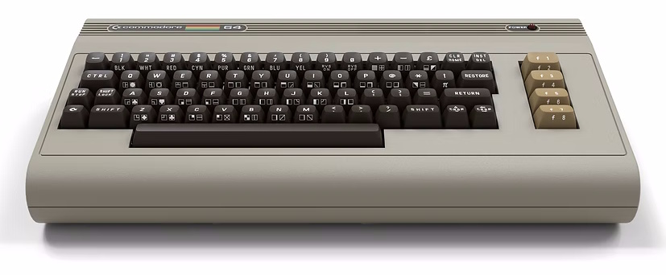
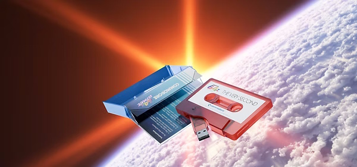

The box arrived today, just in time before the holidays, sitting on my doorstep like a time capsule. The moment I saw the familiar Commodore logo on the packaging, I had to pause. It wasn’t just another retro gadget. It was the **Commodore 64**. Or at least, as close as we’re ever going to get in 2025.

I tore open the cardboard (carefully, because let’s be honest, I’ll probably keep the box) and there it was: the [**Commodore 64 Ultimate**](https://www.commodore.net/product-page/commodore-64-ultimate-basic-beige-batch1), in all its beige glory. The weight of it, the shape, even the slight texture of the plastic, it all felt right. Like holding a piece of my childhood again.

## A Perfect Recreation

The first thing I noticed was the manual. A real, spiral-bound, physical manual, complete with BASIC listings. I flipped through it, running my fingers over the pages, and for a second, I was 12 years old again, typing in programs and hoping I didn’t make a typo. The attention to detail here is insane. The keyboard has that same satisfying clack (though, admittedly, with better switches than the original), the ports are all where they should be, and even the power LED glows with that same warm, slightly orange hue.

But this isn’t just a replica. It’s a **reimagining**.

The C64U is built around an FPGA, meaning it’s not emulation, it’s real hardware, just like the original. No software tricks, no shortcuts. It is a C64, just with a few modern luxuries. HDMI out. Wi-Fi. USB ports. A 48MHz Turbo mode (which feels almost like cheating). And yet, when I plugged in an old cartridge, it just… worked. No fuss. No compatibility issues. Just that familiar `LOAD "*",8,1` prompt staring back at me, waiting for commands.

I connected it to my modern monitor via HDMI, but I also dug out an old CRT (Commodore 1084S monitor) from the garage, just to see. And there it was, the same slightly fuzzy, slightly wobbly image I remember from 1985. The same SID chip music, crackling through the speakers like it never left.

## The Little Things That Matter

The C64U comes with a USB "cassette drive" preloaded with 100+ games, some classics and new ([https://www.commodore.net/pressplay](https://www.commodore.net/pressplay)), tools, music and even a few demos that push the hardware in ways I didn’t think possible back then.

And then there’s the Turbo mode. 64MHz! My 12-year-old self would have lost his mind. Games load almost instantly. BASIC programs run at speeds that feel impossible. And yet, with a flick of a switch, I can throttle it back to 1MHz, just like the old days.

## This Feels Different

I’ve owned a C64 in the past, but the Ultimate is something else. It’s not just about playing the games, it’s about feeling the machine again. The way the keys press down. The way the screen flickers just a little when you run a particularly aggressive `POKE` command.

It’s the closest I’ve ever gotten to reliving those late-night coding sessions, where I’d stay up way past my bedtime, typing in BASIC programs and hoping they’d work.

## Is It Worth It?

At $299.99 (for the basic beige model, what I have), it’s not cheap. But then again, neither was the original C64 when it came out. And just like back then, this isn’t just a computer, it’s an experience.

If you grew up with the C64, you’ll understand. If you didn’t, well… this might just be the best way to find out what you missed.

I don’t know if I’ll use it every day. But I know I’ll keep it on my desk, within reach, for those moments when I need a little nostalgia or when I just want to remember what it was like to 'boot' up a computer and feel like anything was possible.

Now, if you’ll excuse me, I have a SID chip to abuse and some old type-in listings to revisit.

The Commodore 64 Ultimate isn’t just a retro computer, it’s a time machine with modern conveniences. It’s a love letter to the era of 1 MHz processors and 64 KB of RAM, wrapped in a package that makes it accessible and enjoyable in 2025. For anyone who ever loved the C64, this is as close as it gets to coming home.

Thank you [Christian Simpson aka Peri Fractic](https://www.perifractic.com) to make this possible again!

**RUN**

