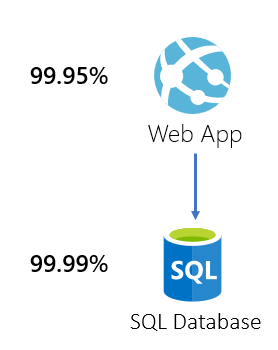
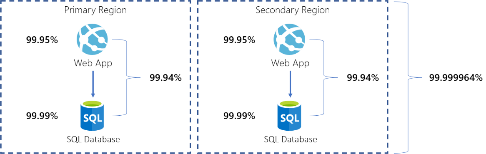

Microsoft provides for most Azure services an [Service Level Agreements](https://azure.microsoft.com/en-us/support/legal/sla/) (SLA), where you can find the availability for that services. The availability has a rage from **99.9%** to **100%** or no range at all (for some free services).

> "We guarantee that 99.95% of the time, the Azure ... Service will successfully receive and respond to ..."

The SLA describes Microsoft's commitments for uptime and connectivity. It is also somewhat guaranteed, i.e., it is backed financially. It shows Microsoft will refund you when it fails the SLA, but it doesn't back your business.

## Availability

When building solutions on Azure, you use multiple Azure services, so how do you know the availability for your solution? Especially when the Azure services have different availability numbers.

First, we need to know which Azure Services are in the **critical path** for your solution, not all Azure Services you use are required for the availability. For example, Azure Application Insights is not vital for the uptime, but an Azure App- or Azure Storage service can be.

Next, we need to know what the availability is for every Azure Services in the critical path. We can look this up on the [SLA website](https://azure.microsoft.com/en-us/support/legal/sla/) from Microsoft, but there is also a good overview on the [Azure SLA Board](https://azurecharts.com/sla).

Some services in your solution have multiple instances and working in parallel, or you have distributed the solution in multiple regions. We start with one instance/region to make it easier to calculate. Later we can also apply the calculation for multiple instances and regions.

## Calculation Method

For the calculations of the availability, we use the **probability theory**. In probability theory, probabilities are expressed as a number between 0 and 1. We have two types of scenarios; services in serial, and service is parallel.

> "[Probability](https://en.wikipedia.org/wiki/Probability) is the branch of mathematics concerning numerical descriptions of how likely an event is to occur or how likely it is that a proposition is true."

## Services in Serial

For calculating the combined availability of services in **serial**, we make use of the *Multiplication Theorem for Independent Events*. The equation of the multiplication of independent events is shown below (The symbol $\cap$ means ‘and’).

This equation is based on the *Multiplication Theorem on Probability*, $P\left(A\cap B\right)\ =P\left(A\right)\cdot P\left(B\middle| A\right)$ and the definition of independent events, $P(B|A)\ =\ P(B)$:

> $P(A\ \cap\ B)\ =\ P(A)\ \cdot\ P(B)$

In our situation, we want to know whether our Azure services for our solution is available. Our solution has two Azure services, an Web App- and SQL Database service.

The **Web App** has a availability of [**99.95%**](https://azure.microsoft.com/en-us/support/legal/sla/app-service/) and **SQL Database** of [**99.99%**](https://azure.microsoft.com/en-us/support/legal/sla/sql-database/), then our equation results in:

> $P("Web\ App\ is\ up\ \cap\ SQL\ DB\ is\ up")\\\\\ =\ P("Web\ App\ is\ up"\ )\ \cdot P("SQL\ DB\ is\ up")\\\\\ =\ 99.95\ \cdot\ 99.99\\\\\ =\ 99.94$

This results in that our whole infrastructure has an availability of **99.94%**. Each component can fail independently, so the more components, the more failures can occur.

## Services in Parallel

When services are in **parallel**, the situation changes. The availability doesn’t depend on the services together. For the solution were services A and B in parallel to be available, $A\ \cup\ B$ (The symbol $\cup$ means ‘or’) needs to be available. When one of them is down, the solution is still available.

To calculate the availability of this solution, we need to know the probability that a service is not available. The probability that service A is not available is defined as:

> $P\left(\lnot A\right)=1-P\left(A\right)$

In the case of parallel services, the system is available, when as long as both services $A$ and $B$ are not down. We can calculate that as:

> $P\left(A\cup B\right)=1-P\left(\lnot A\cap\lnot B\right)\\\\\ =1-\left(P\left(\lnot A\right)\cdot P\left(\lnot B\right)\right)\\\\\ =1-\left(\left(1-P\left(A\right)\right)\cdot\left(1-P\left(B\right)\right)\right)$

Here, we used the definition when a service is not available and the *multiplication theorem* from above. To calculate the availability of more than two services in parallel, we can calculate the availability of $A$ and $B$ first and then see $A$ and $B$ as a ‘single service’ and use the same equation again to calculate together with $C$.

> $P\left(A\cup B\cup C\right)=1-\left(\left(1-P\left(A\right)\right)\cdot\left(1-P\left(B\right)\right)\cdot\left(1-P\left(C\right)\right)\right)\\\\P\left(A\cup B\cup C\right)=1-\left(\left(1-P\left(A\ \cap\ B\right)\right)\cdot\left(1-P\left(C\right)\right)\right)$

> $P(Primary\ or\ Secondary\ is\ up)\ =\ 1\ -\ (1\ -\ P(Primary\ is\ up))\ \cdot\ (1\ -\ P(Secondary\ is\ up))\\\\\ =\ 1\ -\ (1\ -\ 99.94)\ \cdot\ (1\ -\ 99.94)\\\\\ =\ 1\ -\ 0.06 \cdot\ 0.06\\\\\ =\ 1\ -\ 0.000036\\\\\ =\ 99.9964$

We can boost the availability of a solution by implementing a multi-region failover. This increases the complexity and cost of the solution.

## Theoretical availability

The calculations above are a theoretical availability of the solution, based on the SLA's from Microsoft. The actual availability should be much higher, have a look at the [Azure status history & Root Cause Analysis (RCAs)](https://status.azure.com/en-us/status/history/) site. It is essential to **measure the solution** to get a realistic availability number and SLA.