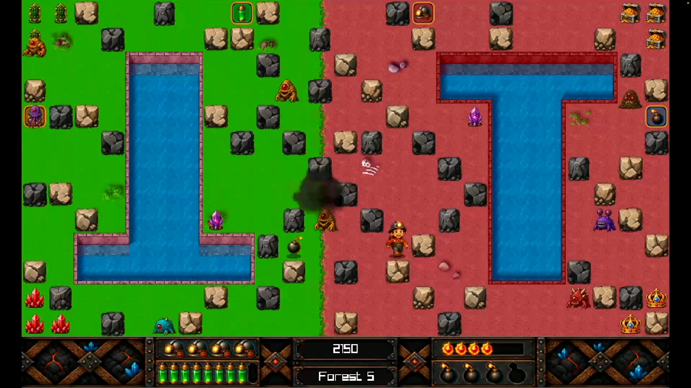
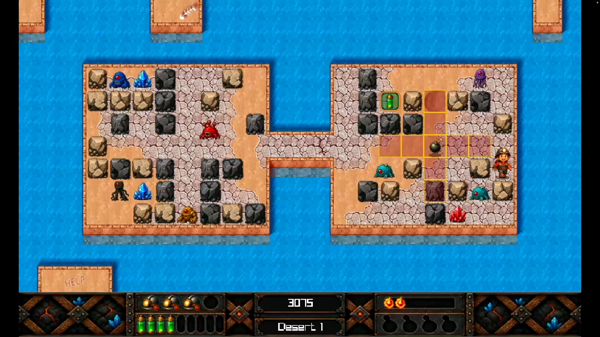
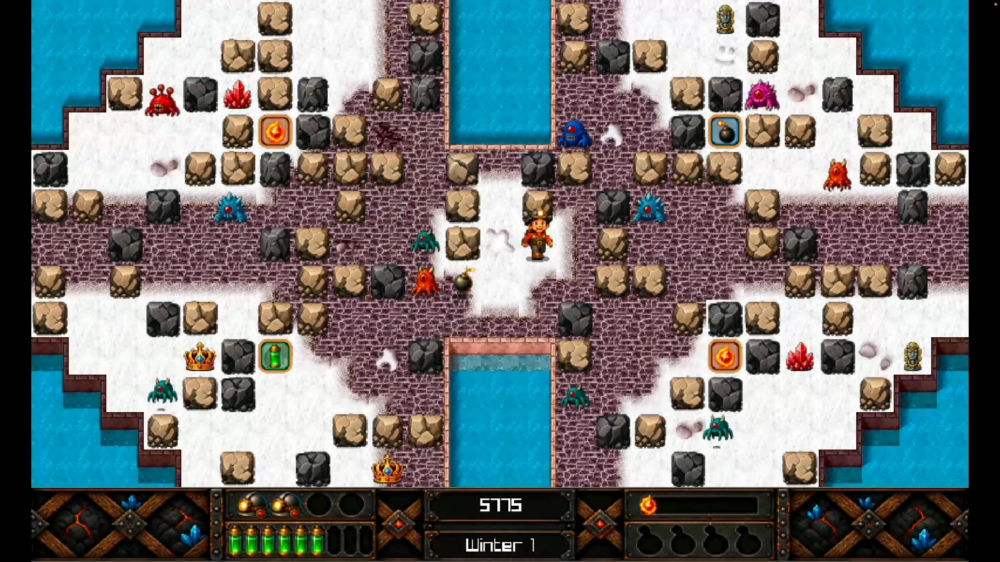
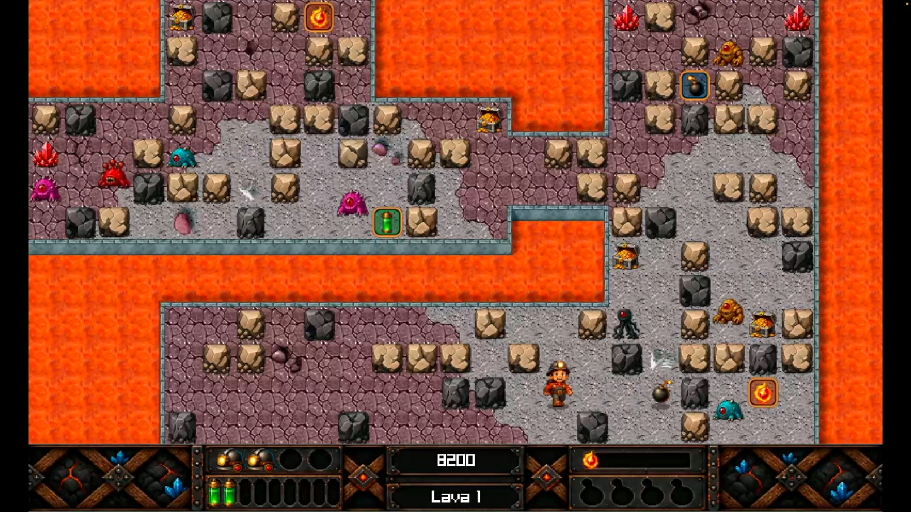

A few weeks ago, I wrote about bringing the original **CaveRace** back to life. That became CaveRace 1.5, a modern Windows and macOS version of the little DOS game I originally created with friends in 1997. At the time, I thought that was probably enough CaveRace for a while.

Apparently not. Sitting next to all those old DOS, DirectX and SharpDX sources in my repository was another version of the game: **CaveRace 2.0**. It had 25 levels instead of ten, four different worlds, more enemies, more power-ups and considerably more ambitious gameplay. I originally wrote it around 2012 using C# and Microsoft's XNA framework for Windows, Windows Phone and Xbox 360, and unlike the original CaveRace, this version had never really had its proper moment. So naturally I did the sensible thing and started rewriting another old game.



## CaveRace 2 was already there

The funny thing about CaveRace 2 is that it is simultaneously a new game and a very old game. The levels and basic gameplay came from the XNA version I created around 2012, which expanded the CaveRace formula into four environments, Forest, Desert, Winter and Lava, that together make up a campaign of 25 caves.

The basic rules still sound wonderfully simple. You control a miner. There is treasure, there are aliens, there are rocks, and you have bombs. Your job is to destroy every alien and preferably collect as much treasure as possible while doing so, and the complication is that bombs don't care about your intentions. An explosion can destroy an alien, but it can also destroy treasure, remove a useful power-up or hurt you, and since some rocks can be destroyed while others cannot, each level gradually becomes a routing problem: place a bomb, run away, and discover that the route you intended to use is now gone. Repeat.

That part hasn't changed much since 1997. What *has* changed is almost everything around it.

## First question: which engine?

When I started thinking seriously about CaveRace 2 again, I considered moving the game to a complete modern game engine. **Godot** was an obvious candidate, with a proper scene system, editor, animation tools, input handling, cross-platform exports and all the conveniences you'd expect from a modern game engine, and I spent time exploring what a native Godot architecture for CaveRace could look like.

But after finishing CaveRace 1.5, I had another option, and **Odin and raylib were already working extremely well**. CaveRace doesn't need a physics engine, 3D world, complex scene graph or huge content pipeline. At its heart it is still a small deterministic 2D game running on a grid: raylib gives me the window, graphics, audio and input APIs, while Odin gives me a modern systems programming language without putting a large framework between me and the game. That combination turned out to fit CaveRace remarkably well, so instead of porting the old XNA architecture directly or moving everything into a large game engine, CaveRace 2.1 became another **from-scratch Odin implementation using raylib**. I think that was the right decision.

## Rewriting instead of porting

There is an important difference between a port and a rewrite. I wasn't trying to translate old C# classes into new Odin structs line by line, which would mostly preserve fifteen-year-old architecture along with fifteen-year-old assumptions. Instead, I treated the XNA game as a specification. The old source code answered questions like how enemies should move, what a power-up does, how a level is completed, what happens when an explosion reaches another bomb, what score an object should produce, and how the original levels were encoded, and I implemented those rules again in a much simpler modern codebase.

Chain reactions are a good example of a rule worth preserving exactly. A bomb's blast is built once into a fixed footprint, a center cell plus up to four directional arms, and any other bomb caught inside that footprint has its fuse cleared so it detonates on the same tick rather than waiting out its own timer:

```odin
// source/explosion.odin
build_explosion_state :: proc(bomb: ^Bomb_State) -> Explosion_State {
	explosion := Explosion_State{active = true}
	append_explosion_cell(&explosion, bomb.position, .Center)
	power := clamp(bomb.power, 0, PLAYER_MAX_BOMB_POWER)
	// ...walk the four directions out to `power` tiles...
	return explosion
}

chain_bombs_in_explosion :: proc(gameplay: ^Gameplay, explosion: ^Explosion_State) {
	for bomb_index in 0 ..< MAX_BOMBS {
		bomb := &gameplay.bombs[bomb_index]
		if !bomb.active || bomb.fuse_ticks <= 0 do continue
		if explosion_contains_cell(explosion, bomb.position) {
			bomb.fuse_ticks = 0
		}
	}
}
```

`start_ready_explosions` then rescans every bomb slot in a loop until nothing new goes off, so a long row of bombs still resolves deterministically in one action boundary instead of the chain unrolling recursively down the call stack. It's the same rule that made careless bomb placement dangerous in 1997, just expressed without the original's DOS-era shortcuts.

The repository is actually becoming a small history lesson in game-development technology. CaveRace has now existed as:

| Version | Technology |
| --- | --- |
| 1.2 | Borland C and x86 assembly on MS-DOS |
| 1.3 | Visual C++ and DirectX |
| 1.4 | C# and SharpDX |
| 2.0 | C# and XNA |
| 1.5 | Odin and raylib |
| 2.1 | Odin and raylib |

Almost thirty years of finding new ways to make a miner blow up rocks.

## Keeping the old levels

One thing I deliberately did **not** modernize was the level format. CaveRace 2 still uses the original level data from the XNA-era game, loaded as immutable map data and validated before the game creates the live player, enemies, bombs and explosions around it. The struct mirrors the original file layout exactly, five 25×13 tile layers of one byte each, and a compile-time assertion keeps that promise honest:

```odin
// source/level.odin
Map_Data :: struct {
	background: Map_Grid,
	item:       Map_Grid,
	treasure:   Map_Grid,
	enemy:      Map_Grid,
	player:     Map_Grid,
}

#assert(size_of(Map_Data) == 1625)
```

If a future change to the struct ever drifted from that 1,625-byte layout, the build would fail before a single level loaded. Every one of the 25 shipped `.bin` files is then read straight into that struct and walked tile by tile through `validate_level_data`, which rejects any out-of-range background, item, treasure, enemy or player index before the level is allowed to replace the active one. Only once every check passes does the loaded data become the live level.

I like this separation: the level says what the cave *is*, and the runtime says what is currently *happening* inside it. It also gave me a very useful compatibility test, because if the new engine can load the old CaveRace 2 levels and they behave correctly, I'm preserving an important part of the original game rather than accidentally creating something merely inspired by it. The result is a 25-cave campaign built around the original maps, but running inside a completely new application.

| Forest | Treasure and crystals |
| --- | --- |
|  |  |

## Modern around the edges

Preserving the gameplay does not mean preserving every limitation. A lot of the work on CaveRace 2 happened around the game itself: there is now an interactive tutorial, proper menus, settings, pause and retry flows, controller support, keyboard remapping, music, sound effects, visual effects and accessibility options, and the game supports keyboard, mouse and controllers. There are also two difficulty profiles, plus settings for screen shake, controller rumble, reduced flashes, high-contrast bomb previews, music and sound volume, and pausing when focus is lost.

One feature I particularly like is the idle demo. Leave the main menu alone for a minute and CaveRace starts playing itself, which is completely unnecessary and exactly why I wanted it. The idle clock only ever runs on the main menu page, and any keyboard, controller or pointer activity resets it immediately:

```odin
// source/autoplay.odin
AUTOPLAY_IDLE_SECONDS :: 60.0

advance_main_menu_autoplay :: proc(
	autoplay: ^Autoplay_State,
	menu: ^Menu_State,
	input: Game_Input,
	frame_seconds: f64,
) -> bool {
	activity := input.keyboard_activity || input.controller_activity ||
	            pointer_activity(input.pointer)
	if menu.page != .Main || activity {
		autoplay.menu_idle_seconds = 0
		return false
	}
	autoplay.menu_idle_seconds += clamp(frame_seconds, 0, MAX_FRAME_DELTA_SECONDS)
	return autoplay.menu_idle_seconds >= AUTOPLAY_IDLE_SECONDS
}
```

It reminds me of arcade machines and old computer games where you could watch an attract mode before pressing Start. Sometimes software doesn't need another feature; sometimes it needs a little personality.



## 800 × 480 is a feature, not a limitation

CaveRace 2 renders to a fixed **800 × 480 canvas**, which on a modern 4K monitor sounds almost ridiculous, but it solves an important design problem. The game is tile based, and every screen, HUD element and piece of artwork is composed around that same logical resolution:

```odin
// source/config.odin
WINDOW_WIDTH  :: 800
WINDOW_HEIGHT :: 480

MAP_WIDTH     :: 25
MAP_HEIGHT    :: 13
MAP_TILE_SIZE :: 32

#assert(MAP_OFFSET_X * 2 + MAP_WIDTH * MAP_TILE_SIZE == WINDOW_WIDTH)
#assert(MAP_OFFSET_Y + MAP_HEIGHT * MAP_TILE_SIZE <= WINDOW_HEIGHT)
```

Those two `#assert` lines tie the 25×13 grid, its 32-pixel tiles and the 800×480 window together as a single checked equation, so nobody can quietly break the layout by editing one constant and forgetting the others. Instead of allowing layouts to stretch and shift depending on the display, CaveRace renders one consistent canvas and scales it proportionally, so different aspect ratios get letterboxing rather than distorted artwork, and I can reason about one coordinate system everywhere. It also creates an interesting mix between old and new: the underlying game still behaves like a classic grid-based computer game, while the presentation around it can use high-resolution artwork, animation, lighting and effects.

| Winter | Lava |
| --- | --- |
|  |  |

## Redrawing CaveRace without losing CaveRace

Graphics were probably the most subjective part of the project. The original CaveRace was unmistakably pixel art, and for good reason: when we created the first game, artwork was literally drawn pixel by pixel, some of it using Deluxe Paint on the Amiga. That style is part of CaveRace, but I didn't want CaveRace 2 to look like I had simply increased the resolution of a 1997 sprite sheet. The new visual direction therefore became a mixture, where the gameplay still follows the clarity and structure of the original tiles and sprites, but the surrounding presentation became much richer: illustrated miners, caves, crystals, monsters, atmospheric lighting and a much more developed world of Eldora.



AI tools became surprisingly useful here, not as a magical *"make game"* button, but as an extremely fast iteration tool. I could start with old artwork, describe what needed to remain recognizable, experiment with a visual direction and iterate until CaveRace had something approaching a consistent style. The same applied to development, where I used AI throughout the project for source archaeology, code reviews, refactoring ideas, test cases, packaging scripts, documentation and lots of *"there has to be a cleaner way to do this"* conversations.

It is a fascinating way to build software. AI can generate enormous amounts of code very quickly, so the more important skill becomes knowing what **not** to accept. Architecture, constraints, gameplay rules and ultimately responsibility for the code still need to live somewhere, preferably inside the developer rather than inside the prompt history.

## Testing a game from 1997

Games are slightly awkward things to test. I can easily write `2 + 2 == 4`, but it is much harder to write `assert(game_feels_fun)`. Still, there are many parts of CaveRace that absolutely can be tested, and the current project has automated tests covering areas including movement behaviour, presentation invariants, effect boundaries and validation of every campaign level.

The movement tests are a good example of why that matters. Reversing direction mid-tile, for instance, needs to land the player back at the exact sub-tile position it started from rather than snapping or drifting:

```odin
// source/player_movement_test.odin
@(test)
test_halfway_opposite_input_reverses_without_position_jump :: proc(t: ^testing.T) {
	gameplay := halfway_gameplay_for_test()
	gameplay.tick_state.input.move_left = true
	before := player_subtile_position(&gameplay.player)

	testing.expect(t, try_reverse_player_at_halfway(&gameplay))
	after := player_subtile_position(&gameplay.player)
	testing.expect_value(t, after.x, before.x)
	testing.expect_value(t, gameplay.player.direction, Direction.Left)
}
```

That last part, level validation, is especially valuable. Old binary level formats have a habit of working perfectly until one strange file appears that violates an assumption nobody remembers making, so having all 25 shipped caves automatically validated during development catches an entire category of problems before I have to discover them somewhere around Lava Cave 7, preferably after twenty minutes of playing.

## Shipping is part of development

Getting a game to compile is one thing; getting it into an app store is another project entirely. CaveRace 2 is available for both **Windows and macOS**, which means the repository contains more than game code. There are scripts for building release versions, constructing application bundles, preparing Mac App Store packages and generating Microsoft Store MSIX packages. For macOS there is code signing, provisioning and notarization; for Windows there is the application manifest, package identity and Store packaging.

The build scripts compile with strict Odin vetting and treat warnings as errors, and they also verify that required levels and media actually made it into the resulting package. That final check sounds boring, and boring is excellent, because there are few things more annoying than successfully uploading a perfectly signed application that starts beautifully and then discovers someone forgot to copy the `levels` directory. Especially when that someone is you.

## And then there is the website

At some point CaveRace stopped being just an executable and became a small product, which meant it needed a proper home. So I also rebuilt [caverace.com](https://caverace.com), deliberately going in the opposite direction of modern web-development fashion. There is no giant application framework behind it, no React hydration, no dependency tree containing half the JavaScript ecosystem just to display a game screenshot. The CaveRace website is mostly straightforward static HTML, CSS and a little JavaScript, and it is fast.

The site now has separate sections for CaveRace 2, CaveRace 1, and the historical CaveRace releases, a separation that became important once CaveRace 2 arrived. The website is no longer a page about an old DOS game; it represents a small family of releases stretching from 1997 to 2026. The original versions are history, CaveRace 1.5 is the restored classic, and CaveRace 2 is the new game, a hierarchy that's much easier to understand than trying to squeeze almost thirty years of releases onto one product page.

## Building for humans, search engines and machines

I also used the website rebuild as an opportunity to clean up the less visible parts of a modern site: canonical URLs, Open Graph metadata, structured data, a sitemap and robots.txt. And because apparently it is 2026, the site also has an `llms.txt`. Whether `llms.txt` becomes an important long-term convention or a wonderful archaeological curiosity for developers in 2036 remains to be seen, but the broader idea makes sense.

For years we designed websites for two audiences, people and search engines, and increasingly there is a third: software trying to understand what the website contains. Keeping a site semantic, structured and easy to crawl is useful regardless of which particular AI-related conventions survive. Perhaps the best optimization for AI turns out to be the same optimization we should have been doing all along: **write clear HTML containing clear information.** Revolutionary stuff.

## No accounts, no backend, no tracking machinery

There is another deliberate technical decision behind CaveRace 2: it doesn't need a server. The game is completely offline, with no account, no login, no cloud save, no advertising, no in-app purchases, no analytics inside the game, and no online service that needs to keep running for CaveRace to work ten years from now. For a small game like this, every external dependency is another thing that can eventually break. The 1997 DOS version still runs today because everything the game needs is right there, and I'd quite like the 2026 version to have the same property.

## Open source again

The complete source history is available in the [NavaTron/CaveRace repository on GitHub](https://github.com/NavaTron/CaveRace), and I mean *history* fairly literally. The repository contains the different CaveRace generations rather than only the shiny new source:

```text
1.2 Original (MS-DOS)
1.3 DirectX (Windows)
1.4 SharpDX (Windows)
1.5 Odin (Windows & macOS)
2.0 XNA (Windows Phone & Xbox)
2.1 Odin (Windows & macOS)
```

There aren't many personal programming projects where you can put code written for DOS next to code written almost thirty years later and say *"Yes, technically these are the same product."* The source code is available under the Apache 2.0 license, while the game artwork, music and other content remain copyrighted by NavaTron. Apart from being useful to anyone curious about the implementation, keeping all those versions together has become valuable to me personally: it is essentially my own software-development time capsule.

## What I learned this time

CaveRace 1.5 taught me that old software doesn't necessarily need to be replaced to become useful again. CaveRace 2 taught me something slightly different: old **ideas** don't necessarily need to remain old. The 2012 version contained plenty of things I still liked, the four worlds, larger campaign, power-ups and more tactical levels, and what it lacked was a modern home. Rewriting it gave me the opportunity to keep those pieces while reconsidering almost everything around them.

The funny part is that modernizing the project often meant making it simpler: a small language, a small graphics library, a static website, local files, no backend, no accounts, no services, just a native executable that starts a game. After spending much of my professional career around increasingly large technology platforms, there is something refreshingly satisfying about that. CaveRace 2 doesn't need to scale to millions of concurrent miners; it just needs one miner, a cave full of aliens and enough bombs to make poor decisions. And after nearly thirty years, that still seems to work.

---

**CaveRace 2 is available now for Windows and macOS at [caverace.com](https://caverace.com/2/).**

The complete CaveRace source-code archive is available on [GitHub](https://github.com/NavaTron/CaveRace).

See you in Eldora.
