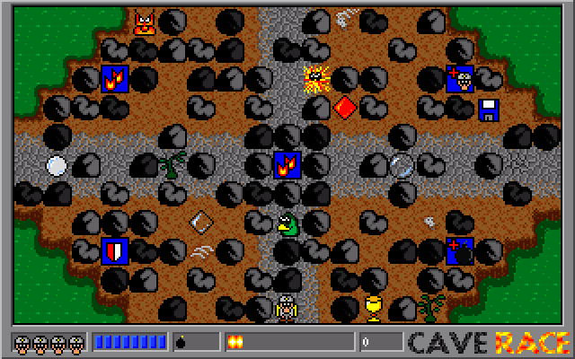
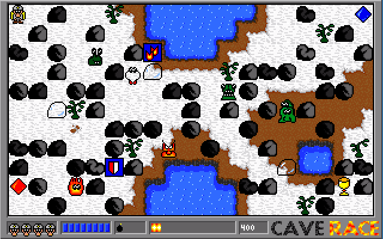
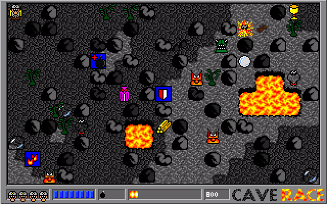
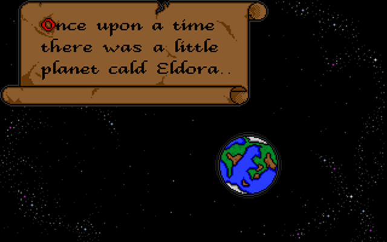
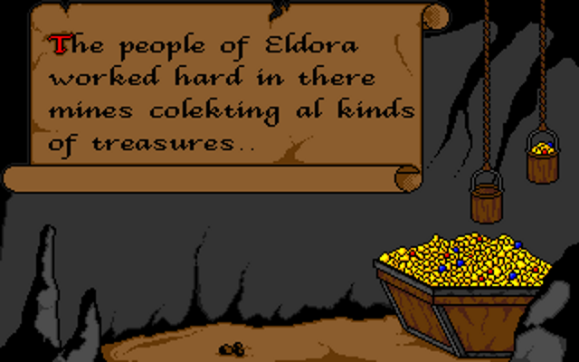
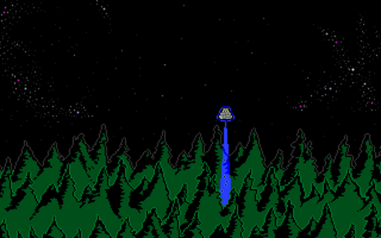
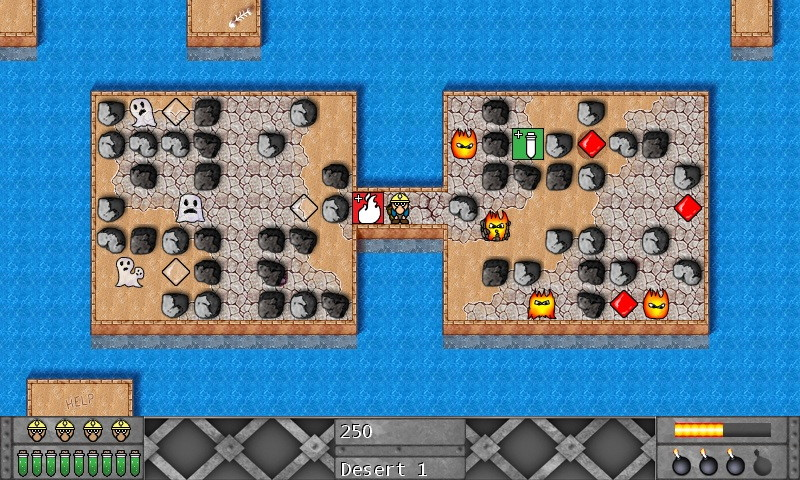
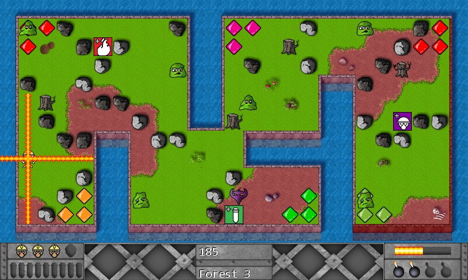
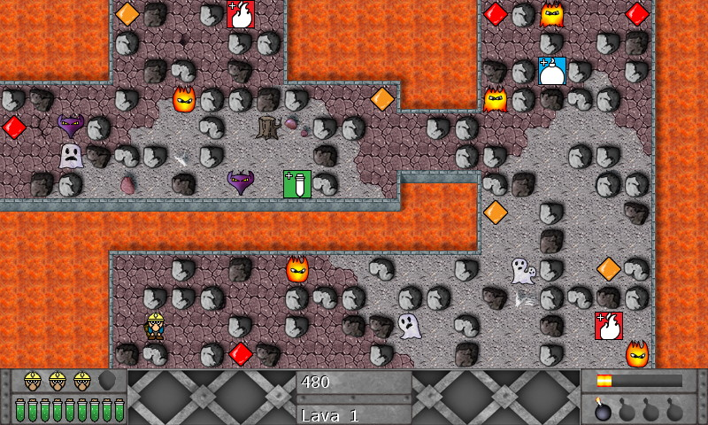
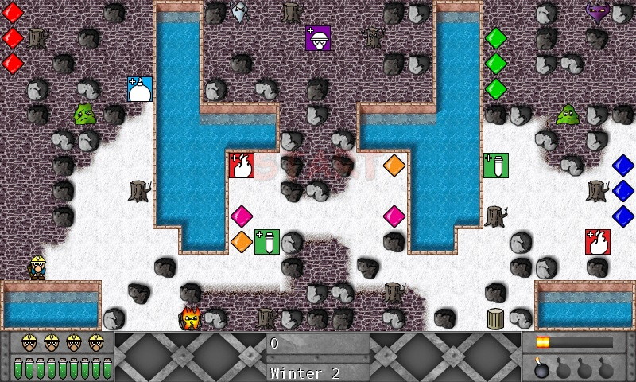

**CaveRace** is a classic maze-based video game I developed back in **1997** with some other students. Inspired on a game, I played on my Commodore Amiga, called **Dyna Blaster** [(Bomberman)](https://en.wikipedia.org/wiki/Bomberman_(1990_video_game)).

| Forest level               | Winter level               | Lava level             |
| -------------------------- | -------------------------- | -------------------      |
|  |  |  |

## Download

You can **[download](caverace-1.2-dos.zip)** the 16-bit MS-DOS version of CaveRace (version 1.2) here.

## Story

On the planed Eldora, there are miners collecting gold and diamonds. When the miners get unexpected visitors from outer space, the mining of precious minerals is in danger. The only defense the miners have is their explosions to make a way inside the mines and caves. CaveRace is a game where you collect as much as possible precious minerals and destroy all alien visitors.

| Planed Eldora                | Collect treasure                  | Alien visitors      |
| ---------------------------- | --------------------------------- | ------------------- |
|  |  |  |

## Borland C

The game is mainly written in the programming language [Borland C](https://en.wikipedia.org/wiki/Borland_C%2B%2B) 3.1, and some graphic routines are in x68 assembly language. The minimal system requirements are an Intel 80386 IBM compatible PC running MS-DOS and VGA 320×200 pixels (Mode 13h) in 256-color mode video system.

The game is using your mouse and keyboard for navigation and gameplay. The game loop is in sync with the refresh rate of the screen, not the best choice, but simple to understand. No sound is present in the MS-DOS version, later on, I ported CaveRace to Windows, this version has upgraded graphics and sounds (explosions).

There is also a **MapEditor** available to create levels yourselves. Let me know what you have created.

## Graphics

The original artwork is created on an **Amiga** using [Deluxe Paint](https://en.wikipedia.org/wiki/Deluxe_Paint) in the file format IFF (Interchange File Format). The game CaveRace is using a binary RGB byte file format. Game tiles (16 x 16 pixels) and screens (320 x 200 pixels) are converted to this binary RGB byte file format.

| File | Tiles         | Bytes   | Description |
| ---- | ------------- | ------- | ----------- |
| BGS  | 5 x 50(16x16) | 64000   | BackGrounds
| BOM  | 17 x (16x16)  | 4352    | Boms
| CAR  | 320 x 200     | 64000   | Carder (Picture)
| ENM  | 16 x (16x16)  | 4096    | Enemys
| FNT  | 36 x (3x5)    | 540     | Font
| HIS  | 320 x 200     | 64000   | Hi-Scores (Picture)
| ITM  | 13 x (16x16)  | 3328    | Items
| MAN  | 18 x (16x16)  | 4608    | Man
| MN1  | 320 x 200     | 64000   | Menu 1 (Picture)
| MN2  | 320 x 200     | 64000   | Menu 2 (Picture)
| PAL  | 256 x (RGB)   | 768     | Palette
| STS  | 4 x (16x16)   | 1024    | Status
| TRS  | 6 x (16x16)   | 1536    | Treacure

## Game cheats

Start the game using the switch **-powerblast**, and now you can use the function keys for additional power.

| Key | Result |
| --- | ------ |
| F1  | next level
| F2  | max. health
| F3  | max. bombs
| F4  | more bomb power
| F5  | double points
| 1   | screen capture, output is saved to the file screen.raw
| %   | shows the rendering time

When running the game on old and slow systems, you can use the **-slow** switch to speed up the game.

## Open Source

The MS-DOS version of [CaveRace is opensource](https://github.com/cschotte/caverace) under the Apache-2.0 license and can found op GitHub.

## CaveRace for Windows

There is also a Microsoft **Windows** and **Windows Phone 7** version of CaveRace. Written in **C#** and using **DirectX** graphics. More information about how I ported the C version to C# in an upcoming blog post.



| Desert & Lava levels                             | Forest & Winter level                            |
| ------------------------------------------------ | ------------------------------------------------ |
|  |  |
|      |  |
