**CaveRace** began in **1997** as a maze-based action game I created with a
group of fellow students. We were inspired by **Dyna Blaster**
([Bomberman](https://en.wikipedia.org/wiki/Bomberman_(1990_video_game))), a
game I loved playing on my Commodore Amiga.

Almost thirty years later, I returned to Eldora and rebuilt CaveRace for modern
computers. **CaveRace 1.5.1** keeps the original levels, pixel art, bombs,
treasure, and aliens, but now runs natively on Windows and macOS with music,
sound effects, controller support, and a new story presentation.

## Download CaveRace

> **CaveRace is now available from its official website.** Visit
> [caverace.com/1](https://caverace.com/1/) for the latest downloads and start
> exploring the caves of Eldora.

**[Visit the official CaveRace 1 website to get the game](https://caverace.com/1/)**

| Story | Main menu | Controls |
| --- | --- | --- |
|  |  | 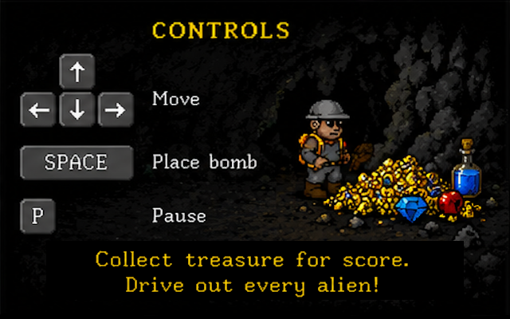 |

## The story of Eldora

Far out in space lies **Eldora**, a small planet whose people have built their
lives around treasure-filled mines. Every day, its miners venture underground
to recover gold, diamonds, and other precious minerals hidden deep inside the
caves.

Then unexpected visitors arrive from outer space. Alien creatures invade the
mines, threatening Eldora's people and the riches they depend on. The miners
have only one practical defense: the explosives they already use to open paths
through the rock.

You are one of those miners. Enter each cave, collect as much treasure as you
can, and drive out every alien. Bombs can clear softer stone and destroy nearby
monsters, but careless explosions can also destroy treasure or valuable
power-ups. Dense rock does not move, so every bomb can reveal a route—or create
a new danger.

| Planet Eldora | Collect treasure | Alien visitors |
| --- | --- | --- |
| 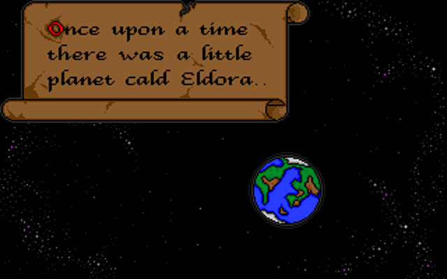 | 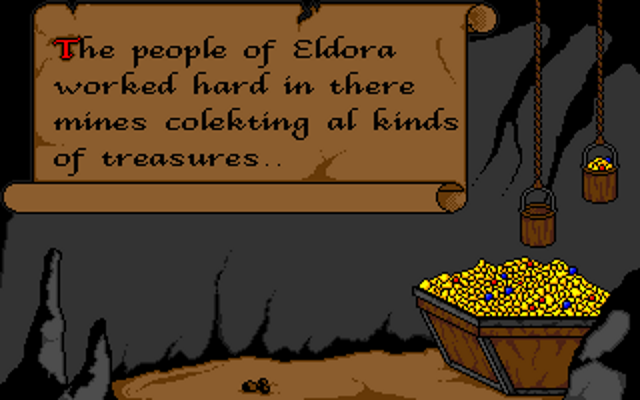 | 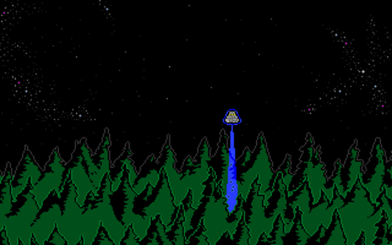 |

## The modern rewrite

CaveRace 1.5.1 is a from-scratch rewrite in the
[Odin programming language](https://odin-lang.org/) using Odin's bundled
[raylib](https://www.raylib.com/) bindings. I wanted the game to feel like the
original rather than replace it with something unrecognizable. The ten level
files from the DOS and DirectX releases are still used unchanged.

The rewrite adds the things I once wished the original could have: a proper
story sequence, an original soundtrack, streamed music, sound effects,
keyboard and controller remapping, pause and retry flows, screen and audio
settings, controller rumble, and comfort options such as reduced flashes and
adjustable screen shake. The simulation runs at a fixed 60 Hz, independent of
the display refresh rate.

## Versions through the years

CaveRace has moved through several generations of PC and console technology.
The version numbers represent different development branches, so the 2012 XNA
2.0 experiment predates today's 1.5 classic desktop rewrite.

| Version | Year | Platform and technology | Availability |
| --- | ---: | --- | --- |
| 1.2 | 1997–1998 | Original MS-DOS game, Borland C 3.1 and x86 assembly | [CaveRace Classics](https://caverace.com/classics/) |
| 1.3 | 2002 | 32-bit Windows port using Visual C++ and DirectX 8.1 | [CaveRace Classics](https://caverace.com/classics/) |
| 1.4 | 2012 | Windows 8 Store app written in C# with SharpDX | Source preserved on [GitHub](https://github.com/NavaTron/CaveRace) |
| 2.0 | 2012 | XNA 4 edition for Windows, Windows Phone, and Xbox 360 | Source preserved on [GitHub](https://github.com/NavaTron/CaveRace) |
| **1.5.1** | **2026** | **Modern Windows and macOS rewrite using Odin and raylib** | **[CaveRace 1 website](https://caverace.com/1/)** |

The Windows Store and XNA editions expanded the game with Forest, Desert,
Winter, and Lava environments. They are preserved as part of the project's
history, while 1.5 is the only version under active development.



| Desert and Lava levels | Forest and Winter levels |
| --- | --- |
| 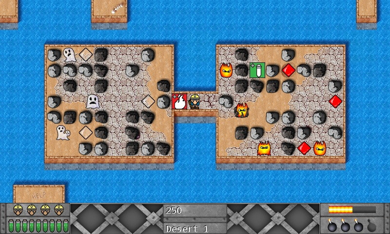 | 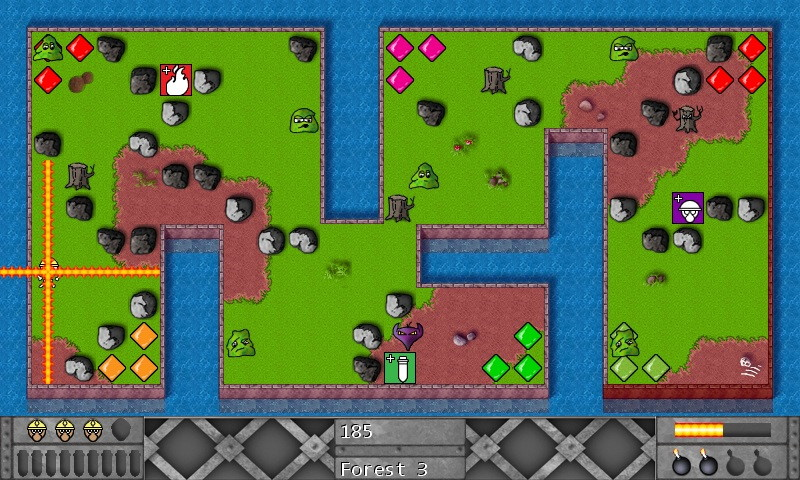 |
| 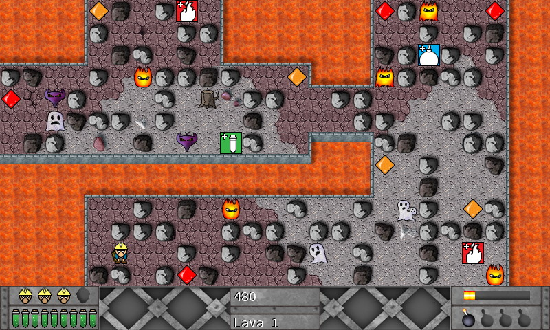 | 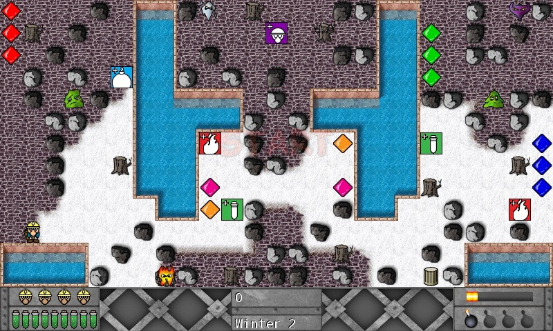 |

## How the original was built

| Forest level | Winter level | Lava level |
| --- | --- | --- |
| 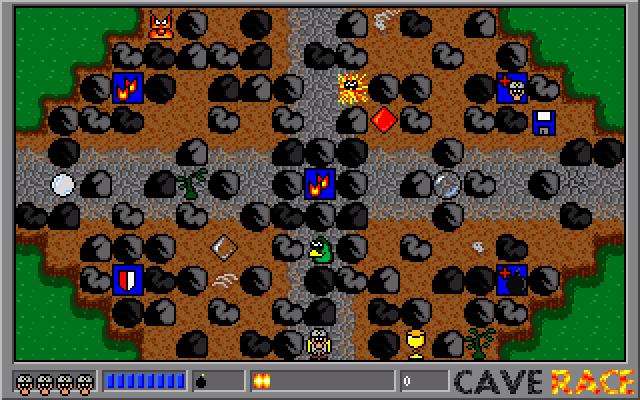 | 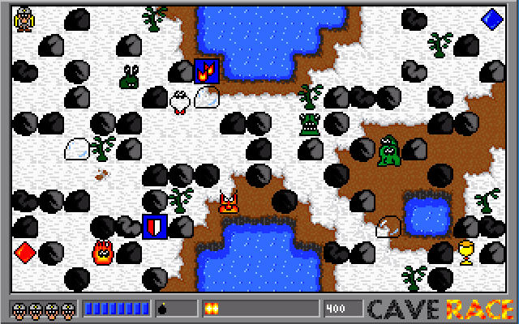 | 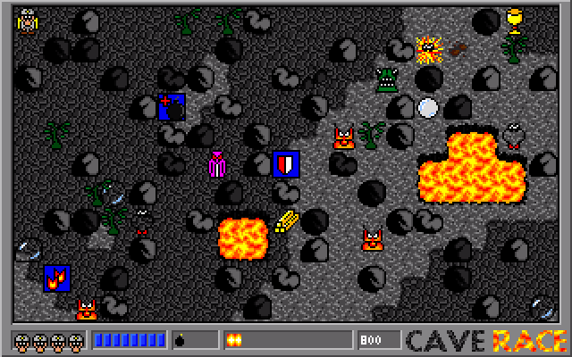 |

The original game was written mainly with
[Borland C](https://en.wikipedia.org/wiki/Borland_C%2B%2B) 3.1, with some
graphics and memory routines in x86 assembly language. Its minimum target was
an Intel 80386-compatible IBM PC running MS-DOS with a 320×200, 256-color VGA
display (Mode 13h).

The menus use the mouse and gameplay uses the keyboard. The game loop is tied
to the display refresh rate—simple, but a design that I changed in the modern
rewrite. The DOS release has no sound; audio first arrived in the DirectX port.

The DOS download also includes the original **MapEditor**, so you can create
your own levels. If you make one, I would still love to see it.

## Graphics

Marijn Schotte created the original artwork on an **Amiga** using
[Deluxe Paint](https://en.wikipedia.org/wiki/Deluxe_Paint). The source art is
stored as IFF (Interchange File Format). For the DOS game, its 16×16 tiles and
320×200 screens were converted to raw indexed graphics that share a 256-color
RGB palette.

| File | Content | Bytes | Description |
| --- | --- | ---: | --- |
| BGS | 5 × 50 tiles (16×16) | 64,000 | Backgrounds |
| BOM | 17 tiles (16×16) | 4,352 | Bombs |
| CAR | 320×200 screen | 64,000 | Title card |
| ENM | 16 tiles (16×16) | 4,096 | Enemies |
| FNT | 38 glyphs (3×5) | 570 | Font |
| HIS | 320×200 screen | 64,000 | High scores |
| ITM | 13 tiles (16×16) | 3,328 | Items |
| MAN | 18 tiles (16×16) | 4,608 | Player |
| MN1 | 320×200 screen | 64,000 | Menu 1 |
| MN2 | 320×200 screen | 64,000 | Menu 2 |
| PAL | 256 RGB entries | 768 | Palette |
| STS | 4 tiles (16×16) | 1,024 | Status |
| TRS | 7 tiles (16×16) | 1,792 | Treasure |

## Game cheats

Start the DOS or 1.5 game with `-powerblast` to enable the function-key cheats.

| Key | Result |
| --- | ------ |
| F1 | Complete the current level |
| F2 | Restore maximum health |
| F3 | Give the maximum number of bombs |
| F4 | Increase bomb power |
| F5 | Double the score |
| 1 | Save a screenshot (`screen.raw` in DOS, timestamped PNG in 1.5) |

The historical `-slow` option remains available. In 1.5 it limits presentation
to 30 FPS while the game simulation continues at 60 Hz.

## Open source and credits

The complete [CaveRace source and version archive](https://github.com/NavaTron/CaveRace)
is available on GitHub under the Apache License 2.0. The repository preserves
the DOS, DirectX, SharpDX, XNA, and Odin codebases together with their original
assets and build notes.

The original CaveRace team was Clemens Schotte (code and concept), Marijn
Schotte (artwork and concept), Paul Bosselaar and Paul van Croonenburg
(documentation), and Harro Lock (code). From version 1.3 onward, I continued
development with artwork by Marijn.

I hope you enjoy returning to Eldora—or discovering it for the first time.
**[Get CaveRace 1 from the official website](https://caverace.com/1/)** and let
me know how far you get.
