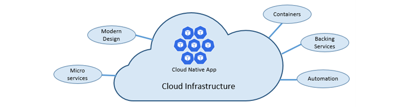
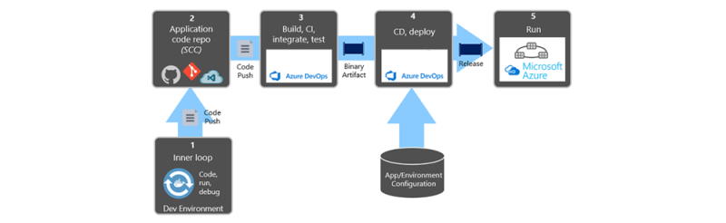

## Introduction

To adopt [cloud-native](https://www.cncf.io/) application patterns, companies must learn new skills and communicate effectively across team boundaries. A new architecture, platforms, and developer workflows mean evolving developer skillsets. While microservices allow teams to move independently, they also emphasize the degree to which software and the organization grow to resemble one another, also known as Conway's law. To achieve a result in which many microservices are a cohesive system and still maintain velocity, an organization's communication structures need to be highly functional and effective.

### Initial Challenges

#### Skillset

Development teams that are not primarily digital native, these development teams often do not have the incentive structure, time, experience, or knowledge to effectively adopt the design and architecture skills required to build cloud-native applications. 

#### Time/Budget

Another factor is just (too much) time pressure to build new features, and having a "legacy" application that works today may in many cases be "good enough" but continue to create a lot of the operational and productivity barriers that have given rise to cloud-native practices.

#### Development Infrastructure

Many development teams also lack the investment in a development infrastructure that is required to lean further into cloud-native: CI/CD pipelines, integration tests, monitoring and observability frameworks, cloud-based dev- and test environments. The cost of implementing all these pieces is a barrier to adopting a more cloud-native approach.

#### Organizational Structure

Traditionally company communication structures stand in the way of cloud-native development. For example, all networking operations and deployments belong to a separate team from that which does development or Ops, creating barriers or synchronous process points that constrain the adoption of new technology or patterns. Microservices are creating new importance on API contracts, which often become the boundary between teams.

#### Legacy Anchors

Lastly, there may be technology assets that just aren't going to change for one reason or another. For several reasons, teams may be anchored to a legacy technology choice for some time to come and bridge their applications into the future somehow.

### Cloud-native development

Cloud-native is all about changing the way you think about constructing critical business systems. Cloud-native systems are designed to embrace rapid change, large scale, and resilience. Cloud-native apps share some common traits: they are **containerized**, **dynamically orchestrated**, and composed of **loosely coupled microservices**. The cloud-native philosophy builds on top of established cloud application best-practices such as containers for application packaging, service discovery, 12 factors, dev-prod parity, centralized configuration, distributed tracing, multilingual applications, and fast, iterative development. 

Cloud-native is about **speed** and **agility**. Business systems are evolving from enabling business capabilities to being weapons of strategic transformation that accelerate business velocity and growth. It's imperative to get ideas to market immediately.

The speed and agility of cloud-native come about from several factors. These five foundational pillars also provide the bedrock for cloud-native systems:

## The Twelve-Factor Application

A widely accepted methodology for constructing cloud-based applications is the Twelve-Factor Application. It describes principles and practices that developers follow to build applications optimized for modern cloud environments.

While applicable to any web-based application, many practitioners consider Twelve-Factor a solid foundation for building cloud-native apps. Systems built upon these principles can deploy and scale rapidly and add features to react quickly to market changes.
 
The following table highlights the Twelve-Factor methodology:

|      | Factor              | Explanation |
| ---- | ------------------- | ----------- |
|   1  | Code Base           | A single code base for each microservice stored in its own repository. Tracked with [version control](https://azure.microsoft.com/en-us/services/devops/repos/), it can deploy to multiple environments (QA, Staging, Production). |
|   2  | Dependencies        | Each microservice isolates and packages its [dependencies](https://docs.microsoft.com/en-us/azure/devops/extensions/dependency-tracker/overview), embracing changes without impacting the entire system. |
|   3  | Configurations      | Configuration information is moved out of the microservice and externalized through a [configuration management](https://azure.microsoft.com/en-us/services/app-configuration/) tool outside of the code. The same deployment can propagate across environments with the correct configuration applied. |
|   4  | Backing Services    | Ancillary resources ([data stores, caches, message brokers](https://docs.microsoft.com/en-us/azure/architecture/guide/technology-choices/data-store-overview)) should be exposed via an addressable URL. Doing so decouples the resource from the application, enabling it to be interchangeable. |
|   5  | Build, Release, Run | Each release must enforce a strict separation across the build, release, and run stages. Each should be tagged with a unique ID and support the ability to roll back. Modern [CI/CD](https://azure.microsoft.com/en-us/services/devops/pipelines/) systems help fulfill this principle. |
|   6  | Processes           | Each microservice should [execute in its own process](https://azure.microsoft.com/en-us/product-categories/containers/), isolated from other running services. Externalize required state to a backing service such as a distributed cache or data store. |
|   7  | Port Binding        | Each microservice should be self-contained with its interfaces and functionality exposed on its own port. Doing so provides isolation from other microservices. |
|   8  | Concurrency         | Services scale-out across a large number of small identical processes (copies) as opposed to scaling-up a single large instance on the most powerful machine available. |
|   9  | Disposability       | Service instances should be disposable, favoring fast startups to increase scalability opportunities and graceful shutdowns to leave the system in a correct state. Docker containers, along with an orchestrator ([Kubernetes](https://docs.microsoft.com/en-us/azure/aks/intro-kubernetes)), inherently satisfy this requirement. |
|  10  | Dev/Prod Parity     | Keep [environments](https://docs.microsoft.com/en-us/azure/architecture/framework/devops/automation-infrastructure) across the application lifecycle as similar as possible, avoiding costly shortcuts. Here, the adoption of containers can significantly contribute by promoting the same execution environment. |
|  11  | Logging             | Treat logs generated by microservices as event streams. Process them with an event aggregator and propagate the data to data-mining/log management tools like [Azure Monitor](https://azure.microsoft.com/en-us/services/monitor/) or [Azure Application Insights](https://docs.microsoft.com/en-us/azure/azure-monitor/app/app-insights-overview) and, eventually, long-term archival. |
|  12  | Admin Processes     | Run administrative/management tasks as one-off processes. Tasks can include data cleanup and pulling analytics for a report. Tools executing these tasks should be invoked from the production environment, but separately from the application. |
 
In the book, [Beyond the Twelve-Factor App](https://tanzu.vmware.com/content/ebooks/beyond-the-12-factor-app), the author *Kevin Hoffman* details each of the original 12 factors (written in 2011). Additionally, the author discusses three additional factors that reflect today's modern cloud application design.
  
|      | New Factor          | Explanation |
| ---- | ------------------- | ----------- |
|  13  | [API First](https://azure.microsoft.com/en-us/services/api-management/) | Make everything a service. Assume your code will be consumed by a front-end client, gateway, or another service. |
|  14  | Telemetry           | On a workstation, you have deep visibility into your application and its behavior. In the Cloud, you don't. Make sure your design includes the collection of [monitoring](https://docs.microsoft.com/en-us/azure/azure-monitor/app/app-insights-overview), domain-specific, and health/system data. |
|  15  | Authentication/ Authorization | Implement identity from the start. Consider RBAC ([role-based access control](https://docs.microsoft.com/en-us/azure/role-based-access-control/overview)) features available in public clouds. |
	 
## Microservices

Cloud-native systems embrace microservices, a popular architectural style for constructing modern applications. Built as a distributed set of small, independent services that interact through a shared fabric, microservices share the following characteristics:

* Each implements a specific business capability within a larger domain context.
* Each is developed autonomously and can be deployed independently.
* Each is self-contained, encapsulating its own data storage technology (SQL, NoSQL) and programming platform.
* Each runs in its own process and communicates with others using standard communication protocols.
* They compose together to form an application.

### Why microservices?

Microservices provide agility. Each microservice has an autonomous lifecycle and can evolve independently and deploy frequently. You don't have to wait for a quarterly release to deploy new features or updates. You can update a small area of a complex application with less risk of disrupting the entire system. Each microservice can scale independently. Instead of scaling the entire application as a single unit, you scale out only those services that require more processing power or network bandwidth. This fine-grained approach to scaling provides for greater control of your system and reduces overall costs as you scale portions of your system, not everything.

## Automation

Cloud-native systems embrace microservices, containers, and modern system design to achieve speed and agility. But that's only part of the story. How do you provision the cloud environments upon which these systems run? How do you rapidly deploy app features and updates? How do you round out the complete picture?

Enter the widely accepted practice of [Infrastructure as Code](https://docs.microsoft.com/en-us/dotnet/architecture/cloud-native/infrastructure-as-code), or IaC.

With IaC, you automate platform provisioning and application deployment. You essentially apply software engineering practices such as testing and versioning to your DevOps practices. Your infrastructure and deployments are automated, consistent, and repeatable.

### Automating infrastructure

Tools like Azure Resource Manager, Terraform, Azure Bicep, and the Azure CLI, enable you to declaratively script the cloud infrastructure you require. Resource names, locations, capacities, and secrets are parameterized and dynamic. The script is versioned and checked into source control as an artifact of your project. You invoke the script to provide a consistent and repeatable infrastructure across system environments, such as QA, staging, and production.

IaC is idempotent under the hood, meaning that you can run the same script repeatedly without side effects. If the team needs to make a change, they edit and rerun the script. Only the updated resources are affected.

In the article, [What is Infrastructure as Code](https://docs.microsoft.com/en-us/azure/devops/learn/what-is-infrastructure-as-code), the author *Sam Guckenheimer* describes how "Teams who implement IaC can deliver stable environments rapidly and at scale." Teams avoid manual configuration of environments and enforce consistency by representing the desired state of their environments via code.

Infrastructure deployments with IaC are **repeatable** and prevent runtime issues caused by configuration drift or missing dependencies. DevOps teams can work together with a unified set of practices and tools to deliver applications and their supporting infrastructure rapidly, reliably, and at scale."

### Automating deployments

The Twelve-Factor Application calls for separate steps when transforming completed code into a running application.

> Factor #5 specifies that "Each release must enforce a strict separation across the build, release and run stages. Each should be tagged with a unique ID and support the ability to roll back."

Modern CI/CD systems help fulfill this principle. They provide separate deployment steps and help ensure consistent and quality code that's readily available to users.

In the previous figure, pay special attention to the separation of tasks.

The developer constructs a feature in their development environment, iterating through what is called the "inner loop" of code, run, and debug. When complete, that code is pushed into a code repository, such as GitHub or Azure DevOps.      

The push triggers a build stage that transforms the code into a binary artifact. The work is implemented with a Continuous Integration (CI) pipeline. It automatically builds, tests, and packages the application.

The release stage picks up the binary artifact, applies external application and environment configuration information, and produces an immutable release. The release is deployed to a specified environment. The work is implemented with a Continuous Delivery (CD) pipeline. Each release should be identifiable. You can say, "This deployment is running Release 3.11 of the application."

Finally, the released feature is run in the target execution environment. Releases are immutable, meaning that **any change must create a new release**.

Applying these practices, you have radically evolved how to ship software. Many development teams have moved from quarterly releases to on-demand updates. The goal is to catch problems early in the development cycle when they're less expensive to fix. The longer the duration between integrations, the more expensive issues become to resolve. With consistency in the integration process, teams can commit code changes more frequently, leading to better collaboration and software quality.

## Programming frameworks

### Spring

[Spring](https://azure.microsoft.com/en-us/services/spring-cloud/) is a trendy framework for microservices development and has rapidly evolved to support cloud application patterns. More than 50% of Enterprise applications are in Java, and more than 50% of Java applications use Spring, which has dedicated support on Azure

### Dapr

[Dapr](https://dapr.io/) is a new framework that adds cloud-native capabilities and patterns to other popular language frameworks like Node.js, Python, Java, and .Net/C#. Dapr especially shines for interservice communication between microservices and state stores. For example, Dapr adds a side car pattern that adds resiliency, retries, and service discovery between HTTP and gRPC based microservices without having to fully implement a service mesh or write lower-level logic to handle. Dapr adds high scale and availability bindings to state stores and messaging services like CosmosDB, Redis, or Kafka.