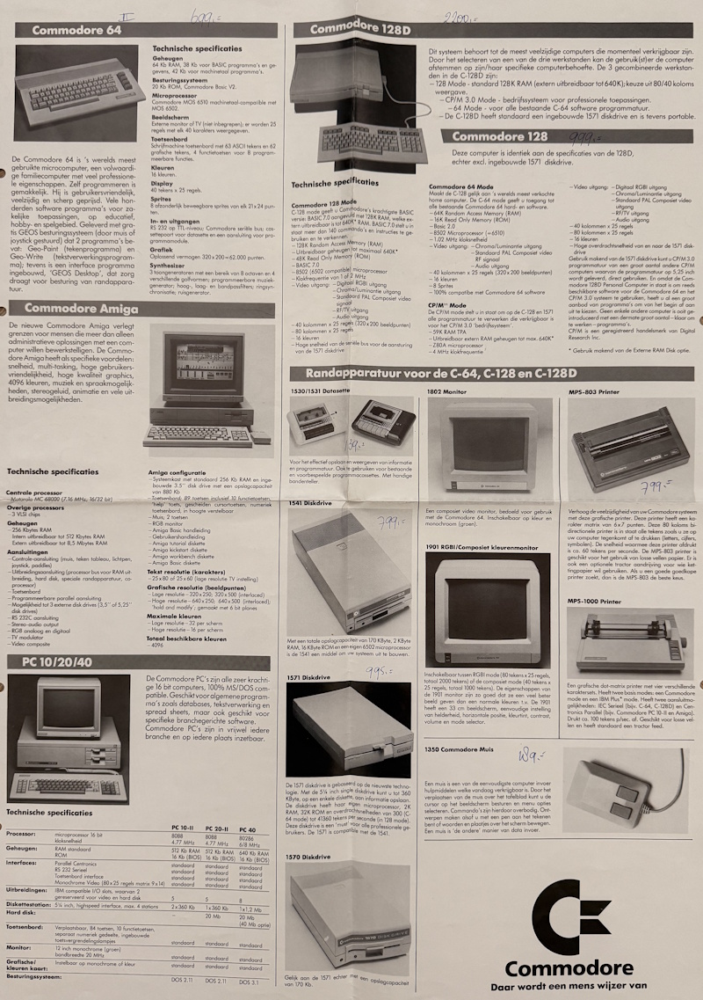
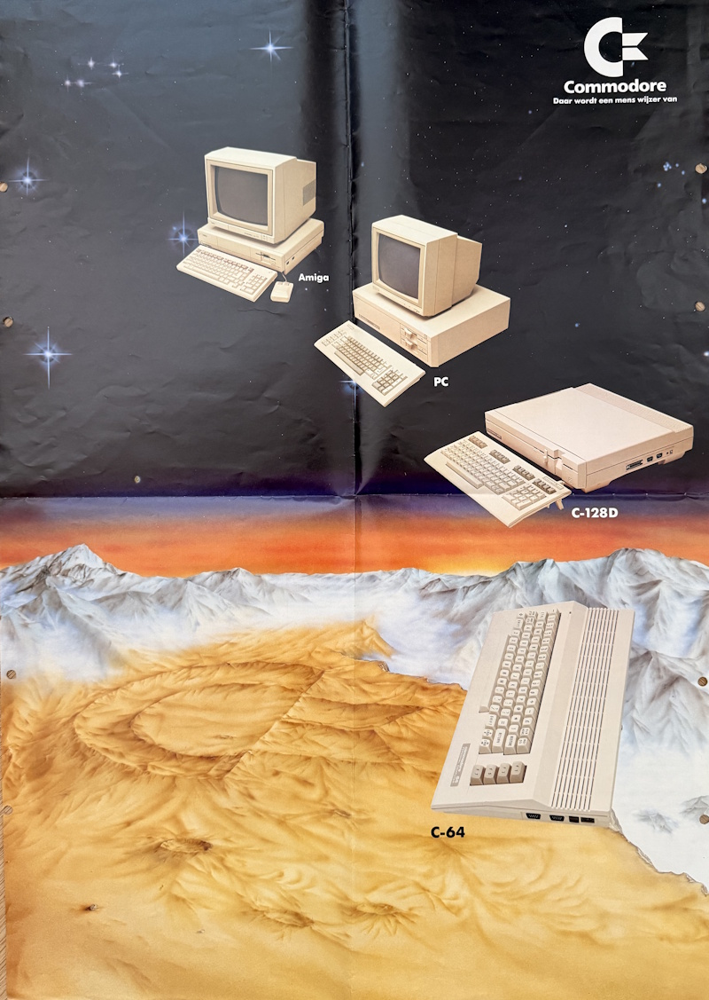
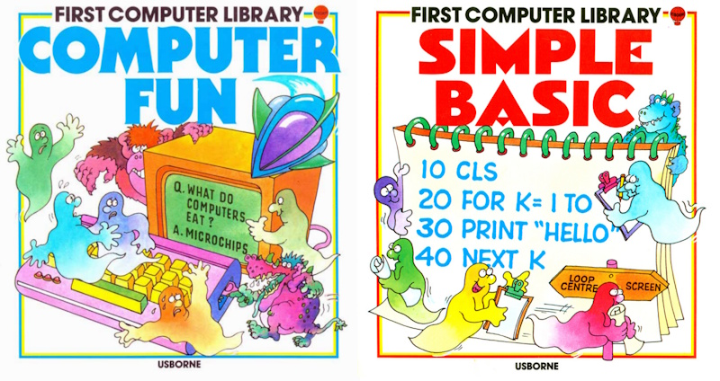
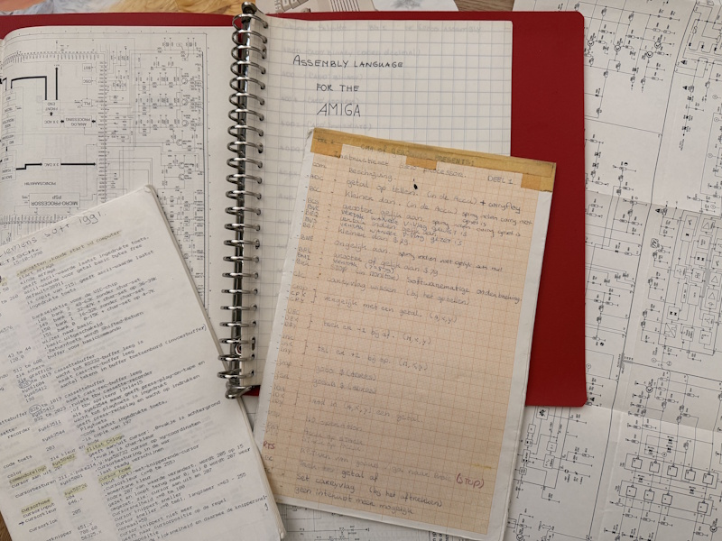
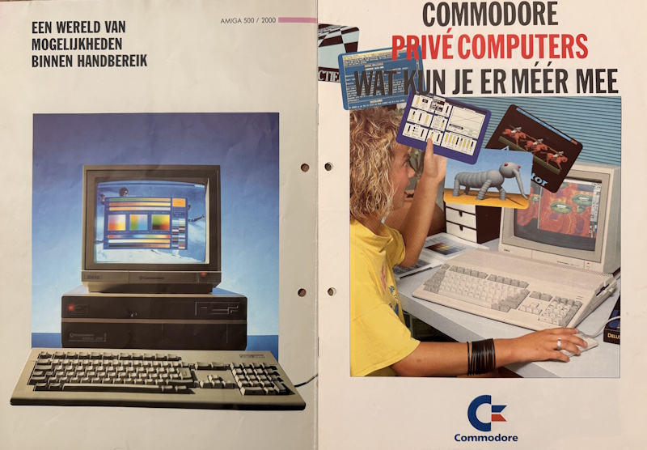

A personal history in a few very nerdy chapters

## Pac-Man

The first “computer” that really knocked on my brain wasn’t even called a computer. It was an [Atari 2600](https://en.wikipedia.org/wiki/Atari_2600) with those giant wood-paneled vibes, a plastic spaceship parked under a living-room TV. Somewhere far from home (friends of my parents), the kind of visit where adults drink coffee forever, I met Pac-Man and the notorious E.T. They weren’t just games, they were a portal. The graphics were blocky miracles, the sound was pure electricity, and my head did that little swivel where a new obsession clicks into place. I didn’t own one. I barely got to touch it. But the idea got in. That was enough.

## The Commodore 64

Back then a computer at home was a rare beast, the sort of thing you circled in a catalog and dreamed about. My dad heard coworkers talking about this “Commodore” machine and, after saving for ages, brought home a **Commodore 64C** with a tape drive, a color TV to borrow as a monitor, and one noble joystick that took more abuse than a drum kit. The original ad my dad marked up made it clear, this was an investment. For him it was “education.” For me and my brother, it was warp drive.



We fired it up and there it was, the blue screen that launched a million obsessions: **READY.** No OS like we think of today. Just the ROM, the kernel, and Commodore BASIC blinking at you like a dare. Our first flights were games, like [Chopper Hunt](https://www.lemon64.com/game/chopper-hunt) and the brutal [Fort Apocalypse](https://www.lemon64.com/game/fort-apocalypse), which taught me two things: one, helicopters are hard; two, loading from tape requires saintly patience.



## BASIC

The C64 came with that ring bound manual that didn’t just tell you which key was **RUN/STOP** but taught you how to make the machine sing. I devoured First Computer Library titles like “Computer Fun” and “Simple BASIC” by Gaby Waters, beautifully illustrated by Graham Round. [BASIC](https://en.wikipedia.org/wiki/Commodore_BASIC) was my first superpower. I typed, I ran, I crashed, I learned. Printing scrolling text felt like broadcasting to the world. Making a sprite walk across the screen felt like building life from numbers.

```Basic
10 PRINT "Hello World!"
20 GOTO 10
```



At some point the tape drive had to go. Floppies arrived like the future showing up early. Faster loads, easier saves, fewer rituals. Then came the add-ons that turned the C64 from a friendly pet into a pocket monster, the [KCS Power Cartridge](https://retro.ramonddevrede.nl/kcs-power-cartridge/), followed by [The Final Cartridge III](https://en.wikipedia.org/wiki/The_Final_Cartridge_III) with its delicious machine-code monitor. Suddenly I could freeze programs, peek inside, dump sprites, edit text right there in memory. It felt like lifting the hood and discovering the engine actually wanted to talk.

## Assembly

I joined Computer Club Zeeland (CCZ), where Saturdays smelled like solder and success. We swapped disks, traded tips, and most importantly, shared knowledge. I kept a handwritten list of every relevant PEEK and POKE, plus addresses for C64 and SID registers like they were phone numbers of superheroes. BASIC had been great, but I wanted speed and control, so I dove into assembly for the [MOS 6510](https://en.wikipedia.org/wiki/MOS_Technology_6510), that quirky cousin of the legendary 6502. When your world is 64 KB wide and your CPU ticks around 1 MHz, you learn to think like a tightrope walker. Every byte counts, every cycle matters, and cleverness beats brute force nine times out of ten.



It still blows my mind when I look at today’s software, how much stuff we sling around just to draw a button. Back then, a demo would swirl a 'thousand' sprites and play a melody that could break your heart, all while fitting into memory you could scribble on a napkin.

## The Amiga 500

At CCZ meetups I kept drifting toward a table that sounded different. The Commodore Amiga had color that didn’t just glow,  it danced. It had audio that wasn’t beeps, it was music. And it had a proper desktop, Workbench, that made the PC’s DOS prompt look like a gas station receipt. I did jobs, saved coins, begged grandparents, and eventually landed an Amiga 500. The built-in disk drive sounded like a tiny factory making joy.



I fell headfirst into [DeluxePaint](https://en.wikipedia.org/wiki/Deluxe_Paint) and lost countless evenings drawing pixels until they started to feel like atoms. Animations, palettes, and the delicious thunk of saving to disk, my creative loop clicked. And yes, I kept programming, this time with [Devpac 3 Assembler](https://en.wikipedia.org/wiki/HiSoft_Systems) and the Amiga ROM Kernel Reference Manuals. Nothing makes you feel more unstoppable than compiler warnings you finally understand.

## The Amiga 1200

Eventually I sold the Amiga 500 and upgraded to an Amiga 1200, which felt like getting glasses and realizing trees have leaves. Better graphics, more memory, and then the absolute splurge, a 120 MB hard drive that cost me 800 Dutch guilders. I added a board with a MC68030 and an FPU, which my 3D software (LightWave 3D) gobbled up like candy. Through the first couple years of my Computer Information Sciences and Technology studies, I was still hardcore Amiga. PCs with MS-DOS or even Windows 3.1 felt like a downgrade in soul. The Amiga wasn’t just a machine, it was a party trick that never got old.

And then the music stopped. Commodore went bankrupt. The line that had taught me how to think about computers, that had taught me how to build, draw, and dream, just… ended. I kept the A1200 and I still have it, now with a few modern bionics: extra hardware, memory, fresh connectors, even HDMI. Every once in a while I power it up and the room gets that old glow again.

## What the 8-Bit computers taught me

Those early machines taught me a kind of respect. When you only have 64 KB to play with, you learn restraint. When your CPU runs near 1 MHz, you learn patience and precision. And when you’re forced to understand memory maps, interrupts, and why your raster bar flickers, you learn to own your code. Today’s devices are miracles, but it’s easy to forget what sits under the glass. You don’t have to know how a car’s engine works to drive, but if you’re a developer, understanding how the pistons move will make you smoother on every curve.

## Commodore is back

Here’s the plot twist I didn’t see coming, [**Commodore is back**](https://www.commodore.net) under Christian “Perifractic” Simpson (yep, the one from [Retro Recipes](https://www.youtube.com/@RetroRecipes)). The first new product is the **Commodore 64 Ultimate**, a modern C64 that isn’t just emulation but the real silicon soul reborn. Of course I bought one. Of course I did. Sometime this year, my first true computer will walk back through my door wearing a new jacket, and I’m not even pretending to be chill about it.



## READY.

From an Atari joystick miles from home to a blue screen that taught me the word **READY.**, from PEEK and POKE to copper lists and DPaint brushes, the journey has always been the same, curiosity, tinkering, and the sheer thrill of making a machine do something it didn’t do a minute ago. My first computers didn’t just run programs, they rewired my brain. And as I wait for that C64 Ultimate to arrive, I can almost hear the SID warming up. One more program to write. One more sprite to nudge. One more chapter to load.

**RUN**