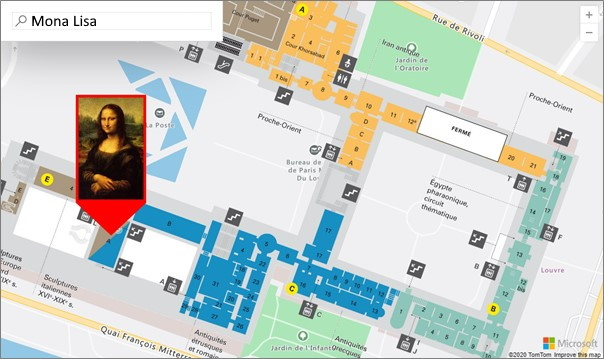
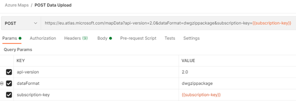
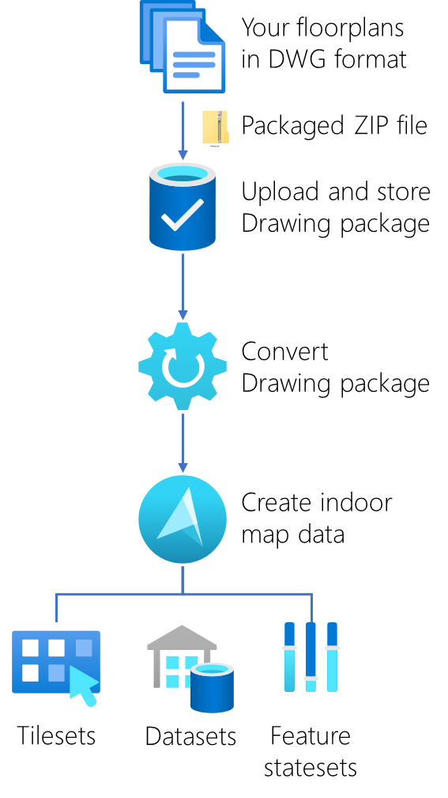

## Introduction

When you are working inside a building, like an office, factory, shopping mall, or something like a museum. There are probably a lot of sensors that can tell you information about that building, like what is the temperature and air quality per room, is there any door open or is there some alarm happening. When you in a big building and you want to know the fastest route to a specific room/store/painting, you probably apricate some help in navigating. These are all smart buildings.

Using indoor maps will not only help you visualize the building/floorplans and its IoT sensors, but also interact and navigate with it. For example, when you are for the first time in the [Louvre Museum](https://www.bing.com/search?q=paris+louvre+museum) and want to know how to get to the famous [Mona Lisa](https://www.bing.com/search?q=Mona%20Lisa) painting, you can use an interactive indoor map to find and navigate to what you were searching for.

 
By using the same technology for mapping outdoors we can use Azure Maps also for indoor mapping solutions. [Azure Maps](https://azure.microsoft.com/en-us/services/azure-maps/) is a collection of geospatial services APIs and SDKs that use fresh mapping data to provide geographic context to web and mobile applications. [Azure Maps Creator](https://azure.microsoft.com/en-us/updates/azure-maps-creator-is-now-generally-available/) is the service that facilitates the creation of indoor maps using your own building drawings. Azure Maps has SDKs for Web, Android, and iOS (is coming), and is available in [Power BI](https://docs.microsoft.com/en-us/azure/azure-maps/power-bi-visual-getting-started).

 
## Azure Maps Creator

To get started using the Azure Maps Creator services, you first need a free [Azure subscription](https://azure.microsoft.com/en-us/free/) and an Azure Maps account. To use the Creator services, Azure Maps Creator must be created in an Azure Maps account. For information about how to create Azure Maps Creator in Azure Maps, see [Manage Azure Maps Creator](https://docs.microsoft.com/en-us/azure/azure-maps/how-to-manage-creator).

After you have created an Azure Maps account you get two options to authenticate to the Azure Maps services; a subscription API key or by using Azure Active Directory (what is a more secure way). The API key you use in the API calls. Currently, there are two endpoint regions: Europe, and the United States.

 
Second, you need to have or create your own CAD drawings from your building like floorplans in the `.DWG` file format (AutoCAD DWG file format version AC1032). These drawings need then be packaged into a simple `.ZIP` file including a `manifest.json` file that describes the Drawing package. See for more information, the [Conversion Drawing package guide](https://docs.microsoft.com/en-us/azure/azure-maps/drawing-package-guide). This step is very important, creating and preparing your floorplans including all the interactive elements that make your solution stand out or not.

The process after the drawing package creation is very straightforward. You upload the drawing package using the [Data Upload API](https://docs.microsoft.com/en-us/rest/api/maps/data-v2), convert it using the [Conversion API](https://docs.microsoft.com/en-us/rest/api/maps/v2/conversion), and create a dataset and tileset using the [Dataset API](https://docs.microsoft.com/en-us/rest/api/maps/v2/dataset) and [Tileset API](https://docs.microsoft.com/en-us/rest/api/maps/v2/tileset). See this tutorial on how to do this step by step: [Use Creator to create indoor maps](https://docs.microsoft.com/en-us/azure/azure-maps/tutorial-creator-indoor-maps).

* **Dataset** is a collection of indoor map features.
* **Tileset is** a collection of vector data that represents a set of uniform grid tiles.
* **Feature statesets** are collections of dynamic properties (states) that are assigned to dataset features, such as rooms or equipment.

 
## Rendering the indoor map

The [Azure Maps Web SDK](https://docs.microsoft.com/en-us/azure/azure-maps/) includes the Indoor Maps module. This module offers extended functionalities to the Azure Maps **Map Control library**. The Indoor Maps module renders indoor maps created in Creator. It integrates widgets, such as floor picker, that help users visualize the different floors. The Indoor Maps module also supports dynamic map styling. For a step-by-step walkthrough to implement feature stateset dynamic styling in an application, see [Use the Indoor Map module](https://docs.microsoft.com/en-us/azure/azure-maps/how-to-use-indoor-module).

If you like to see what more is possible with the Azure Maps Web Control, there is a sample gallery with a collection of 270 code samples. See the [Azure Maps Web SDK Samples](https://samples.azuremaps.com/).