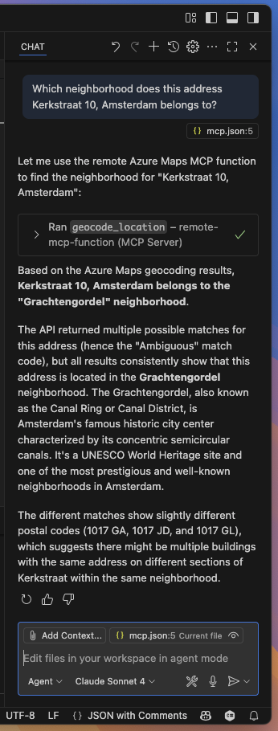

In today’s AI era, you’ve likely interacted with Microsoft Copilot, ChatGPT, or Claude.ai, tools powered by advanced **Large Language Models** (LLMs). These models excel at understanding and generating human-like text based on vast amounts of training data. However, while LLMs are impressive at reasoning and answering general questions, they fall short when it comes to performing real-world tasks or retrieving live, domain-specific information.

This is where the **Model Context Protocol** (MCP) comes in.

MCP extends the capabilities of LLMs by connecting them to structured, real-time, and authoritative data sources, essentially giving them access to **tools** and APIs that can “do things” instead of just “talk about things.” One compelling use case is enriching LLMs with geospatial intelligence by integrating Azure Maps into an MCP server.

Let’s consider a practical example, you ask Copilot:

> “Which neighborhood does this address Kerkstraat 10, Amsterdam belongs to?”

Out-of-the-box, the model may not know the answer. At best, it might offer a hallucinated guess based on its training data, which is often outdated or incomplete for such hyper-local questions.

By integrating Azure Maps into an MCP server, you empower the LLM to perform (reverse) geocoding to get address details, Identify neighborhoods, postal codes, or administrative regions, visualize or reason about spatial data like routes, boundaries, or real-time traffic details.

With an MCP server acting as a bridge between the LLM and Azure Maps, the process looks like this:
1.	**User Query:** The user (or AI agent) asks a geographically relevant question.
2.	**MCP Routing:** The MCP server receives the query and routes it to a plugin/tool backed by Azure Maps APIs.
3.	**Azure Maps Execution:** The server makes the API call (e.g., reverse geocoding, route calculation, etc).
4.	**LLM Response Generation:** The MCP server returns structured results to the LLM, which incorporates it into a coherent and accurate response.



Integrating Azure Maps into an MCP server is surprisingly straightforward, especially when using **.NET** and **Azure Functions**. In this blog, I’ll walk you through the core setup to expose Azure Maps as a tool to an LLM via MCP.

While implementing a Model Context Protocol (MCP) server normally requires strict adherence to the [MCP protocol](https://modelcontextprotocol.io/) specifications, Microsoft has made it much easier by providing a prebuilt extension: `Microsoft.Azure.Functions.Worker.Extensions.Mcp`. This NuGet package abstracts away most of the boilerplate, so you can focus on defining the tools you want to expose and simply wire them to Azure Maps APIs.
We’ll start by creating a standard Azure Functions project using **Visual Studio** or **Visual Studio Code**.

## Step 1: Set Up the Project

Create a new Azure Functions project targeting .NET 9 or newer and add the following NuGet package:

`dotnet add package Microsoft.Azure.Functions.Worker.Extensions.Mcp`

## Step 2: Configure MCP 

Here’s a sample `Program.cs` that sets up the MCP tool metadata and registers an `HttpClient` for making requests to Azure Maps:

```csharp
var builder = FunctionsApplication.CreateBuilder(args);

builder.ConfigureFunctionsWebApplication();
builder.EnableMcpToolMetadata(); // Enables tool registration metadata
builder.ConfigureMcpTool("Azure Maps Tool"); // Register the tool name exposed to LLMs

builder.Services
    .AddHttpClient("AzureMaps") // Named http client for Azure Maps
    .AddStandardResilienceHandler(); // Optional: adds resilience policies

builder.Build().Run();
```

## Step 3: Implement an MCP Tool

Let’s expose one function for this example: **geocoding a location** (i.e., converting an address or landmark into geographic coordinates) using Azure Maps.

Here’s the function code:

```csharp
public class AzureMapsTools(IHttpClientFactory httpClientFactory, IConfiguration configuration)
{
    [Function(nameof(GeocodeLocation))]
    public async Task<string> GeocodeLocation(
        // This attribute registers the function as an MCP tool trigger.
        // The name and description help users understand what the tool does.
        [McpToolTrigger(
            "geocode_location",
            "Geocode a location, such as an address or landmark name using Azure Maps")] ToolInvocationContext context,
        [McpToolProperty(
            "location",
            "string",
            "address or landmark name")] string location 
    )
    {
        // Get the Azure Maps subscription key from configuration.
        // This key is needed to authenticate requests to the Azure Maps API.
        // If the key is missing, throw an error to alert the developer.
        var subscriptionKey = configuration["AZURE_MAPS_SUBSCRIPTION_KEY"] 
            ?? throw new InvalidOperationException("Azure Maps subscription key not configured");

        // Build the URL for the Azure Maps geocoding API.
        // The query parameter contains the location, and the subscription key authenticates the request.
        var url = $"https://atlas.microsoft.com/geocode?api-version=2025-01-01&query={Uri.EscapeDataString(location)}&subscription-key={subscriptionKey}";

        // Create an HTTP client to send the request.
        using var httpClient = httpClientFactory.CreateClient("AzureMaps");

        // Send the GET request to the Azure Maps API.
        var response = await httpClient.GetAsync(url);

        // Check if the response was successful.
        // If not, read the error message and throw an exception.
        if (!response.IsSuccessStatusCode)
        {
            var error = await response.Content.ReadAsStringAsync();
            throw new HttpRequestException($"Azure Maps API failed with status {response.StatusCode}: {error}");
        }

        // Read the result from the response as a string (JSON format).
        var result = await response.Content.ReadAsStringAsync();

        // Return the geocoding result to the caller.
        return result;
    }
}
```

The function returns the full Azure Maps response in JSON format, which can then be parsed or summarized by the LLM in its reply.

By combining the *real-time spatial intelligence* of Azure Maps with the *reasoning capabilities of large language models*, you move beyond passive AI into the realm of *actionable AI agents*, where systems not only understand queries but execute real-world tasks in response.

You can easily add more tools such as reverse geocoding, route calculation, POI search, or even time zone conversion, all backed by the same MCP server architecture.