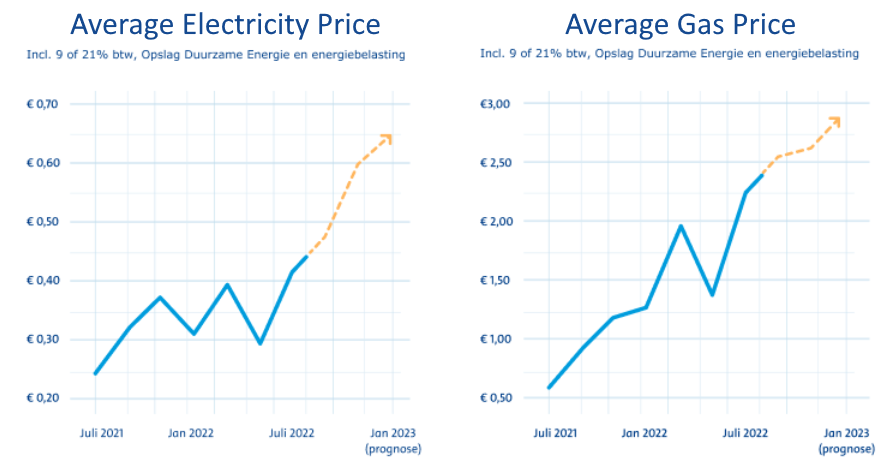
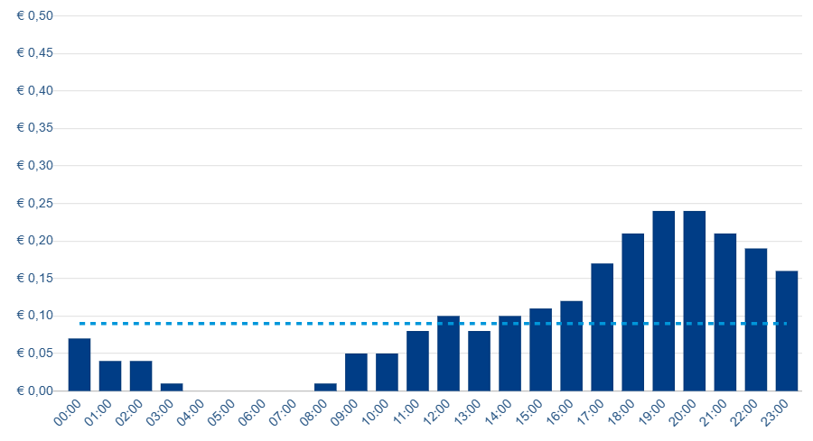
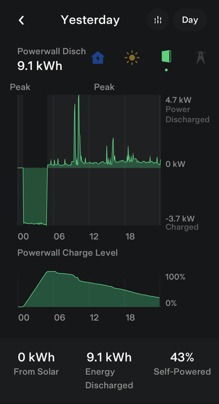

## Introduction

In today's energy and climate crisis, prices for energy such as natural gas for heating and electricity have risen significantly in recent years, with prices at least two to three times higher than in past decades. This is particularly true in Europe, where affordable natural gas from Russia is currently not available. The price of electricity is also closely linked to the price of natural gas, so even when clean electricity is generated through wind, solar, and nuclear power, the price is still higher than what we are used to. This is due to the demand for and availability of electricity, which is typically high during the day and in the evening, but low during nighttime. When there is no wind or sun, electricity is generated by gas, coal, and lignite power plants, which is harmful to the environment. The mix of energy and the linked gas price drives up our energy bills.

The demand for energy is increasing worldwide as countries and markets modernize and raise their standard of living. As a result, it is unlikely that energy prices will return to their previous lows. However, there are ways for consumers to reduce their energy bills.

## Dynamic Pricing

In the past, most people in the Netherlands had fixed energy contracts for one or more years, with a fixed monthly price. New energy contracts still use this model, but there is little incentive to save or reduce consumption and habits when demand is high. However, dynamic pricing in combination with home or block storage of electricity in batteries can make a big difference. By storing electricity when it is cheap (typically during the night) and using it during the day, you can save money without changing your habits.

## Home Battery Storage

For example, I have a dynamic energy contract ([ANWB](https://www.anwb.nl/huis/energie)) where the price of electricity changes every hour. I also have a home battery, a Tesla Powerwall 2, with a capacity of 13.5 KWh (read [here](/my-solar-energy-and-tesla-powerwall-2-setup/) more details about my setup). I charge the battery automatically between 1am and 5am in the night when the price for electricity is almost free and sell my solar electricity during the day when the price is high. This has resulted in a very low energy bill for me.

Even if you do not have solar panels, a combination of a dynamic energy contract and a home battery can make a big difference in your energy bill. Home batteries are becoming more affordable each year, and in a normal setup, you can earn back your investment in just under two years with current energy prices.

