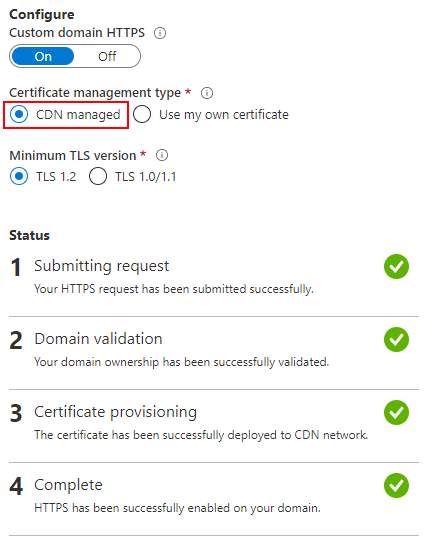

Today, when a website does not have an **SSL/TSL certificate**, web browsers give you a warning `not secure`. This warning not only scares people but also gives you a disadvantage in search engine ranking. On Azure, web sites have a default https-enabled URL, like `https://sitename.azurewebsites.net/`, but when you have a vanity domain configured, you are missing this secure connection. Luckily there are some free SSL/TLS certificate options to explore. 

## Let's Encrypt

Wait, there is [Let's Encrypt](https://letsencrypt.org/), its free! Why are you not using this excellent service? Yes, that is true, but there are some downsides to use Let's Encrypt (on Azure), like:

* You need an Azure Web App Site Extension to enable and renew certificates, like this one from [Simon J.K. Pedersen](https://github.com/sjkp/letsencrypt-siteextension/).
* Let's Encrypt does not have any official support or SLA model.
* It's complex to implement correctly for all the Azure services you need.
* Let's Encrypt only validates the domain name. There are **no further validations** like other CAs, and certificates are misused for phishing attacks.

## Azure Built-In free certificates

It should be easy and free to enable SSL/TSL certificates in Azure. This was the number one question on [UserVoice feedback](https://feedback.azure.com/forums/170024-additional-services). Microsoft implemented this Built-In free certificate option for some services, like Azure [CDN](https://azure.microsoft.com/en-us/services/cdn/), [Front Door](https://azure.microsoft.com/en-us/services/frontdoor/), [Application Gateway](https://azure.microsoft.com/en-us/services/application-gateway/), etc. When you put one of those services in front of your web site (like what I did with [this blog](/)), you can enable an auto-renewable Built-In certificate for free.

> "[Custom Domain HTTPS feature](https://docs.microsoft.com/en-us/azure/cdn/cdn-custom-ssl) enables you to deliver content to your users securely over your own domain. This is done by encrypting the data between the CDN and your users' clients (typically web browsers) via TLS protocol (which is a successor of the SSL protocol) using a certificate. Using our "CDN managed certificate" capability, you can enable this feature with just a few clicks and have Azure CDN completely take care of certificate management tasks such as its renewal. You can also bring your own certificate (stored in Azure Key vault ) or even purchase a new certificate through Key vault and have Azure CDN use that certificate for securing the content delivery."

## Use your own certificate

There is also an option to use your own certificate, especially when you need a naked domain (without the "www"-prefix). This is not currently possible with the Build-In certificate option. See "[Hosting a Static Site on Azure using CDN and HTTPS](/hosting-a-static-site-on-azure-using-cdn-and-https/)" how to fix this.