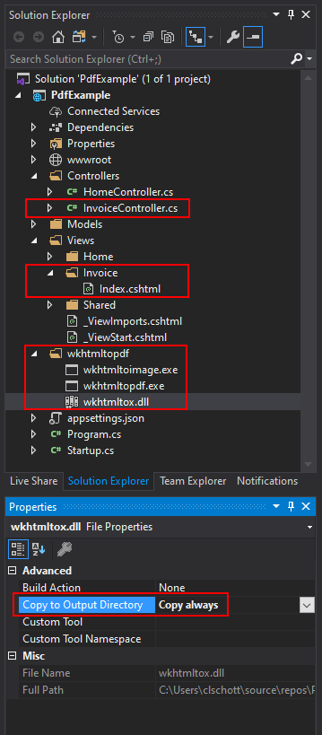
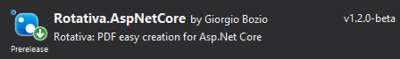

There are many libraries and services to generate PDF files for asp.net core web applications. There are excellent commercial solutions out there, but if you need a free solution, it gets harder. Some libraries are hard to use, or others are limited in functionality. I need a free, easy to use, and quick solution to generate PDF files on an [Azure Web App](https://azure.microsoft.com/en-us/services/app-service/web/).

## Can a View retrun a PDF?

What I need is a View that returns a PDF and not HTML what it usually does. The beauty of using a standard View is that I can use my web and asp.net core knowledge to design the View. In this case, I need to generate invoices. 

> I'm using MVC as a pattern to structure my web project.

I start by creating an invoice controller and a correlated view, where I can design an invoice in HTML.

```c#
public class InvoiceController : Controller
{
    public IActionResult Index()
    {
        return View();
    }
}
```

## html to pdf

Next, we need a way to render the HTML (the View) as PDF. I use the opensource command-line tool [wkhtmltopdf](https://wkhtmltopdf.org/). It is easy to use and compatible to run on Azure Web Apps.

> wkhtmltopdf is an opensource (LGPLv3) command-line tool to render HTML into PDF using the Qt WebKit rendering engine. It runs entirely "headless."

[Download](https://wkhtmltopdf.org/downloads.html) wkhtmltopdf and add the files to your project. I created a folder `/wkhtmltopdf` in my solution. When downloading, pick the correct version that is compatible with your Azure Web App (Windows or Linux).

Add the files `wkhtmltoimage.exe`, `wkhtmltopdf.exe`, and `wkhtmltox.dll` to your solution and change the 'Copy to Output Directory' to 'Copy always.'



## Rendering the PDF

An easy way to interact with the wkhtmltopdf command-line tool is to use the [Rotativa](https://github.com/webgio/Rotativa.AspNetCore) library from NuGet.



First, we need to tell Rotativa where to find the wkhtmltopdf tool. Add the following line to `Startup.cs`

```c#
public void Configure(IApplicationBuilder app, IWebHostEnvironment env)
{
    ...

    RotativaConfiguration.Setup(env.ContentRootPath, "wkhtmltopdf");
}
```

Next, we create a new action result in our InvoiceController that will return the PDF file. This new action result 'IndexAsPDF' will reuse the View we already had created. 

```c#
public class InvoiceController : Controller
{
    ...

    public IActionResult Pdf()
    {
        return new ViewAsPdf("Index")
        {
            FileName = "Invoice.pdf",
            PageSize = Size.A4,
            MinimumFontSize = 16,
            ContentDisposition = ContentDisposition.Inline,
        };
    }
}
```

When we go to the URL `https://localhost:44349/Invoice/Index` it will show the HTML version of the Invoice, but when we go to `https://localhost:44349/Invoice/Pdf` we get the PDF version.