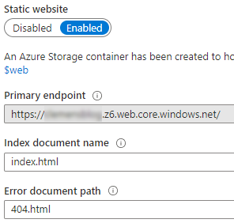
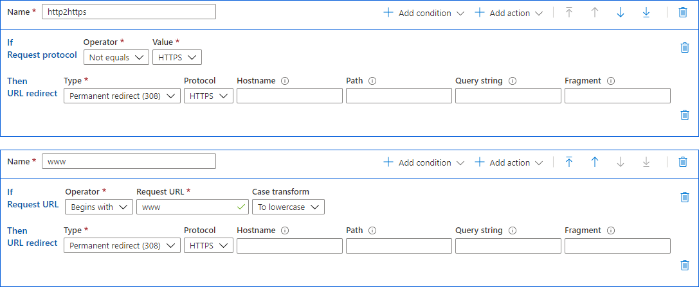

Most websites don’t need a dynamically generated page for every visitor; it is slow, expensive, and requires continuous updates to be secure. A static site is fast and reliable. I hear you thinking; this is old school, most websites are interactive and are using a CMS in some kind to manage their content.

## Headless CMS

The solution for a static website is to make use of a headless CMS, like [Hugo](https://gohugo.io/) or [Jekyll](https://jekyllrb.com/). Basascly, you generate a static site from content and a template, similar to what this blog is doing.

## A fast and scalable website

[Microsoft Azure](https://azure.microsoft.com/) Cloud platform is the ideal candidate to host your website and web applications. Usually, when I create a website, I use **App Service Web Apps**, which runs your solution in a scalable manner.

But there is also another option, which is cheaper and is very fast. You can also host your static website from a [Storage Account](https://azure.microsoft.com/en-us/services/storage/blobs/), and when you combine this with Azure [Content Delivery Network](https://azure.microsoft.com/en-us/services/cdn/) (CDN), your site is lightning fast and available worldwide.

## Storage Account

We start by creating a normal general-purpose storage account in Azure. Use a unique name and choose a location close to yourself. I live in the Netherlands, so West Europe is, in my case, the best option. Replication I don’t need, so locally redundant, is the cheapest for me.

Next, we need to **enable the Static website option** in the storage account, and which also gives us the primary endpoint URL we need later.

Upload some test HTML content into the BLOB storage. I used the build-in Storage Explorer when uploading. Use the container **$web** (this was created by enabling the Static website option).

Let’s test if the files are visible in the browser. Use the primary endpoint URL from the enable the Static website option. It looks something like: `https://«your unique name».z6.web.core.windows.net/`

> The z6 in the URL is the location of the datacenter and can be different in your situation.

## Content Delivery Network (CDN)

To make your website fast and responsive, is it to have it close to your visitors. Visitors from the US and Australia are far from West Europe, so by using a CDN, the content is as closeby as possible. Azure CDN has [130 point-of-presence (POP) locations](https://docs.microsoft.com/en-us/azure/cdn/cdn-pop-locations) worldwide worldwide.

Creating an Azure CDN is easy, give it a unique name and point it to the primary endpoint URL from the Storage account we had created earlier.

Test if your site is still working, and go to the CDN edge URL. It looks something like: `https://«your unique name».azureedge.net/`

## Domain names and Azure DNS

Our site is now working, served by a storage account, and cached by a CDN worldwide. Now we need a beautiful domain name and URL before we can communicate this to our visitors.

I require a subdomain “www” and a naked/root domain without the “www” prefix pointing to the CDN edge URL. For the subdomain, this is easy, use a CNAME-record. But for a naked/root domain, it is a little bit more complicated. You can’t use a CNAME, but need an A- and AAAA-record pointing to an IP address. But how do I know the right IP address for the Azure CDN edge, and what happens if this IP address changes (and changes happen)? Luckily, when using Azure DNS, we can point to Azure resources what automatically takes the right IP address. We add the naked/root domain and subdomain to the CDN under Custom domains. And test if the website is working in our browsers.

## Traffic encryption using SSL for HTTPS

If your website is not using HTTPS, most browsers warn you nowadays. To make the traffic secure between your visitors and the site, we need encryption. We do this by enabling HTTPS at the CDN endpoint. By enabling HTTPS, you get a free certificate that automatically renews. There is a catch if you need HTTPS for a naked/root domain; you need to bring your certificate. Store your certificate in a Key Vault and give the CDN permissions to read this certificate. Then it is possible to enable HTTPS for a naked/root domain.

## URL rewire rules

I don’t like the “www” prefix before my domain, but people still type this. To make it easy for people, I want to redirect traffic to the right URL.

1. Trafic to “www” needs to go to my naked/root domain.
2. Trafic that is not using HTTPS (encryption) needs to go to HTTPS.

The Azure CDN Rules engine is more than capable of rewriting the URL, and I used HTTP 308 (permanent redirect) to redirect the traffic to the right place.

## Azure Static Web Apps

> Azure [Static Web Apps](https://azure.microsoft.com/en-us/services/app-service/static/) (currently in preview) gives you similar capabilities combined with a GitHub native workflow and serverless API’s.