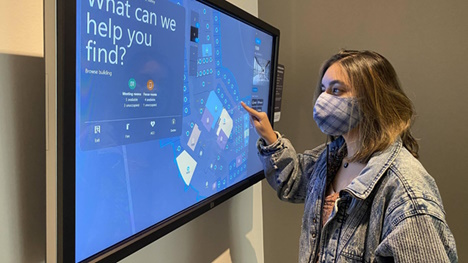

In the evolving landscape of remote work and [sustainability](https://www.microsoft.com/en-us/sustainability/approach), the optimization of physical spaces has become increasingly important. Microsoft is at the forefront of this transformation, utilizing [Azure Maps Creator](https://aka.ms/azuremapscreator) to enhance the management of its diverse global workspaces. This product is essential for facilities managers, providing dynamic, interactive indoor mapping solutions that allow for real-time assessment of space and resources, quick response to critical issues, and seamless adaptation to the needs of a hybrid workforce—all while minimizing environmental impact.

Azure Maps Creator is not just a product for efficient space management; it's a showcase of Microsoft's commitment to creating exceptional experiences for employees, customers, and partners visiting its buildings. By integrating IoT sensors throughout its facilities, Microsoft can monitor various environmental parameters such as temperature, energy consumption, and occupancy levels. This data, coupled with the capabilities of [Azure Digital Twins](https://learn.microsoft.com/en-us/azure/digital-twins/overview) and [Azure Maps](https://azuremaps.com/), empowers the [Digital Workplace team](https://www.microsoft.com/insidetrack/blog/transforming-microsoft-buildings-with-iot-technology-and-indoor-mapping/) to construct detailed floorplans and data pipelines that support sustainable operations and superior indoor navigation.

Imagine a hybrid employee contemplating their commute to the office. With Azure Maps Creator, they can evaluate whether to attend a meeting in person or remotely via Microsoft Teams, consider the environmental and time implications of different travel options, and even check parking availability. This decision-making process is part of what Microsoft refers to as the "Green Commute" initiative, which aims to identify the most efficient commuting method in terms of both time and energy.

Upon arrival at a Microsoft facility, employees are greeted by kiosks equipped with Azure Maps Creator's interactive maps. These maps not only display detailed floor plans but also provide navigational guidance to meeting locations, individuals, or specific areas within the building. For the health-conscious, the maps can suggest stair routes as an alternative to elevators. And for those unexpected meetings, this experinace enables the instant search and reservation of available meeting rooms, accessible via the kiosk or a mobile device.

The integration of Azure Maps Creator into Microsoft's kiosks exemplifies the company's innovative approach to enhancing the workplace experience. It transforms technical building plans into smart, adaptable overlays that offer a wealth of interior data visualization options. To learn more about Azure Maps Creator and its comprehensive capabilities, be sure to explore the [Azure Maps Blog](https://blog.azuremaps.com).

> This blog post was initially written by me for the [Azure Maps Tech Blog](https://blog.azuremaps.com).