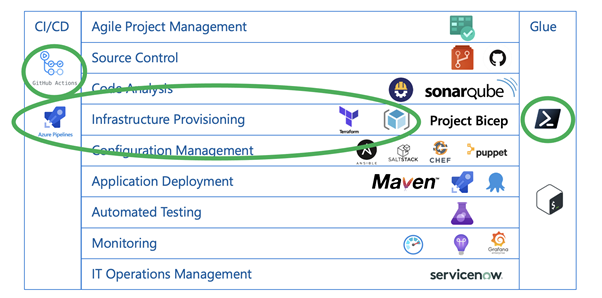
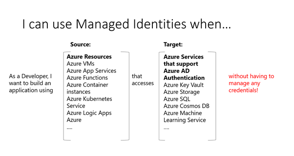
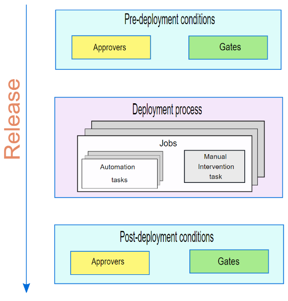

## Infrastructure as Code

Infrastructure as Code (IaC) is the process of managing and provisioning infrastructure and configuration dependencies for application stacks using machine-readable definition files rather than physical hardware configuration or interactive configuration tools.

### What is Infrastructure as Code?

* Source Controlled
* In code (Scripts & Templates)
* Automated & Continuous Deployment
* Testing
* Feedback loop (Monitoring)

### Categories of IaC tooling

You can use many declarative [infrastructure deployment technologies](https://docs.microsoft.com/en-us/azure/architecture/framework/devops/automation-infrastructure) with Azure. These fall into two main categories.

* Imperative IaC involves writing scripts in a language like Bash, PowerShell, C# script files, or Python. These programmatically execute a series of steps to create or modify your resources. When using imperative deployments, it is up to you to manage things like dependency sequencing, error control, and resource updates.
* Declarative IaC involves writing a definition of how you want your environment to look; the tooling then figures out how to make this happen by inspecting your current state, comparing it to the target state you've requested, and applying the differences.

## Terraform

[Hashicorp Terraform](https://www.terraform.io/) is an open-source tool for provisioning and managing cloud infrastructure. It codifies infrastructure in configuration files that describe the topology of cloud resources. These resources include virtual machines, storage accounts, and networking interfaces. The Terraform CLI provides a simple mechanism to deploy and version the configuration files to Azure.

> **See also:**
> * [Terraform with Azure](https://docs.microsoft.com/en-us/azure/developer/terraform/overview)
> * [Using Terraform together with Azure, Azure Pipelines & GitHub Actions](https://geekzter.medium.com/using-terraform-with-azure-azure-pipelines-github-actions-86e043bd0d9e)

Infrastructure as Code with Terraform has become pervasive for provisioning cloud infrastructure. Azure engineering has invested in Terraform AzureRM provider as a first-party control plane, of equal importance to Azure-Cli and PowerShell, for Azure. As companies mature in their use of Terraform, there is an increasing need to apply DevOps practices to their IaC development to increase velocity and reduce Mean-Time-To-Recover from failures.

> **See also:**
> * [Immutable Infrastructure](https://docs.microsoft.com/en-us/azure/architecture/solution-ideas/articles/immutable-infrastructure-cicd-using-jenkins-and-terraform-on-azure-virtual-architecture-overview) CI/CD using Jenkins and Terraform on Azure Virtual Architecture.

### Challenges

Doing automation around terraform has several key challenges:

* How you deploy in production **MUST** match how you deploy in development and testing?
* Testing requires that physical resources be deployed before the test.
* State management is challenging in multi-user/multi-team scenarios.
* Not a lot of best practices around how to segment/manage remote state & workspaces.

### Testing

Terraform enables the definition, preview, and deployment of cloud infrastructure. Using Terraform, you create configuration files using HCL syntax. The HCL syntax allows you to specify the cloud provider - such as Azure - and the elements that make up your cloud infrastructure. After you create your configuration files, you create an execution plan that allows you to preview your infrastructure changes before they're deployed. Once you verify the changes, you apply the execution plan to deploy the infrastructure.

> **See also:**
> * Best practices [Terraform testing](https://docs.microsoft.com/en-us/azure/developer/terraform/best-practices-testing-overview) overview.
> * Automated testing with [Terratest](https://github.com/gruntwork-io/terratest). Terratest is a critical component in the toolchain needed for effective terraform development.

## Project Lucidity

[Project Lucidity](https://github.com/rguthrie-ghec/Terraform-Pipelines) allows you to deploy infrastructure to Azure using Terraform easily. It addresses some of the challenges from above:

* An opinionated approach to terraform development on Azure using Azure DevOps
* Flexible installation script that creates a project with pipelines configured so you can focus on writing terraform and creating test
* Minimize fixed design choices while adhering to best practices
    * The directory structure for maintaining Terraform modules and deployments.
    * Use environment variables stored in .env files instead of .tfvars
    * Use Terratest to test your terraform code as an acceptance test
    * Secrets should only ever live in KeyVault.

## Azure Bicep

[Azure Bicep](https://docs.microsoft.com/en-us/azure/azure-resource-manager/templates/bicep-overview) is an abstraction built on top of Azure ARM Templates and Azure Resource Manager that offers a cleaner code syntax with better support for modularity and code reuse. Azure Bicep moves away from the JSON syntax used by ARM Templates and is much easier to read and write Infrastructure as Code (IaC) in Azure.

### What is Azure Bicep?

Azure Bicep is a new declarative Domain Specific Language (DSL) for deploying Azure resources. This new language aims to make it easier to write Infrastructure as Code (IaC) targeting Azure Resource Manager (ARM) using a syntax that's more friendly than the JSON syntax of Azure ARM Templates.

Azure Bicep works as an abstraction layer built on top of ARM Templates. Anything that can be done with Azure ARM Templates can be done with Azure Bicep as it provides a "transparent abstraction" over ARM (Azure Resource Manager). With this abstraction, all the types, API versions, and properties valid within ARM Templates are also valid with Azure Bicep.

Azure Bicep is a compiled language. This means that the Azure Bicep code was converted into ARM Template code. Then, the resulting ARM Template code is used to deploy the Azure resources. This enables Azure Bicep to use its syntax and compiler for authoring Azure Bicep files that compile down to Azure Resource Manager (ARM) JSON as a sort of intermediate language (IL).

## Security Best Practices for IaC

The security of IaC definitions, deployments, and operational workloads are critically important due to the high level of permissions required to implement an IaC solution effectively. This chapter attempts to outline key best practices that contribute to secure IaC strategies.

### Use directory services for authentication

Directory services enable you to safeguard user and system credentials by enforcing strong authentication and conditional access policies. These technologies allow you to manage your identities by ensuring that the right services have the right access to the right resources.

* Use directory services, like [Azure Active Directory](https://azure.microsoft.com/en-us/services/active-directory/), for authenticating users and services when deploying infrastructure so that Role-Based-Access-Control can be used to apply the principle of least privilege.
* When deploying infrastructure, use a dedicated identity so that the blast radius of a leaked credential is scoped as narrowly as possible.
* When deploying infrastructure, leverage platform authentication technologies that avoid needing to store a username and password to make it harder for credentials to leak. In practice, this means leveraging [Managed Identities](https://docs.microsoft.com/en-us/azure/active-directory/managed-identities-azure-resources/overview) or [Service Connections](https://docs.microsoft.com/en-us/azure/devops/pipelines/library/connect-to-azure?view=azure-devops) in Azure DevOps.
* When a username or password must be used based on technology limitations, all sensitive information should be stored in a secret store such as [Key Vault](https://clemens.ms/azure-key-vault/) and masked in any logging output so that secrets are not leaked during deployments.

### Rotate Deployment Credentials

Credential rotation refers to the changing/resetting of a credential(s). Limiting a credential's lifespan reduces the risk from and effectiveness of credential-based attacks and exploits by condensing the window of time during which a stolen credential may be valid.

* All secrets required to authenticate to external services (i.e., Azure) should expire on a regular cadence so that any leaked credentials are not valid indefinitely.
* Design automated credential rotation from the beginning of a project so that the delivered solution can recover from a security breach quickly.

### Apply the principle of least privilege

The principle of least privilege (PoLP), also known as the principle of minimal privilege or the principle of least authority, requires that in a particular abstraction layer of a computing environment, every module (such as a process, a user, or a program, depending on the subject) must be able to access only the information and resources that are necessary for its legitimate purpose. Limiting the access of a computing-environment reduces the risk from and effectiveness of credential-based attacks and exploits by minimizing the blast radius of a leaked credential.

* Identities used for infrastructure deployments should have a minimal set of privileges so that a leaked credential has the smallest blast radius possible.
* Use separate identities for deploying to each environment (i.e., dev, QA, prod) so that a leaked credential for one of those environments does not grant access to another environment. This also protects against a bug being tested in a dev IaC deployment from unintentionally impacting non-test environments.

### Manage secrets securely

Secure secrets management is essential to protect data in the cloud and can be used to store sensitive information like passwords and certificates securely. Managed secret stores often provide the ability to protect sensitive information using strong encryption while avoiding the need to keep secrets in a repository or as a plain text environment variable.

* Secrets required for deployments, such as database credentials or private certificates, should be referenced from a secure vault to be stored at rest with encryption and are only accessible via authenticated requests.

### Deploy through automated pipelines

CI/CD pipelines are at the core of daily operations for many businesses today. When set up correctly, these processes help keep the delivery process consistent by automating many manual tasks and providing visibility into how the software is being worked on.

* Infrastructure deployments to non-development environments should only be done through repeatable processes such as a continuous deployment pipeline so that it is not possible for the deployed environment to drift from the environment as described through IaC templates.

### Enforce branch policies and PRs

Branch policies are an essential part of the Git workflow and enable you to: Isolate work in progress from the completed work in your master branch. Guarantee changes build before they get to Main. Limit who can contribute to specific branches.

* Changes to IaC should only be deployed to non-development environments after being reviewed by the team and merged into the appropriate branch so that malicious or unintended changes to infrastructure are not deployed into production environments. See Configure [Branch Policies](https://docs.microsoft.com/en-us/azure/devops/repos/git/branch-policies-overview?view=azure-devops) in Azure DevOps.

### Use gated approvals in automated releases

Approvals and gates give you additional control over the start and completion of the deployment pipeline. Each stage in a release pipeline can be configured with pre-deployment and post-deployment conditions, including waiting for users to manually approve or reject deployments and checking with other automated systems until specific conditions are verified.

* Infrastructure deployments should not be deployed into customer-facing environments without the explicit approval of an application operator so that they can monitor the application and its dependencies after the deployment completes. See [Release Approvals and Gates](https://docs.microsoft.com/en-us/azure/devops/pipelines/release/approvals/?view=azure-devops) Overview.

## Azure Blueprints

Just as a blueprint allows an engineer or an architect to sketch a project's design parameters, [Azure Blueprints](https://azure.microsoft.com/en-us/services/blueprints/) enables cloud architects and central information technology groups to define a repeatable set of Azure resources that implements and adheres to an organization's standards, patterns, and requirements. Azure Blueprints makes it possible for development teams to rapidly build and stand-up new environments with trust they're building within organizational compliance with a set of built-in components, such as networking, to speed up development and delivery.

Blueprints are a declarative way to orchestrate the deployment of various resource templates and other artifacts such as:

* Role Assignments
* Policy Assignments
* Azure Resource Manager templates (ARM templates)
* Resource Groups

The Azure Blueprints service is backed by the globally distributed Azure Cosmos DB. Blueprint objects are replicated to multiple Azure regions. This replication provides low latency, high availability, and consistent access to your blueprint objects, regardless of which region Azure Blueprints deploys your resources to.



### How it's different from ARM templates

The service is designed to help with environment setup. This setup often consists of a set of resource groups, policies, role assignments, and ARM template deployments. A blueprint is a package to bring each of these artifact types together and allow you to compose and version that package, including through continuous integration and continuous delivery (CI/CD) pipeline. Ultimately, each is assigned to a subscription in a single operation that can be audited and tracked.

Nearly everything that you want to include for deployment in Azure Blueprints can be accomplished with an ARM template. However, an ARM template is a document that doesn't exist natively in Azure – each is stored either locally or in source control. The template gets used for deployments of one or more Azure resources, but once those resources deploy there's no active connection or relationship to the template.

With Azure Blueprints, the relationship between the blueprint definition (what should be deployed) and the blueprint assignment (what was deployed) is preserved. This connection supports improved tracking and auditing of deployments. Azure Blueprints can also upgrade several subscriptions at once that are governed by the same blueprint.
There's no need to choose between an ARM template and a blueprint. Each blueprint can consist of zero or more ARM template artifacts. This support means that previous efforts to develop and maintain a library of ARM templates are reusable in Azure Blueprints.

### How it's different from Azure Policy

A blueprint is a package or container for composing focus-specific sets of standards, patterns, and requirements related to the implementation of Azure cloud services, security, and design that can be reused to maintain consistency and compliance.

A policy is a default allow and explicit deny system focused on resource properties during deployment and for already existing resources. It supports cloud governance by validating that resources within a subscription adhere to requirements and standards.

Including a policy in a blueprint enables the creation of the right pattern or design during assignment of the blueprint. The policy inclusion makes sure that only approved or expected changes can be made to the environment to protect ongoing compliance to the intent of the blueprint.

A policy can be included as one of many artifacts in a blueprint definition. Blueprints also support using parameters with policies and initiatives.

### Blueprint definition locations

When creating a blueprint definition, you'll define where the blueprint is saved. Blueprints can be saved to a management group or **parent** subscription that you have Contributor access to. If the location is a management group, the blueprint is available to assign to any **child** subscription of that management group.

### Managing Blueprints as Code

Using the Blueprints in the Azure Portal is a great way to get started with Blueprints or to use Blueprints on a small-ish scale, but often you'll want to manage your [Blueprints-as-Code](https://github.com/Azure/azure-blueprints) for a variety of reasons, such as:

* Sharing blueprints
* Keeping blueprints in source control
* Putting blueprints in a CI/CD or release pipeline

## Testing strategies

[Compliance-as-Code](https://clemens.ms/compliance-as-code/) can be summarized as the organizational capability to automate the implementation, verification, remediation, monitoring, and compliance status reporting. This automation comes in the form of code and is integrated into the code repositories used by Devs and Engineers. It becomes "just another piece of code." I have written an entire blog post about [Compliance-as-Code](https://clemens.ms/compliance-as-code/) here.