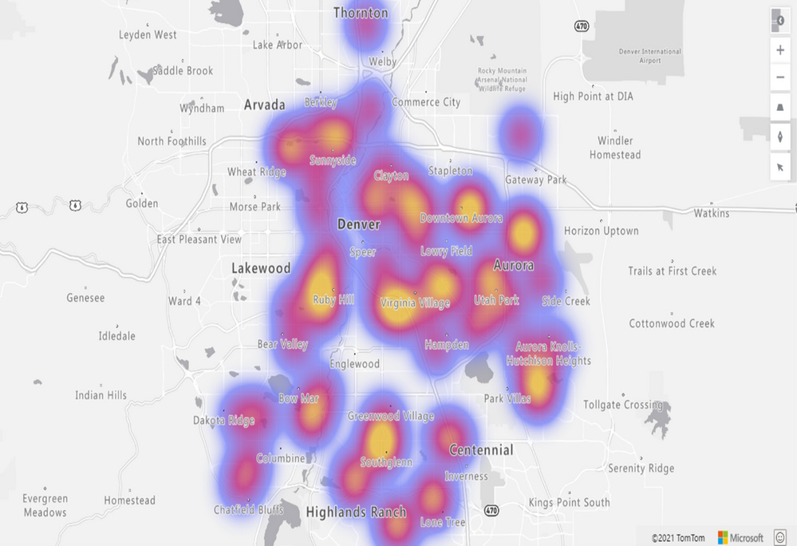

We are thrilled to announce the addition of the **Heat Map layer** option to the **Azure Maps Visual** in **Power BI**. This powerful feature allows you to visualize data density using various colors, highlighting data “hot spots” on a map. Whether you’re analyzing customer behavior, regional performance, or statistical trends, the heat map provides valuable insights.

## Key Benefits of the Heat Map Layer in Power BI

1. **Data Density Visualization:** Heat maps are ideal for rendering datasets with a large number of points. They effectively display data concentration and distribution. Use heat maps to compare customer satisfaction rates, shop performance, or any other relevant metrics across different regions or countries.
2. **Frequency Analysis:** For example, by measuring the frequency with which customers visit shopping malls in various locations, you can identify popular areas and potential growth opportunities.
3. **Statistical Insights:** Heat maps are excellent for visualizing vast statistical and geographical datasets. Explore patterns, correlations, and outliers with ease.

## Customization Options

The heatmap formatting pane (Format) empowers users to tailor their visualizations according to their preferences. Here are the customization options available:

1. **Radius Configuration:** Adjust the radius of each data point in either pixels or meters. Fine-tune the level of detail based on your specific use case.
2. **Opacity and Intensity:** Customize the opacity and intensity of the heatmap layer. Find the right balance between visibility and aesthetics.
3. **Weighted Data Points:** Specify whether the Size field should be used as the weight for each data point. This allows you to emphasize certain data elements.
4. **Color Customization:** Choose custom colors using the color picker. Match the heatmap colors to your brand or convey specific meanings.
5. **Zoom Levels:** Set the minimum and maximum zoom levels for the heatmap. Ensure optimal visibility at different map scales.
6. **Layer Arrangement:** Arrange the heat map layer position relative to other layers (e.g., 3D bar chart, bubble layers). Create cohesive visualizations that tell a compelling story.

With the new Heat Map layer, you can unlock deeper insights from your data and enhance your Power BI reports. Try it out today and discover the hidden patterns within your geographical data!

> This blog post was initially written by me for the [Azure Maps Tech Blog](https://blog.azuremaps.com).