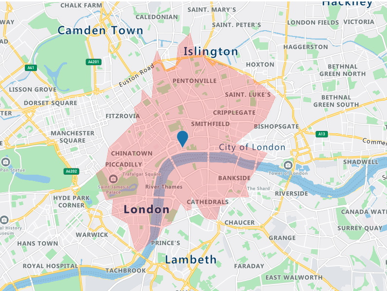
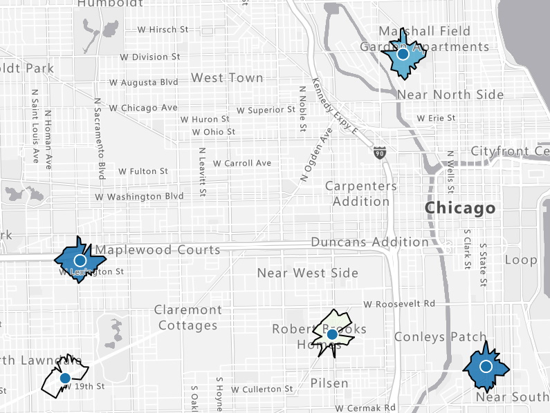

Imagine you are a store owner and would like to target customers that live within a 15-minute drive from your store with advertising for your weekly specials. You could draw a circle on a map, guessing that is about 15 minutes away, but it will not truly represent the time it will take for customers to get to your store. For example, a customer living near a major transit route can live further away from the store than a customer living in a less well-served part of the city. To meet this need, an **isochrone** is a polygon (an area on a map) of expected travel time. It represents the locations that will take the specified time, or less, it will take to get to a specific point (your store, in this case). Estimating an isochrone correctly, including all the variables like traffic, road, and vehicle conditions, is very hard to do by yourself!



## Azure Maps Get Route Range

Using the [Get Route Range](https://docs.microsoft.com/en-us/rest/api/maps/route/get-route-range) API from Azure Maps makes it very easy to calculate the isochrone. For our store example, we need to calculate a 15-minute isochrone for every store we have. We only need the coordinates (longitude and latitude) from our stores and the drivetime in seconds (15 x 60 = 900 sec).

```http
GET https://atlas.microsoft.com/route/range/json?subscription-key=[subscription-key]&api-version=1.0&query=47.65431,-122.1291891&timeBudgetInSec=900
```

## Search Customer Address

To determine which customer is living inside the 15-minute drive isochrone, we first need the coordinates for every customer's address. Then, we simply loop through all our customers and use the [Get Search Address](https://docs.microsoft.com/en-us/rest/api/maps/search/get-search-address) API to get the coordinates.

```http
GET https://atlas.microsoft.com/search/address/json?subscription-key=[subscription-key]&api-version=1.0&query=15127 NE 24th Street, Redmond, WA 98052
```

## Point In Polygon

The last step is to check if a customer coordinate is inside one of our store isochrones. We use the [Point In Polygon](https://docs.microsoft.com/en-us/rest/api/maps/spatial/post-point-in-polygon) API to determine if this is true.

```http
POST https://atlas.microsoft.com/spatial/pointInPolygon/json?subscription-key=[subscription-key]&api-version=1.0&lat=33.5362475&lon=-111.9267386
```

And the request body (the store isochrone)

```json
{
  "type": "FeatureCollection",
  "features": [
    {
      "type": "Feature",
      "properties": {
        "geometryId": 1001
      },
      "geometry": {
        "type": "Polygon",
        "coordinates": [
          [
            [
              -111.9267386,
              33.5362475
            ],
            [
              -111.9627875,
              33.5104882
            ],
            [
              -111.9027061,
              33.5004686
            ],
            [
              -111.9267386,
              33.5362475
            ]
          ]
        ]
      }
    }
  ]
}
```

We now can target those customers with store-specific offers and promotions.



## Examples

What schools are within a 20-minute walk from my home? What available jobs are within a 30-minute transit commute? Where you are located and what is near you brings context to the choice of where you want to live and Azure Maps Isochrone API can help you bring that location intelligence into your applications.

* [Azure Maps Isochrone Samples](https://samples.azuremaps.com/?search=Isochrone)
* [Best practices for Azure Maps Search Service](https://docs.microsoft.com/en-us/azure/azure-maps/how-to-use-best-practices-for-search)
* [Search for a location using Azure Maps Search services](https://docs.microsoft.com/en-us/azure/azure-maps/how-to-search-for-address)

> This blog post was initially written by me for the [Azure Maps Tech Blog](https://blog.azuremaps.com).