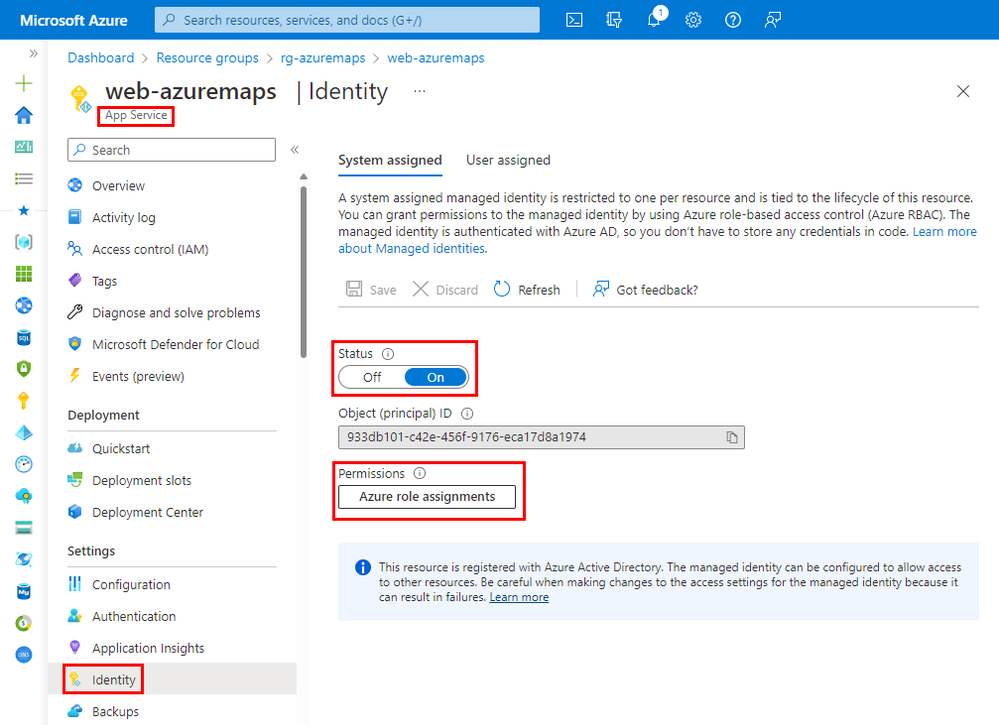
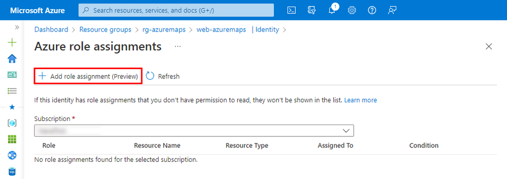
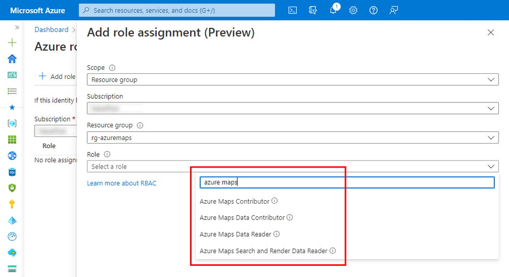

In many enterprise organizations, there are strict processes for privacy, access, and handling of personally identifiable information (PII). Azure Maps is a global Azure service, which means it is available worldwide (except for China and South Korea), but it also needs to store metadata and logs somewhere. In addition, Azure Maps Creator is an addon for private indoor maps that also holds map data. So, where do we keep this data?

Even when Azure Maps stores almost no information, you still need to select in which region the metadata, logs, and private maps must be stored. When creating a new Azure Maps account, the region selection only affects your Azure Maps account's account management and metadata capabilities. Basically, you decide that all metadata, logs, and private map data stay in the selected region (the United States or Europe). Microsoft doesn't control or limit the locations from which your end users come to Azure Maps.

Azure Maps shares customer-provided address/location queries with third-party TomTom for mapping functionality purposes. These queries aren't linked to any customer or end-user when shared with TomTom and can't be used to identify individuals. TomTom is listed on Microsoft's [Online Services Subcontractor List](https://servicetrust.microsoft.com/Search?keyword=Subprocessors%20List).

## Azure Maps Keys

When using Azure Maps Keys, you can access, modify, upload, and delete all the data associated with that Azure Maps account. Not the best choice for a production solution. I recommend using Azure Managed identities for Azure Maps, which give you several powerful security benefits and access controls. You can disable (also by policy) the use of Azure Maps Keys for development, testing, and production. The best thing about managed identities is that you do not need to store any secrets, and you can no longer accidentally leak any keys in your source code.

## Setting up managed identities

You can set up managed identities easily using the Azure Portal (what we are doing here), or if you like, you can also use the Azure command line (CLI). Here, I have written a [step-by-step guide on using managed identities with Azure Maps and .NET](/azure-maps-authentication/).

Before we start, you need an **Azure Account**, a **Web App** and an **Azure Maps** instance.

I start here with a Web App, where you like to enable managed identities for. First, navigate to your Web App, select the Identity option, and enable the system-assigned identity. Next, click on the permissions button.



Azure manages this system-assigned identity; no need to know any secrets. Next, we need to assign what this managed identity can do and access it or not. Finally, click the plus button to add what role this managed identity needs.



Select the resource group where you have created your Azure Maps account. We can use many different roles, but we are only interested in the Azure Maps roles for this blog. Type Azure Maps to filter and select the role you need for your solution. More roles are available here.

| Azure Role Definition | Description |
| --------------------- | ----------- |
| Azure Maps Contributor | Grants access **all** Azure Maps resource management. |
| Azure Maps Data Contributor | Grants access to **read**, **write**, and **delete** access to map related data from an Azure maps account. |
| Azure Maps Data Reader | Grants access to **read** map related data from an Azure maps account |
| Azure Maps Search and Render Data Reader | Grants access to **limited** set of data APIs for common visual web scenarios. Specifically, **render** and **search** data APIs |



Now we have enabled managed identities in our Web App and allowed it to access Azure Maps with the selected role. In the Web App, we can now create a token proxy that uses the managed identity to generate an Azure Maps token that we use in our client app. Example code in C#:

```csharp
using Azure.Core;
using Azure.Identity;
using Microsoft.AspNetCore.Mvc;

namespace AzureMapsDemo.Controllers;

public class ApiController : Controller
{
    private static readonly DefaultAzureCredential tokenProvider = new();

    public async Task<IActionResult> GetAzureMapsToken()
    {
        var accessToken = await tokenProvider.GetTokenAsync(
            new TokenRequestContext(new[] { "https://atlas.microsoft.com/.default" })
        );

        return new OkObjectResult(accessToken.Token);
    }
}
```

This Azure Maps token proxy can then be used in the Azure Maps Web Control, which runs in your browser by the following JavaScript code. Tokens are short-lived and are automatically renewed by the Azure Maps Web Control.

```javascript
// Add authentication details for connecting to Azure Maps.
authOptions: {
    // Use Azure Active Directory authentication.
    authType: 'anonymous',
    // Your Azure Maps client id for accessing your Azure Maps account.
    clientId: '[YOUR_AZUREMAPS_CLIENT_ID]',
    getToken: function(resolve, reject, map) {
        // URL to your authentication service that retrieves
        // an Azure Active Directory Token.
        var tokenServiceUrl = "/api/GetAzureMapsToken";

        fetch(tokenServiceUrl).then(r => r.text()).then(token => resolve(token));
    }
}
```

I hope this blog helped you with setting up Managed Identities in the Azure Portal. If you need a step-by-step guide on how to use managed identities and authorization in a .NET web application, read my [Azure Maps Web Application Authentication](/azure-maps-authentication/) blog. 

> This blog post was initially written by me for the [Azure Maps Tech Blog](https://blog.azuremaps.com).