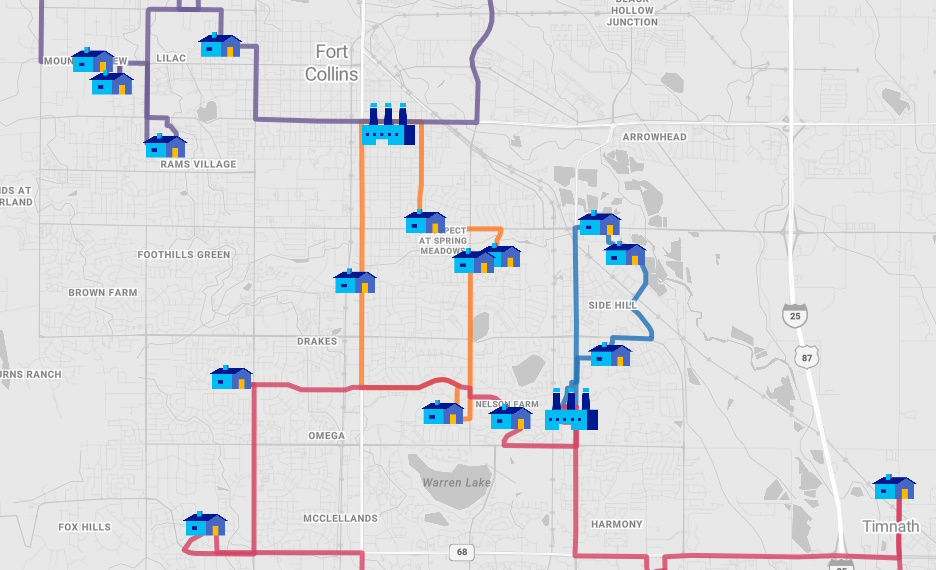

The logistics industry constantly seeks efficiency in routing vehicles to deliver goods. This is where the **Vehicle Routing Problem** (VRP) and **Pickup and Delivery Problems** (PDP) come into the picture as both are sophisticated extensions of the classic Traveling Salesperson Problem (TSP). The TSP poses a simple yet challenging question: *"What is the most efficient route that visits each destination once and returns to the starting point?"* This problem is not just academic; it has practical applications in logistics, where optimizing routes can lead to substantial savings in time and costs.

So, what is needed to tackle this problem? At its simplest incarnation, you need reliable inputs that provide estimates as to how long each route to a location will take and then you need to know how to apply the rest of the constraints like driver availability, time taken at each location, opening hours, working hours, demand, capacity and more. In the solution we will review here, Azure Maps provides the input and NVIDIA cuOpt will apply the constraints for optimization.

## The Flexibility of Azure Maps

[Azure Maps](https://azuremaps.com/) offers, besides mapping, also an **advanced routing engine**, tailored for both cars and commercial trucks, complete with a [Route Matrix API](https://learn.microsoft.com/en-us/rest/api/maps/route/post-route-matrix) and traffic and accident APIs what are part of the routing engine as well. Learn [here](https://learn.microsoft.com/en-us/azure/azure-maps/about-azure-maps) more about what Azure Maps can do for you.

## The Power of NVIDIA cuOpt

Enter [NVIDIA cuOpt](https://www.nvidia.com/en-us/ai-data-science/products/cuopt/), a state-of-the-art, **GPU-accelerated** engine designed for tackling complex routing challenges. It leverages parallel heuristics to accelerate solutions to VRP, PDP, and other related optimization problems. NVIDIA cuOpt is versatile, accommodating various constraints such as vehicle capacities, delivery time windows, and even the intricacies of drivers' shifts and breaks.


 
## Solving TSP with Azure Maps and NVIDIA cuOpt

Imagine you're tasked with coordinating package deliveries from multiple depots, utilizing a fleet of vehicles with varying capacities, to a diverse set of customers with unique requirements. Azure Maps and NVIDIA cuOpt emerge as your allies in this complex scenario.


 
### Preparation: Gathering Essential Data

Before you begin with route optimization, you'll need to collect some fundamental data:
*	**Depot Locations:** Where your journey begins.
*	**Customer Drop-off Locations:** Including details like opening hours and dwell time.
*	**Vehicle Specifications:** Capacity, starting, and ending locations.
*	**Driver Details:** Working hours, breaks, vehicle assignments, and costs.

### Step One: Constructing a Cost and Travel Time Matrix

Using [Azure Maps Matrix APIs](https://learn.microsoft.com/en-us/rest/api/maps/route/get-route-matrix), you can calculate a comprehensive matrix that outlines the 'cost' in meters and travel time in seconds between every depot and drop-off location. For instance, with two depots and eight drop-off points, you'd create a 10x10 matrix. Each location serves as both an origin and a destination, resulting in a matrix where the distance and time to the same location are zero—since they are, naturally, identical.

| matrix  |	Depot 1	| Depot 2	| Stop 1 | Stop 2 |	Stop 3 | ... |
|---------|---------|---------|--------|--------|--------|-----|
| Depot 1 |	0       |         |        |        |        |     |
| Depot 2 |	        | 0       |        |        |        |     |
| Stop 1  |	        |         | 0      |        |        |     |
| Stop 2  |	        |         |        | 0      |        |     |
| Stop 3  |	        |         |        |        | 0      |     |
| ...     |	        |         |        |        |        | 0   |

We have developed a [Multi-Itinerary Optimization Sample](https://samples.azuremaps.com/?sample=multi-itinerary-optimization) to get you started quickly, the core of this sample is this function:

```javascript
// Itinerary Optimization function
async function itineraryOptimizationClicked() {

    // Show loading icon
    showLoadingIcon(true);

    // Clear the route data source
    routeDataSource.clear();

    // We need all coordinates together depots + stops
    const allCoordinates = [...depots, ...stops];

    // Get the Azure Maps Matrix results for all coordinates
    const matrix = await getMatrixAsync(allCoordinates);

    // We use the NVIDIA cuOpt optimizer service to calculate the Multi-Itinerary Optimization
    const solver = await getOptimizedRouteAsync(matrix);

    // Render the route on the map for each vehicle using Azure Maps Route API
    renderRoutes(allCoordinates, solver);

    // Hide loading icon
    showLoadingIcon(false);
}
```

The complete Multi-Itinerary Optimization Sample [source code](https://github.com/Azure-Samples/AzureMapsCodeSamples/blob/main/Samples/REST%20Services/MIO/mio.html) can be found on the [Azure Maps Code Samples GitHub](https://github.com/Azure-Samples/AzureMapsCodeSamples) page.

### Step Two: Determining the Optimal Delivery Sequence

With the matrix data in hand, it's time to decide the delivery sequence. This is where [NVIDIA cuOpt](https://docs.nvidia.com/cuopt/) shines, optimizing the order of delivery for each vehicle based on capacity, demand, and operational hours—without needing any sensitive location or customer data, thus addressing privacy concerns.

> See our [how-to guide](https://learn.microsoft.com/azure/azure-maps/itinerary-optimization-service) how to set up and create a solution with NVIDIA cuOpt and Azure Maps.

### Step Three: Real-World Route Mapping

Once NVIDIA cuOpt has determined the optimal delivery order, the final step is to map the actual routes using Azure Maps Routing APIs. This process translates the optimized sequence into actionable routes for each vehicle.

In a hypothetical scenario with four vehicles serving two depots and eight drop-off locations, the outcome might look like this:

```
Depot 1: Vehicle A -> Stop 1 -> Stop 3 -> Stop 5 -> Depot 1
Depot 1: Vehicle B -> Stop 2 -> Stop 4 -> Stop 6 -> Depot 1
Depot 2: Vehicle C -> Stop 7 -> Stop 8 -> Depot 2
Depot 2: Vehicle D -> Stop 9 -> Stop 10 -> Depot 2
```

[](https://samples.azuremaps.com/?sample=multi-itinerary-optimization)

**Are you ready to deliver?** Get started with the Azure Maps and NVIDIA cuOpt to optimize your delivery needs. Read our [how-to guide](https://learn.microsoft.com/azure/azure-maps/itinerary-optimization-service) and start delivering to your customers quicker.

> This blog post was initially written by me for the [Azure Maps Tech Blog](https://blog.azuremaps.com).