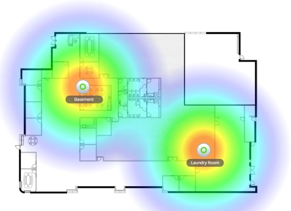

Working from home, I use [Microsoft Teams](https://teams.microsoft.com/) for online meetings. Some of my colleges and customers have an unreliable Internet connection at their homes. Most of the time, the problems are with their Wi-Fi what results in audio or video dropouts during online meetings. In this blog post, I outline my home and office network and Internet setup for a fast and rock-solid connection.

## Internet

In the Netherlands we are blessed with fast and affordable internet, we have options like cable, fiber, and VSDL. For my home and office, I use a 500/500 Mbit fiber connection from my local ISP (KPN). Running [Speedtest](https://www.speedtest.net/) and [Fast](https://fast.com/) (from Netflix) gives me a good understanding of how fast it is.

## Networking equipment

All my networking equipment is from [Ubiquiti](https://www.ui.com/), and I use their [UniFi](https://www.ui.com/products/#unifi) product line. My choice for Ubiquiti/UniFi comes from the experience I had in the past. UniFi gives me professional control over my network and still is easy to use. You need at least a Security Gateway (USG), a Switch with PoE (Power over Ethernet), and one or more Access Points (AP) to start. The control software you can run on your computer, but I recommend to use a Cloud Key (Gen2). All my access points are getting their power from the network cable, so no need to have additional power lines. I manage my network using the Cloud Key (Gen2) Plus. An extra benefit is that it gives me lots of insides, and it is easy to operate.

Usually, the Internet connection comes with a modem with a built-in Wi-Fi router and is placed near the front door, which is not the best place in the house, and they far away from the office. These 'modems' are also not the best quality and have a limited Wi-Fi range. If possible, remove this device from your network or set it in bridge mode. [Read more about how](/kpn-fiber-connection-with-ubiquiti-usg-iptv-and-ipv6/).

## Networking cables

When building my house last year, I wired all my rooms and ceilings with **CAT6** networking cables. All networking cables come together nearby the front door where also the Internet connection (fiber) is entering the house. I created a mini networking cabinet where I have my switching and security gateway networking equipment.

Colors I used for the patch cables are:
- **Red** Internet (public IP)
- **Green** Local network (firewalled)
- **Yellow** patch cables to devices and access points

## Access points

I have multiple access points, on every floor at least 1. The UniFi access points give me excellent Wi-Fi coverage in and around the house. Using the Map functionality in the controller software, I can check where I have blind spots in my house (Below picture is an example). All other devices are hardwired, like in the office.

## Optimize Wi-Fi throughput

To get the maximum Wi-Fi throughput, you need to change the Channel Width. I did this only for the 5G radios, where I turned the Channel Width to VHT80 or VHT160. By default, Channel Width VHT40 is suitable for dense networks with a lot of clients, like a public place (what is not my home).

