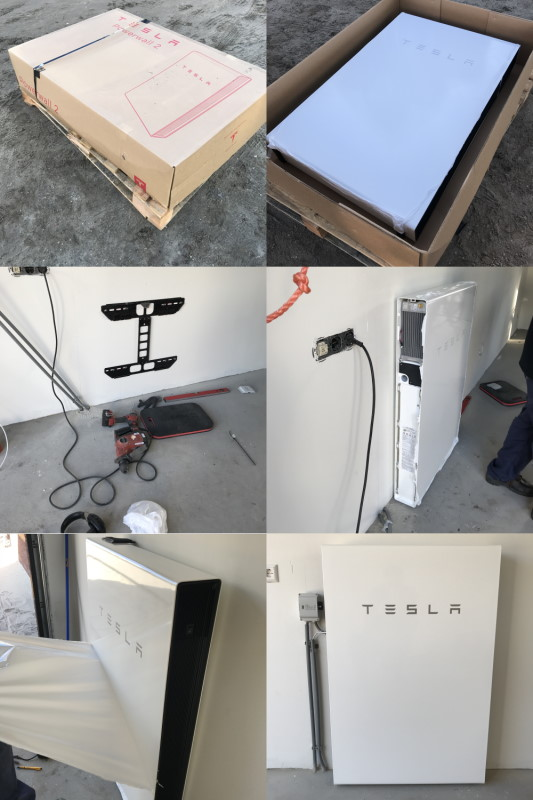
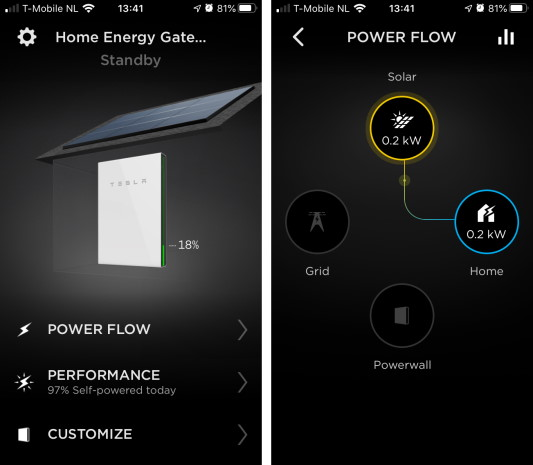
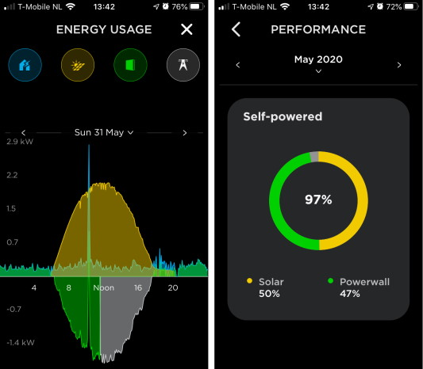

Saving the planate a little bit and trying out new technology is cool, and in the end, it will save me also some money. When building my house last year, I invested in solar energy. The sun delivers me free electricity during the day, especially around noon, but I use it mostly at the end of the day and at the beginning of the evening. Most of my solar energy goes to the public energy grid, and I need to bay it back in the evening. This buying back makes no send to me. I like to use my own 'free' solar energy, so I need a way to store it. After some reach, I selected the [Tesla Powerwall 2](https://www.tesla.com/powerwall) for my energy storage, not only for the best capacity, but my energy company ([Eneco](https://www.eneco.nl)) had a good deal (2.500,- euro back). In the Netherlands, I can also get the tax back I paid for the solar and Tesla Powerwall 2 energy installation, an extra savings of 21%. The investment is still high, but after 5 or 6 years, it should be making money.

## Hardware

My solar and energy installation exist out of different systems working closely together. From the solar panels, converter to the **Tesla Gateway** and **Tesla Powerwall 2**. The gateway needs the Internet for full functionality, it haves his mobile SIM connection, but that is more a fallback scenario. I placed the Tesla Powerwall 2 in the garage because it can make some low zooming noise if it is under load. 

| System       | Brand    | Type              | Notes                   |
| ------------ | -------- | ----------------- | ----------------------- |
| Solar panels | Ja Solar | JAM6K60-280-BK-35 | 8 x 280Wp = **2240 Wp** |
| Converter    | Growatt  | 2000-S            | DC to AC                |
| Gateway      | Tesla    | Gateway           | Connects to the Internet|
| Battery      | Tesla    | Powerwall 2       | **13.5 kWh**            |

## Installation

The Tesla Powerwall 2 arrived from the California factory in a big box and placed against the wall in my garage. There are two cables connected to the Powerwall, one for the communication between the Powerwall and the Gateway, and the second one for the power itself. It took the energy company around 6 hours to complete the setup with the Powerwall.

## Software

To know what is going one with my energy installation, I use the **Tesla App** (it is the same as for the cars). In the Tesla App, I can see what my solar panels a producing, my housing is consuming, and if the battery is charging. I can also use the web version when at home, but the information is limited, but it gives me a [Restful API](https://github.com/vloschiavo/powerwall2).

## Performance

The combination of the solar and the Powerwall gives me an excellent performance, in the table below, you can see the performance I had in the last half-year.

| Month         | Solar  | Powerwall | Total |
| ------------- | ------ | --------- | ----- |
| January 2020  | 9%     | 6%        | 15%   |
| February 2020 | 17%    | 12%       | 29%   |
| March 2020    | 31%    | 40%       | 71%   |
| April 2020    | 45%    | 53%       | 98%   |
| May 2020      | 50%    | 47%       | 97%   |
| June 2020     | 45%    | 44%       | 89%   |

## Conclusion

I'm pleased with the setup and performance, but they're also some small downsides I did not know before. In the Netherlands, the Tesla Powerwall 2 does not have all the functionality I was expecting, like by loss of grid electricity, the Powerwall can't be used or baying cheap electricity from the grid when there is no sun.