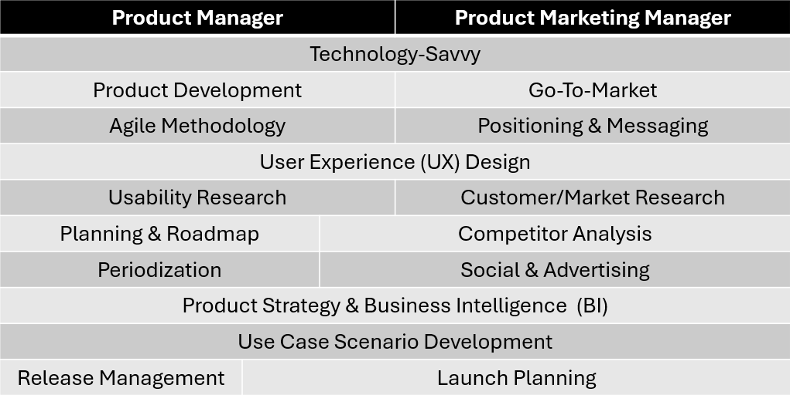

Have you ever wondered what it's like to be a **Program Manager** (PM) at [Microsoft](https://www.microsoft.com/)? As someone who often fields this question, I'd like to offer some insights into the fascinating world of **product development** and **customer-centric decision-making** that defines the role of a PM at one of the world's leading tech companies.

At Microsoft, our mission revolves around creating products and services that address real-world needs and deliver tangible value to our users. As a Program Manager, my primary responsibility is to delve into the evolving landscape of customer demands and technological advancements to identify opportunities for enhancing our products. 

One of the key aspects of the PM role is conducting thorough research to understand what new features or improvements customers are seeking. This involves not only listening to direct customer feedback but also analyzing market trends and competitive landscapes. While it's essential to prioritize features that align with customer needs, we also need to consider the business impact and feasibility of each enhancement.

It's not just about fulfilling every customer request; it's about strategically investing our resources where they will have the most significant impact. This means evaluating the potential financial returns of a feature against the cost of development and deployment. If a proposed feature only caters to a small subset of users, we need to assess whether it aligns with our broader strategic goals and market positioning.

Collaboration is at the heart of everything we do at Microsoft. As a PM, I work closely with **Product Marketing Managers** (PMMs) to ensure that our product roadmap aligns with market demand and consumer behavior. Customer studies and meetings play a crucial role in gathering insights into the challenges users face and the solutions they're seeking.

Once a feature has been conceptualized and scoped, it's time to hand it over to the **Product Manager** for inclusion in the product roadmap. This collaborative effort involves engaging with **engineering teams** to ensure that the proposed features are technically feasible and align with the overall product vision.

On a typical day, I engage in frequent meetings with my fellow PMs to discuss ongoing projects and align our strategies. Cross-team collaboration is essential, especially in complex product ecosystems like [Azure Maps](https://azuremaps.com/), where integration with other Microsoft products is commonplace.

Being a Program Manager at Microsoft is both challenging and rewarding. It requires a blend of technical expertise, strategic thinking, and a deep understanding of customer needs. By constantly iterating on our products and embracing a customer-centric approach, we strive to deliver innovative solutions that empower users and drive business growth. If you're passionate about technology and thrive in a fast-paced, collaborative environment, a [career as a Program Manager at Microsoft](https://jobs.careers.microsoft.com/) might be the perfect fit for you.