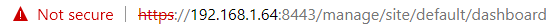
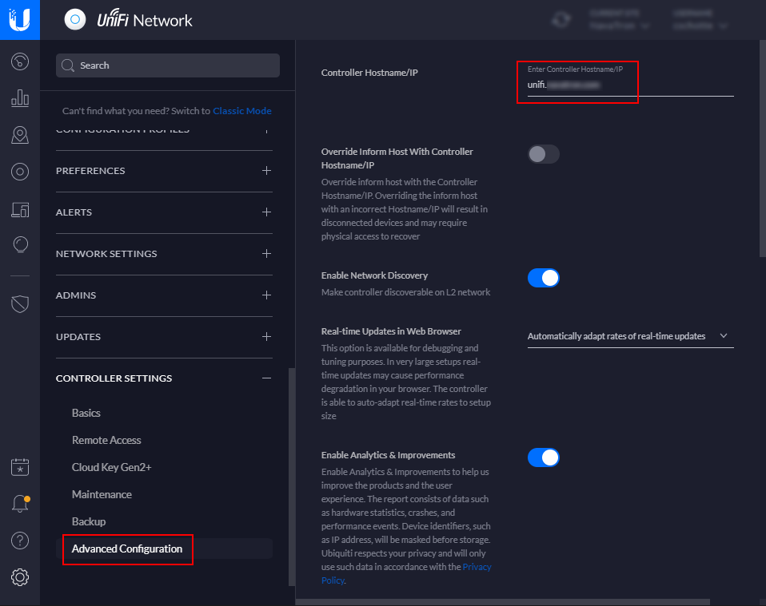
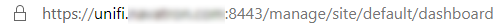

When connecting to the **UniFi Cloud Key Controller**, you need to know the IP-address and port number (default 8443). In my situation, the IP-address is 192.168.1.64



> If you do not know your Cloud Key IP-address, use the [Ubiquiti Device Discovery Tool](https://www.ui.com/download/unifi/).

The connection is using **https** (that's good), but there is no domain name, so the default SSL certificate triggers a security warning in your web browser because it can't be verified. Also, the web browser will not remember your login credentials for the next login.


## Custom hostname

In the Cloud Key Controller, we can use a custom hostname (under *Controller settings -> Advanced Configuration*). I created a sub-domain 'unifi' at my DNS provider (I use [Azure DNS](https://azure.microsoft.com/en-us/services/dns/) for all my domains) and pointed an A-record to the UniFi Cloud Key IP address. This new hostname gives me a friendly URL, but the SSL warning is still there.



## Adding a SSL certificate 

We can now access the Cloud Key with a custom hostname, but we also need to add a custom SSL certificate to the controller. The SSL certificate needs to have the same domain name associated as in the custom hostname field. I used the same wildcard SSL certificate I hold for my public domain name.

My SSL certificate files are in a different format for what we need. We need to create a P12 bunded certificate archive and transfer this to the Cloud Key. To create a P12 bunded certificate archive, I use [OpenSSL](https://www.openssl.org/).

> Under Windows 10, I use the [Windows Subsystem for Linux](https://docs.microsoft.com/en-us/windows/wsl/install-win10) (WSL) and Ubuntu. No need to install OpenSSL for Windows.


This will create a P12 bunded certificate archive with a temporary password we use later.

```bash
openssl pkcs12 -export -inkey certificate.key -in certificate.crt -out certificate.p12 -name ubnt -password pass:temppass
```

Copy the P12 certificate from your local computer to the Unifi Cloud Key. I put it in the '/home' folder.

```bash
scp certificate.p12 ubnt@192.168.1.64:/home
```

## Enable the new SSL certificate

First, we need to login into the Cloud Key and stop the running services. The **ubnt** is the default user.

```bash
ssh 192.168.1.64 -l ubnt
```


> I like to use [Midnight Commander](https://midnight-commander.org/) (MC)  under Linux, to install MC use the following **optional** commands:
>
> ```bash
> sudo apt-get update
> sudo apt-get install mc
> ```

Stop the nginx and unifi services on the cloud key

```bash
service nginx stop
service unifi stop
```

The next step is to remove the symbolic link and the reference to the built-in self-signed SSL certificate inside the Cloud Key. 

```bash
rm /usr/lib/unifi/data/keystore
```

And remove the following line "**UNIFI_SSL_KEYSTORE=/etc/ssl/private/unifi.keystore.jks**" from the file "/etc/default/unifi". It shoud be the last line in the file.

```bash
mcedit /etc/default/unifi
```

Now we can install the new SSL certificate. We use the temporary password we created earlier.

```bash
sudo keytool -importkeystore -deststorepass aircontrolenterprise -destkeypass aircontrolenterprise -destkeystore /usr/lib/unifi/data/keystore -srckeystore /home/certificate.p12 -srcstoretype PKCS12 -srcstorepass temppass -alias ubnt -noprompt
```

This will give a warning you can ignore: "Warning: The JKS keystore uses a proprietary format ...".

Restart the nginx and unifi services we stopped.

```bash
service nginx start
service unifi start
```

## Test en clean up

Let's test if we can now access the Cloud Key using the new hostname and custom SSL certificate.



If everything is working, we need to clean up the temporary P12 certificate.

```bash
rm /home/certificate.p12
```