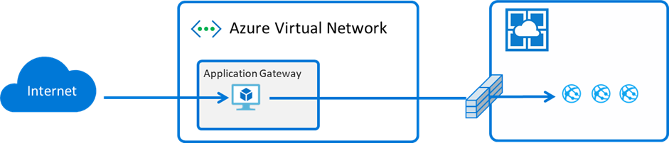
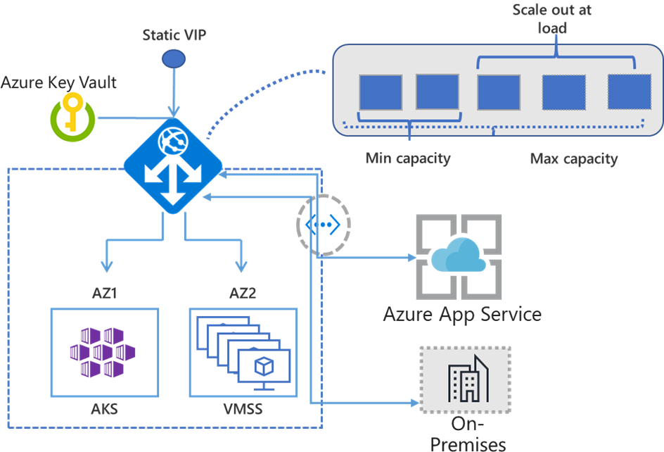
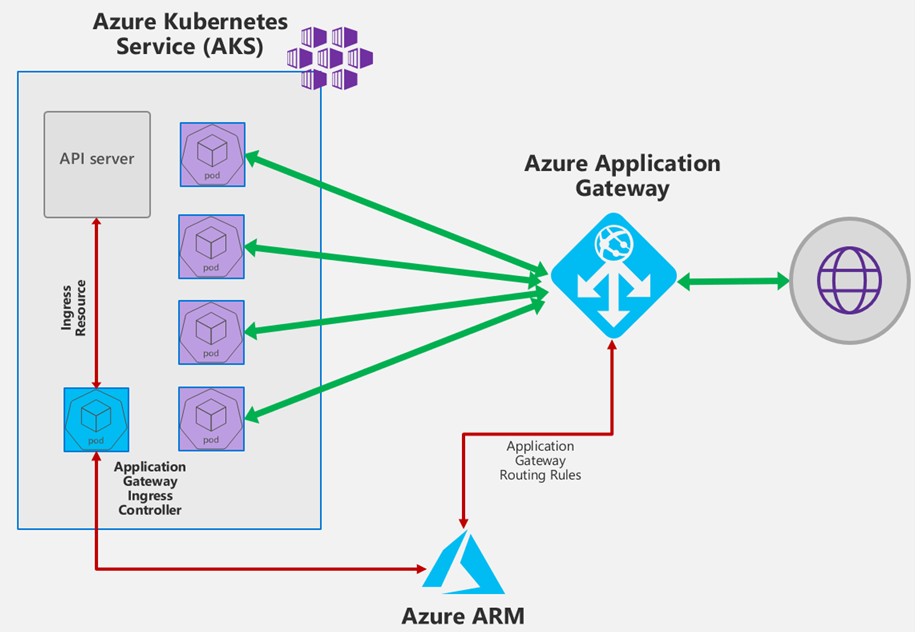
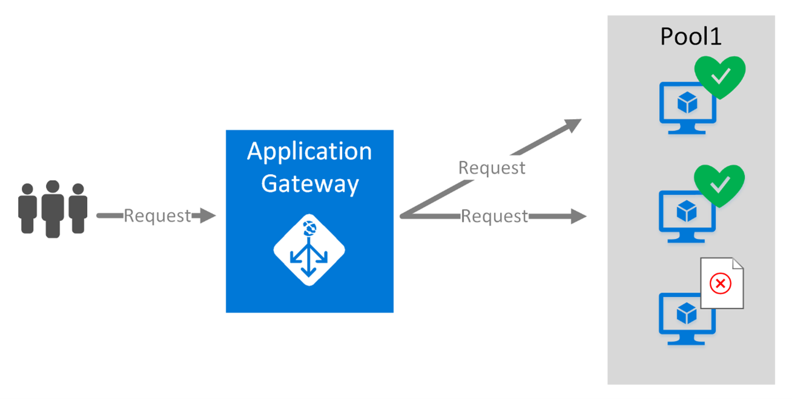

## What is Azure Application Gateway?

Azure Application Gateway is a reverse proxy with optional WAF (Web Application Firewall) capability to allow incoming connections from external sources. The Gateway operates at Layer 3, 4, and 7 for IP-based, TCP/UDP-based, URL-based, and Host Header-based routing.

## When to use the Application Gateway?

Microsoft has multiple services to protect and accelerate your applications; they are used for different scenarios, depending on where your users are:

* [Azure Traffic Manager](https://docs.microsoft.com/en-us/azure/traffic-manager/traffic-manager-overview) – DNS based load balancer across **global regions**
    * `https://navatron.com`
    * `https://us.navatron.com`
    * `https://eu.navatron.com`
* [Azure Application Gateway](https://docs.microsoft.com/en-us/azure/application-gateway/overview) – **Single region**, URL-based routing at the application
    * `https://eu.navatron.com`
    * `https://eu.navatron.com/products`
    * `https://eu.navatron.com/support`
    * `https://eu.navatron.com/jobs`
* [Azure Front Door](https://docs.microsoft.com/en-us/azure/frontdoor/front-door-overview) – **Global** load balancing with SSL offloading 
    * IPv6
    * Application acceleration

> **Global** Route clients to the closest available service region. Offload SSL and accelerate websites at the network edge.
> **Regional / Internal** Route across zones and into your VNET. Private IP space routing and between your resources to build your regional application.

## Application Gateway Capabilities

The v2 SKU has several enhancements which do not exist within the v1 SKU, allowing for additional capabilities.

> **see also:**
> * [Feature comparison between v1 SKU and v2 SKU](https://docs.microsoft.com/en-us/azure/application-gateway/application-gateway-autoscaling-zone-redundant#feature-comparison-between-v1-sku-and-v2-sku)

### Scalability

Application Gateway or WAF deployments under Standard v2 or WAF v2 SKU support autoscaling and can scale up or down based on changing traffic load patterns. Autoscaling (up to 125 instances) also removes the requirement to choose a deployment size or instance count during provisioning. Application Gateway can operate both in fixed capacity (autoscaling disabled) and in autoscaling enabled mode. The v2 SKU offers performance enhancements and adds support for critical new features like autoscaling, zone redundancy, and support for static VIPs.

### Zone Redundancy

An Application Gateway or WAF deployment can span multiple Availability Zones, removing the need to provision separate Application Gateway instances in each zone with a Traffic Manager. You can choose a single zone or multiple zones where Application Gateway instances are deployed, making it more resilient to zone failure. The back-end pool for applications can be similarly distributed across availability zones.

### Static VIP

The v1 SKU did not support a Static VIP and was only accessible via the configured URL. The v2 URL is only configurable with a Static VIP and will not change through reboots.

### AKS Ingress Controller

The Application Gateway Ingress Controller allows Azure Application Gateway to be used as the ingress for an Azure Kubernetes Service (AKS) cluster. The ingress controller runs as a pod within the AKS cluster. It consumes Kubernetes Ingress Resources and converts them to an Azure Application Gateway configuration, allowing the Gateway to load-balance traffic to Kubernetes pods.

### Key Vault Integration

Application Gateway v2 supports integration with Key Vault for server certificates that are attached to HTTPS-enabled listeners. You can either attach the certificate directly to the Application Gateway or provide a reference to an existing Key Vault certificate or secret when you create an HTTPS-enabled listener.

Integration includes many benefits such as:

* More robust security because the application development team doesn't directly handle SSL certificates. This integration allows a separate security team to:
    * Set up Application Gateways.
    * Control Application Gateway lifecycles.
    * Grant permissions to selected Application Gateways to access certificates that are stored in your Key Vault.
* Support for importing existing certificates into your key Vault. Or use Key Vault APIs to create and manage new certificates with any of the trusted Key Vault partners.
* Support for automatic renewal of certificates that are stored in your Key Vault.

Application Gateway currently supports software-validated certificates only. Hardware security module (HSM)-validated certificates are not supported. After Application Gateway is configured to use Key Vault certificates, its instances retrieve the certificate from Key Vault and install them locally for SSL termination. The instances also poll Key Vault at 24-hour intervals to retrieve a renewed version of the certificate if it exists. If an updated certificate is found, the SSL certificate currently associated with the HTTPS listener is automatically rotated.

### Rewriting HTTP/HTTPS Headers

HTTP headers allow a client and server to pass additional information with a request or response. By rewriting these headers, you can accomplish important tasks, such as adding security-related header fields like HSTS/ X-XSS-Protection, removing response header fields that might reveal sensitive information, and removing port information from X-Forwarded-For headers.

Application Gateway allows you to add, remove, or update HTTP request and response headers while the request and response packets move between the client and backend pools. And it allows you to add conditions to ensure that the specified headers are rewritten only when certain conditions are met.

Application Gateway also supports several server variables that help you store additional information about requests and responses. This makes it easier for you to create powerful rewrite rules.

All headers in requests and responses can be modified, except for the Host, Connection, and Upgrade headers.

### Socket Routing

Web Application Gateway can make routing decisions based on the IP, and Port (Socket) requests. This allows for one Application Gateway to front-end multiple applications.

### URL Routing

URL Path-Based Routing allows you to route traffic to backend server pools based on the request's URL Paths. One of the scenarios is to route requests for different content types to another pool.  For example, requests for `https://navatron.com/video/*` are routed to *VideoServerPool*, and `https://navatron.com/images/*` are routed to *ImageServerPool*. *DefaultServerPool* is not sent any traffic in this example.

Rules are processed in the order they are listed in the portal. It is highly recommended to configure multi-site listeners first prior to configuring a basic listener. This ensures that traffic gets routed to the proper back end. If a basic listener is listed first and matches an incoming request, it gets processed by that listener.
 
### Multiple-Site Hosting

Multiple-site hosting enables you to configure more than one website on the same Application Gateway instance. This feature allows you to configure a more efficient topology for your deployments by adding up to 100 websites to one application gateway. Each website can be directed to its own pool. For example, Application Gateway can serve traffic for `navatron.com` and `navatron.nl` from two server pools called *MainServerPool* and *DutchServerPool*.

Similarly, two subdomains of the same parent domain can be hosted on the same application gateway deployment. Examples of using subdomains could include `https://blog.navatron.com` and `https://api.navatron.com` hosted on a single Application Gateway deployment.

### Redirection

Often, Web servers will contain pools specifically for web redirection from HTTP to HTTPS.  Application Gateway can handle this scenario natively, simplifying configs and freeing up resources on the web servers themselves.  This is a generic redirection mechanism to redirect from and to any port you define using rules. It also supports redirection to an external site as well.

### Optional WAF

Web application firewall (WAF) is a feature of Application Gateway that provides centralized protection of web applications from common exploits and vulnerabilities. WAF is based on rules from the OWASP (Open Web Application Security Project) core rule sets 3.0 or 2.2.9.

Web applications are increasingly targeted for malicious attacks that exploit commonly known vulnerabilities. Preventing such attacks in application code can be challenging and may require rigorous maintenance, patching, and monitoring at many application topology layers. A centralized web application firewall helps make security management much more straightforward and reassures application administrators against threats or intrusions. A WAF solution can also react to a security threat faster by patching a known vulnerability at a central location versus securing each of individual web applications. Existing application gateways can be converted to a web application firewall-enabled application gateway easily.

Application Gateway WAF protects against:

* SQL-injection
* Cross-site scripting
* Other common web attacks, such as command injection, HTTP request smuggling, HTTP response splitting, and remote file inclusion
* HTTP protocol violations
* HTTP protocol anomalies, such as missing host user-agent and accept headers
* Bots, crawlers, and scanners
* Common application misconfigurations (for example, Apache and IIS) through detection

These WAF Features can be enabled in monitoring/learning mode or in enforcing mode. All the findings can be reviewed via various monitoring configurations like Azure Monitor, Azure Security Center, or Azure Diagnostics Logs.

### End-to-End SSL

When SSL Encryption must be maintained, Application Gateway can be configured for End-to-End SSL. In this process, the Application Gateway will decrypt the traffic, review and evaluate based on configured policies, modify the headers as configured, and then re-encrypt traffic before sending it to the back-end servers.

> **see also:**
> * [Overview of TLS termination and end to end TLS with Application Gateway](https://docs.microsoft.com/en-us/azure/application-gateway/ssl-overview)

### SSL Termination

Application gateway supports SSL/TLS termination at the Gateway, after which traffic typically flows unencrypted to the back-end servers. This feature allows web servers to be unburdened from costly encryption and decryption overhead.

> **see also:**
> * [TLS termination with Key Vault certificates](https://docs.microsoft.com/en-us/azure/application-gateway/key-vault-certs)

### Session Affinity

The cookie-based session affinity feature is useful when you want to keep a user session on the same server. The Application Gateway can direct subsequent traffic from a user session to the same server for processing by using gateway-managed cookies. This is important in cases where the session state is saved locally on the server for a user session.

### Custom Error Pages

Application Gateway allows for the creation of custom error pages instead of displaying the default error pages. Custom branding and layout can be used within a custom error page.

For example, a custom maintenance page can be displayed if the application isn't reachable or an unauthorized access page if a malicious request is sent to a web application. These custom error pages can replace HTTP 502 and 403 return codes.

If an error originates from the back-end servers, then it's passed along unmodified back to the caller. A custom error page isn't displayed. Application Gateway can display a custom error page when a request can't reach the back-end.

### WebSocket Support

Application Gateway provides native support for the WebSocket protocol. There is no user-configurable setting to selectively enable or disable WebSocket support. The WebSocket protocol enables full-duplex communication between a server and a client over a long-running TCP connection.

### HTTP/2 Support

Application Gateway provides native support for the HTTP/2 protocol. The HTTP/2 protocol enables full-duplex communication between a server and a client over a long-running TCP connection. This allows for a more interactive communication between the web server and the client, which can be bidirectional without the need for polling as required in HTTP-based implementations. These protocols have low overhead, unlike HTTP, and can reuse the same TCP connection for multiple requests/responses, resulting in a more efficient resource utilization. These protocols are designed to work over traditional HTTP ports of 80 and 443.

### Connection Draining

Connection draining helps you achieve graceful removal of back-end pool members during planned service updates. This setting is enabled via the back-end HTTP setting and can be applied to all back-end pool members during rule creation. Once enabled, Application Gateway ensures all de-registering instances of a back-end pool do not receive any new requests while allowing existing requests to complete within a configured time limit. This applies to both back-end instances that are explicitly removed from the back-end pool by an API call, and back-end instances reported as unhealthy as determined by the health probes.
 
### Health Probes

Azure Application Gateway, by default, monitors the health of all resources in its back-end pool and automatically removes any resource considered unhealthy from the pool. Application Gateway continues to monitor the unhealthy instances and adds them back to the healthy back-end pool once they become available and respond to health probes. Application gateway sends the health probes with the same port that is defined in the back-end HTTP settings. This configuration ensures that the probe is testing the same port that customers would be using to connect to the back-end.  In addition to using default health probe monitoring, you can also customize the health probe to suit your application's requirements.

> **see also:**
> * [Application Gateway health monitoring overview](https://docs.microsoft.com/en-us/azure/application-gateway/application-gateway-probe-overview)

### Networking

Azure Application Gateways are always deployed in a virtual network subnet. This subnet can only contain Application Gateways. Although this is an entirely managed service, behind the scenes, Azure is deploying one or more instances of load-balanced virtual appliances into your VNet.

* Application Gateway can talk to instances outside of the virtual network as long as there is IP connectivity.
* Network Security Groups are supported on the Application Gateway subnet to provide segmentation/isolation.
* Front-End IPs on an Application Gateway can be either public or private depending on requirements.