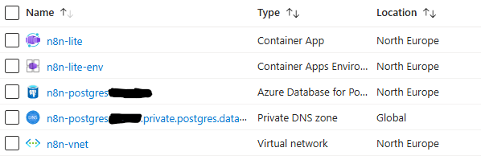
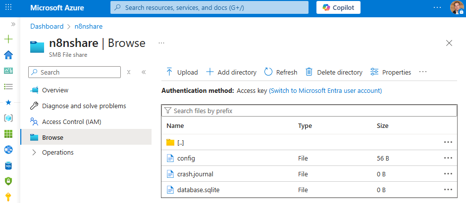

I wanted a tiny, inexpensive backend to experiment with a AI chat agent on my blog. No Kubernetes, no managed databases, no monthly surprises. In this post I’ll show exactly how I stood up **n8n** on **Azure Container Apps** using **SQLite** and an **Azure Files** mount so everything persists, and scales to zero when idle. This is the infrastructure piece. In my next post I’ll walk through how I built the AI chat agent itself and wired the blog UI to n8n.

One Container App runs the official `n8nio/n8n` image. I let n8n use SQLite (the default) and put its working folder on Azure Files so my workflows and credentials survive restarts and image updates. I skip Log Analytics to keep costs near zero and rely on the free `*.azurecontainerapps.io` domain for TLS. It’s enough for a personal blog agent and private testing, and I can swap SQLite for PostgreSQL later without changing the overall shape.

## What you need

I’m doing this from Windows with PowerShell and the Azure CLI. Make sure you have:

Azure CLI up to date:

```powershell
az upgrade --yes
```

The Container Apps extension:

```powershell
az extension add --name containerapp --upgrade
```

Sign in and select the subscription you want to use:

```powershell
az login
az account set --subscription "<YOUR_SUBSCRIPTION_ID_OR_NAME>"
```

## 1. Variables - Pick a region and a few names

```powershell
# Location
$LOCATION = "westeurope"

# Resource group and environment
$RG        = "n8n-lite-rg"
$ENV_NAME  = "n8n-lite-env"
$APP_NAME  = "n8n-lite"

# Storage account (globally unique)
$rand      = Get-Random -Maximum 99999
$SA        = "n8nfiles$rand"
$SHARE     = "n8nshare"

# Auth for n8n editor
$N8N_BASIC_USER = "admin"
$chars = (48..57 + 65..90 + 97..122)
$N8N_BASIC_PASSWORD = -join (1..24 | ForEach-Object { [char]($chars | Get-Random) })

# 32-byte encryption key
Add-Type -AssemblyName System.Security
$bytes = New-Object byte[] 32
[Security.Cryptography.RandomNumberGenerator]::Create().GetBytes($bytes)
$N8N_ENCRYPTION_KEY = ($bytes | ForEach-Object { $_.ToString("x2") }) -join ""
```

## 2. Resource group and cheap persistent storage (Azure Files)

```powershell
az group create --name $RG --location $LOCATION | Out-Null

az storage account create `
  --resource-group $RG `
  --name $SA `
  --location $LOCATION `
  --sku Standard_LRS `
  --kind StorageV2 | Out-Null

$SA_KEY = az storage account keys list `
  --resource-group $RG `
  --account-name $SA `
  --query "[0].value" -o tsv

az storage share create `
  --name $SHARE `
  --account-name $SA `
  --account-key $SA_KEY | Out-Null
```

This file share will back `/home/node/.n8n`, which is where n8n stores workflows, credentials, and the local SQLite file. That makes upgrades and restarts safe.

## 3. Create a Container Apps environment

To keep costs minimal, I create the environment without wiring Log Analytics. You can attach it later if you want.

```powershell
az containerapp env create `
  --resource-group $RG `
  --name $ENV_NAME `
  --location $LOCATION `
  --logs-destination none | Out-Null
```

Attach the Azure File share to the environment once:

```powershell
# Attach the Azure File share
az containerapp env storage set `
  --resource-group $RG `
  --name $ENV_NAME `
  --storage-name n8nfiles `
  --azure-file-account-name $SA `
  --azure-file-account-key $SA_KEY `
  --azure-file-share-name $SHARE `
  --access-mode ReadWrite | Out-Null
```

## 4. Deploy n8n

We’ll protect the editor with basic auth, set an encryption key, and expose port 5678. Because Container Apps CLI storage flags vary across versions, We’ll use a YAML definition so everything (environment, mounts, secrets, variables) is configured before n8n starts for the first time.

First get the environment resource ID:

```powershell
$ENV_ID = az containerapp env show `
  --resource-group $RG `
  --name $ENV_NAME `
  --query id -o tsv
```

Create `n8n-mount.yaml` with a PowerShell here‑string.

```powershell
$yaml = @"
type: Microsoft.App/containerApps
name: $APP_NAME
properties:
  managedEnvironmentId: $ENV_ID
  configuration:
    ingress:
      external: true
      targetPort: 5678
    secrets:
      - name: n8n-basic-password
        value: $N8N_BASIC_PASSWORD
      - name: n8n-encryption-key
        value: $N8N_ENCRYPTION_KEY
    activeRevisionsMode: Single
  template:
    containers:
      - name: n8n
        image: n8nio/n8n:latest
        env:
          - name: N8N_USER_FOLDER
            value: /home/node/.n8n
          - name: N8N_BASIC_AUTH_ACTIVE
            value: "true"
          - name: N8N_BASIC_AUTH_USER
            value: $N8N_BASIC_USER
          - name: N8N_BASIC_AUTH_PASSWORD
            value: secretref:n8n-basic-password
          - name: N8N_ENCRYPTION_KEY
            value: secretref:n8n-encryption-key
          - name: N8N_PROTOCOL
            value: https
          - name: N8N_PORT
            value: "5678"
          - name: N8N_DIAGNOSTICS_ENABLED
            value: "false"
          - name: WEBHOOK_URL
            value: ""
          - name: N8N_HOST
            value: ""
        resources:
          cpu: 0.25
          memory: 0.5Gi
        volumeMounts:
          - mountPath: /home/node/.n8n
            volumeName: n8nfiles
    volumes:
      - name: n8nfiles
        storageType: AzureFile
        storageName: n8nfiles
    scale:
      minReplicas: 0
      maxReplicas: 1
"@
$yaml | Out-File -FilePath .\n8n-deploy.yaml -Encoding utf8

az containerapp create `
  --resource-group $RG `
  --name $APP_NAME `
  --yaml .\n8n-deploy.yaml | Out-Null
```



Grab the public hostname and tell n8n what to use for webhooks and host:

```powershell
$APP_FQDN = az containerapp show `
  --resource-group $RG `
  --name $APP_NAME `
  --query "properties.configuration.ingress.fqdn" -o tsv

az containerapp update `
  --resource-group $RG `
  --name $APP_NAME `
  --set-env-vars WEBHOOK_URL="https://$APP_FQDN" N8N_HOST="$APP_FQDN" | Out-Null

"Open n8n at: https://$APP_FQDN"
```

Open that URL in your browser. Finish the first‑run screen in n8n and you’re ready to create workflows.

## 5. A quick smoke test and where the data lives

All of n8n’s working state, including the SQLite file and encrypted credentials, lives under `/home/node/.n8n`, which is mounted to your Azure File share. You can prove it by opening the Azure Portal an look into folder:



## 6. Pointing a simple blog chat box at n8n

The chat agent itself will come in the next post, but the plumbing is straightforward. In n8n, create a workflow that starts with a Webhook node (POST, JSON), does your AI logic, and ends with a Return node. Activate the workflow and copy its Production URL (it will look like `https://<your-fqdn>/webhook/<id>`).

## 7. Costs, tweaks, and cleanup

This setup is about as lean as Azure gets for a durable web app. There is no managed database to pay for, the Container App scales to zero, and the Azure File share at tiny sizes costs cents per month. You also get a free HTTPS hostname under `*.azurecontainerapps.io`. When you’re done experimenting and want to save even more, delete the resource group:

```powershell
az group delete --name $RG --yes --no-wait
```

If you later outgrow SQLite, switch to Azure Database for PostgreSQL Flexible Server and add the `DB_*` environment variables, everything else stays the same. If you want richer diagnostics, attach a Log Analytics workspace and update the environment with `--logs-customer-id` and `--logs-key`.

## What’s next

In the next post I’ll show how I built the AI chat agent workflow in n8n, how I load a small profile and blog context, and how I return streaming or chunked responses to make the chat feel instant. With this infra in place, you can iterate rapidly without worrying about ops or cost.