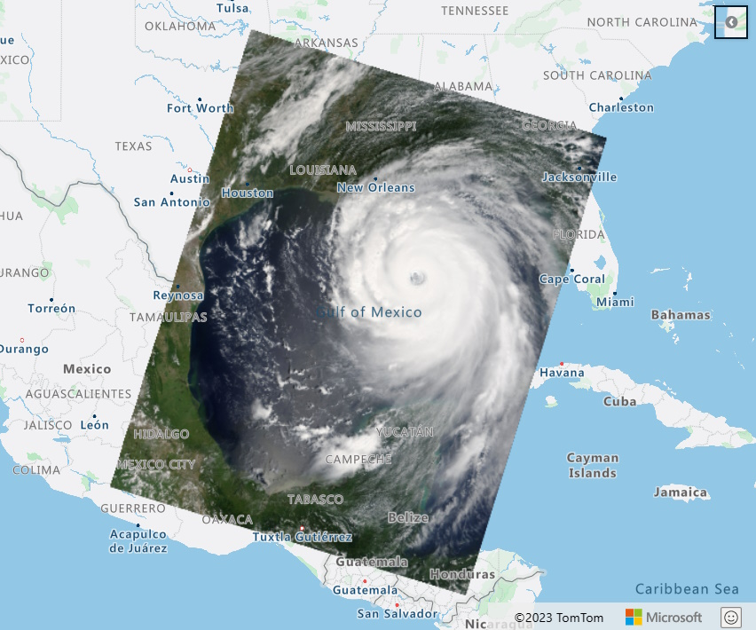

While [Azure Maps](https://azuremaps.com/) is known for great use cases around visualizing and interacting with a map and location data, you probably also need secure and reliable storage for that data that offers the flexibility to query your (location) data. In this blog post, we explore the different options for storing and querying geospatial data in Azure, including Azure Cosmos DB, Azure SQL Database, and Azure Blob Storage. Storing and querying geospatial data in Azure is a powerful and flexible way to manage and analyze large sets of geographic information.

## Azure Cosmos DB

[Azure Cosmos DB](https://learn.microsoft.com/en-us/azure/cosmos-db/nosql/query/geospatial-intro) is a globally distributed, multi-model database that supports document, key-value, graph, and column-family data models. One of the key features of Cosmos DB is its support for geospatial data, which allows you to store and query data in the form of points, lines, and polygons. Cosmos DB also supports spatial indexing and advanced querying capabilities, making it a great choice for applications that require real-time, low-latency access to geospatial data.

Example query:

```sql
SELECT f.id
FROM Families f
WHERE ST_DISTANCE(f.location, {"type": "Point", "coordinates":[31.9, -4.8]}) < 30000
``` 

> Read here more information about [Geospatial and GeoJSON location data in Azure Cosmos DB](https://learn.microsoft.com/en-us/azure/cosmos-db/nosql/query/geospatial-intro).

## Azure SQL Database

Another option for storing and querying geospatial data in Azure is [Azure SQL Database](https://learn.microsoft.com/en-us/sql/relational-databases/spatial/spatial-data-sql-server). SQL Database is a fully managed, relational database service that supports the spatial data types and functions of SQL Server. This allows you to store and query geospatial data using standard SQL syntax, and also includes spatial indexing and querying capabilities. SQL Database is a good choice for applications that require a traditional relational database model and support for SQL-based querying.

> Read here more information about [Spatial Data in Azure SQL Database](https://learn.microsoft.com/en-us/sql/relational-databases/spatial/spatial-data-sql-server).

## Azure Blob Storage

[Azure Blob Storage](https://learn.microsoft.com/en-us/azure/storage/blobs/) can be used to store and query large amounts of unstructured data, including geospatial data. Blob Storage allows you to store data in the form of blobs, which can be accessed via a URL. This makes it a great option for storing large files, such as satellite imagery or shapefiles. While Blob Storage does not include built-in support for spatial querying, it can be used in conjunction with other Azure services, such as Azure Data Lake Storage or Azure Databricks, to perform spatial analysis on the data.

In this sample we used satellite imagery that is stored in Azure Blob storage



## Geospatial data processing and analytics

To see a sample that pulls Azure Maps and Azure Databases together, see the Microsoft Learn topic [Geospatial data processing and analytics](https://learn.microsoft.com/en-us/azure/architecture/example-scenario/data/geospatial-data-processing-analytics-azure). This example scenarios also uses:

* [Azure Database for PostgreSQL](https://azure.microsoft.com/services/postgresql/) - a fully managed relational database service that's based on the community edition of the open-source PostgreSQL database engine.
* [PostGIS](https://www.postgis.net/) - an extension for the PostgreSQL database that integrates with GIS servers. PostGIS can run SQL location queries that involve geographic objects.

## Conclusion

Azure offers a variety of options for storing and querying geospatial data, including **Azure Cosmos DB**, **Azure SQL Database**, and **Azure Blob Storage**. Each of these services has its own set of features and capabilities, and choosing the right one will depend on the specific needs of your application. Whether you need low-latency access to real-time data, support for traditional SQL-based querying, or the ability to store and analyze large amounts of unstructured data, Azure has the tools you need to get the job done.
