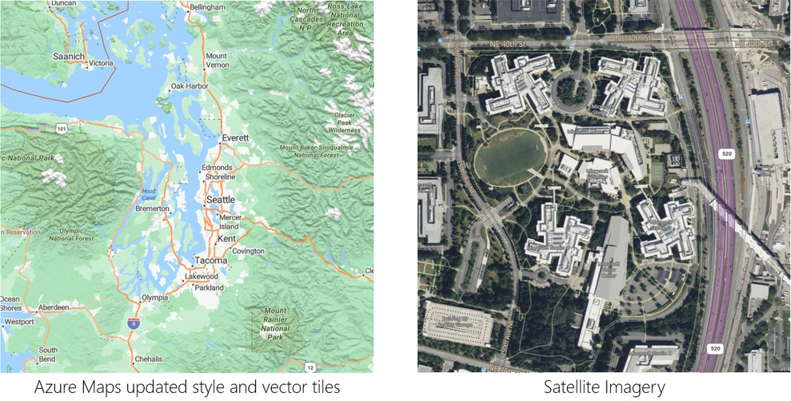
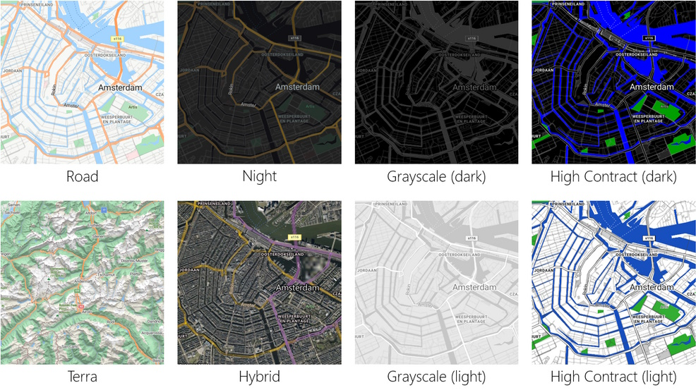
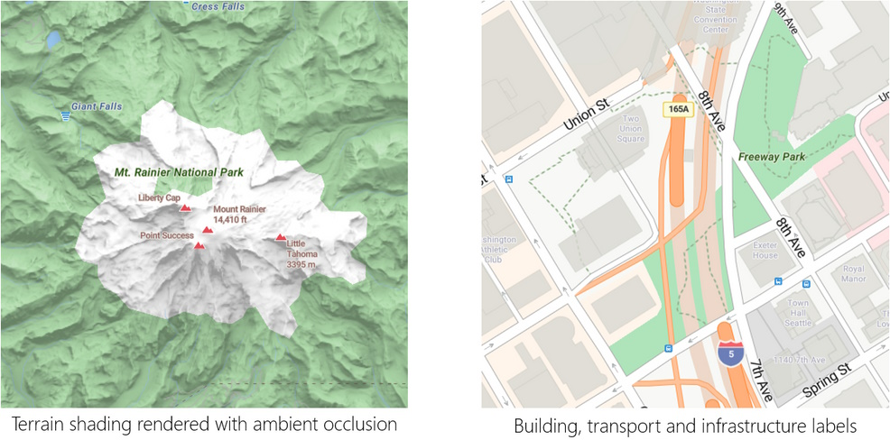
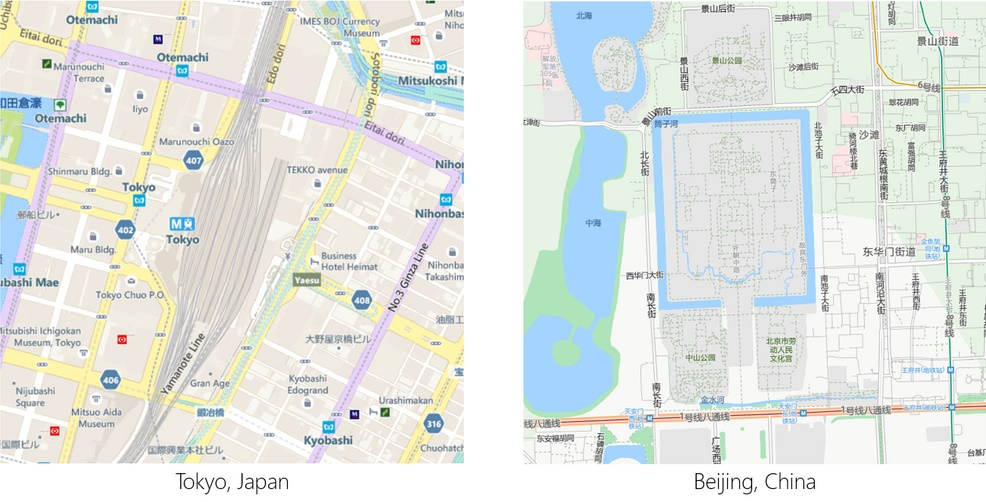

We are excited to announce that we have developed a **new and improved style** for our maps across Microsoft. [Azure Maps](https://azuremaps.com/) now utilizes the same **vector tiles** and **satellite imagery** directly as our other Microsoft mapping platforms, including our [Bing Maps](https://bingmaps.com/) consumer site and more. This updated style introduces a fresh **cartographic identity** across Microsoft, focusing on enhancing usability, information clarity, and aesthetic appeal.



## Key Features of the New Style

1. **Style Choices**: As before, Azure Maps allows you and your customers to choose from several styles, such as:
   - **Road**
   - **Night**
   - **Hybrid**
   - **Grayscale** (dark and light)
   - **Terra**
   - **High Contrast** (dark and light)



2. **Fine-Tuned Colors and Information Density**: We have carefully considered feedback from our previous styles. The result is a balance of colors and information density designed to make our maps more easily consumable across different **zoom levels** and **device profiles**.

3. **Transport Features**: We've introduced transport features with **hairline rendering**. These features provide more context and information without compromising readability.

4. **Greener Base Map Colors**: Our base map colors now support **biomes** and **landcover classes**, including subtle yet functional **terrain shading** rendered with **ambient occlusion**.



5. **Improved Label Density**: With this update, we have significantly improved label density. You'll find an even and consistent level of detail across various zoom levels and geographies.

6. **Clear Hierarchy of Types**: We've defined a clear hierarchy for labels, making it easy to distinguish between:
   - **Transport and infrastructure labels**
   - **Administrative districts**
   - **Natural features**

7. **Expanded Coverage**: Thanks to our partners, the Microsoft mapping platform now combines and enhances data from various sources. As a result, we've expanded our coverage in **China**, **Japan**, and **Korea**.



8. **Additional Enhancements**:
   - **Road Details**
   - **Building Footprints**
   - **Hiking Trail Coverage**
   - **Wider Zoom Level Ranges** for the Terra style
   - More **Transit Types and Information** (e.g., ferry stops, metro stops, bus stops)
   - Additional details about **mountains**, **altitude**, and **waterfall locations**

## Exploring the New Style

If you want to explore the new style, visit our [Azure Maps Samples](https://samples.azuremaps.com/) or try out the [Azure Maps Demo site](https://demo.azuremaps.com/).

Developers can also use the **Azure Maps V3 Web Control** in there applications by utilizing our **CDN endpoint** or the **[NPM package](https://www.npmjs.com/package/azure-maps-control)**.

```javascript
<link rel="stylesheet" href="https://atlas.microsoft.com/sdk/javascript/mapcontrol/3/atlas.min.css" type="text/css" />
<script src="https://atlas.microsoft.com/sdk/javascript/mapcontrol/3/atlas.min.js"></script>
```

> This blog post was initially written by me for the [Azure Maps Tech Blog](https://blog.azuremaps.com).