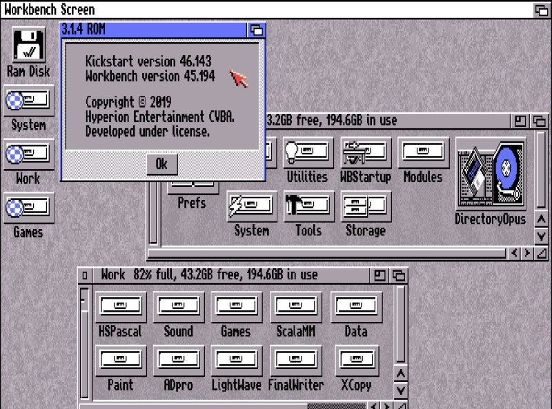
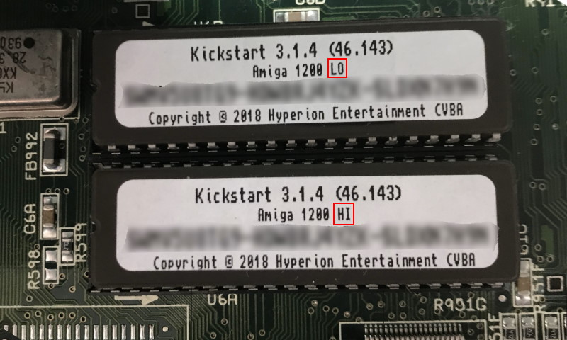
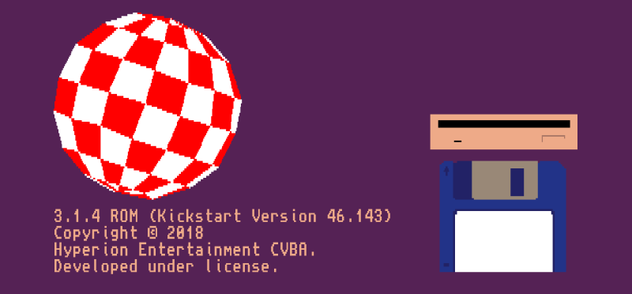
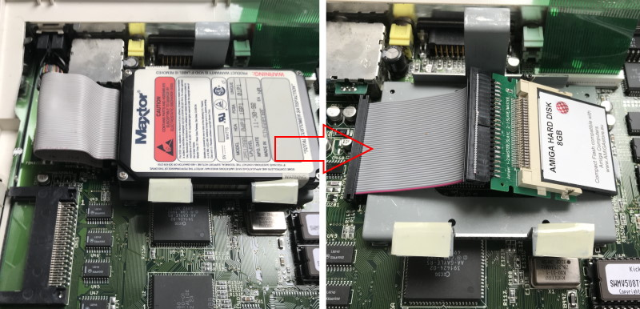
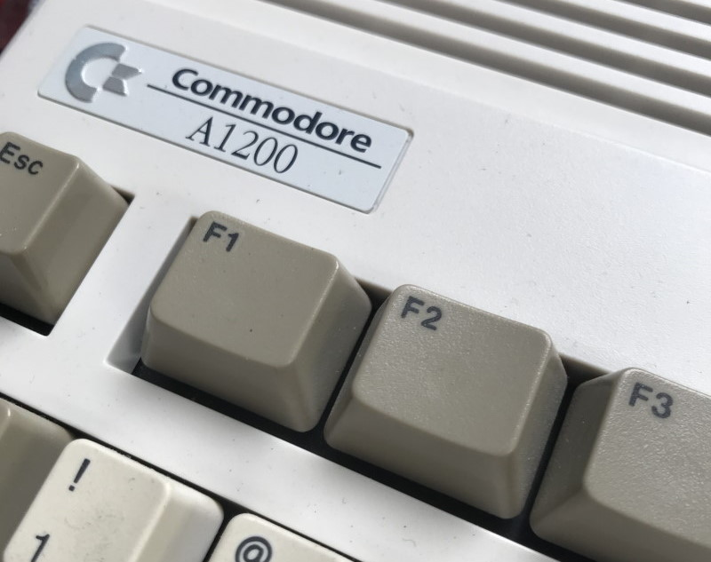

I learned all my basic computer and programming skills on Commodore computers, like the **C64**, **Amiga 500**, and **1200**. Twenty-eight years ago, I upgraded my **Amiga 1200** with a faster processor ([Motorola 68030](https://en.wikipedia.org/wiki/Motorola_68030)) and extra memory (4 megabytes). I also added an FPU (Motorola 68882), a realtime clock, and an internal hard disk (120 megabytes), which is still working correctly in 2020 (wow). At that time, this was a fast Amiga.

After all those years, my Amiga needs some care. Specialty the capacitors on the mainboard need replacement, they are a danger for the PCB and the life of the Amiga. I also like to upgrade some hard- and software.

## Workbench

The **AmigaOS** is called **Workbench**. By default, the Amiga 1200 comes with version 3.0. When upgrading the AmigaOS, you need also to update the Kickstart ROM (this is what the Amiga starts). In 2018 [Workbench version 3.1.4](https://www.hyperion-entertainment.com/index.php/where-to-buy/direct-downloads/188-amigaos-314) came out, whats adds new capabilities, like lager harddisks (4GB+), and fixes bugs from the past. So I ordered this new version, including the Kickstart ROMs. In 2019 update 1 came out, so in the end, I now have **Workbench 3.1.4.1** running.

On top of the Workbench, I installed [BetterWB](http://lilliput.amiga-projects.net/BetterWB.htm). It is much like an enhancement, an updated extension to AmigaOS 3.1, without all those hardware requirement penalties typically associated with these kinds of packs.

## Kickstart

Upgrading the [Kickstart](https://en.wikipedia.org/wiki/Kickstart_(Amiga)) ROMs requires to open the Amiga and replace the old ROMs with the new ones. Not very hard to do. I also removed the metallic shielding on top of the mainboard and did some cleaning.

## Software

The most software I have is on disks. Every disk has only a capacity of 880KB and is getting older. So I need a way to backup all my software. The Amiga 1200 (and also the 600) has a PCMCIA port. I used this port to add a memory card adaptor. With the transfer tool, I copied all my disks to this memory card in an ADF (Amiga Disk File) format. I also made a backup of all the software on the old hard disk. Making a backup is just copying all the files; no special software needed.

## Hardware

The 120 megabytes hard disk I replaced with an 8GB Compact Flash Drive. This new 'hard disk' makes the Amiga much faster to boot up. I [prepared the CF Drive](https://www.everythingamiga.com/2018/03/how-to-setup-an-amiga-compact-flash-drive-using-winuae.html) first on my Windows computer using [WinUAE](http://www.winuae.net/) (the best Amiga Emulator), installed all the software, including the disks I backup earlier.

I also added a USB adaptor on the Game/Mouse port so that I can use a modern mouse.

## Future wishes

The Amiga is outputting a 15KHz video signal, but modern monitors are using a 31KHz input signal. So I need a [flicker fixer](https://en.wikipedia.org/wiki/Flicker_fixer) or scan doubler. I like to have the [Indivision AGA MK2](http://wiki.icomp.de/wiki/Indivision_AGA_MK2), but it is hard to find, so if you know a place that is selling the AGA MK2, please let me know.

