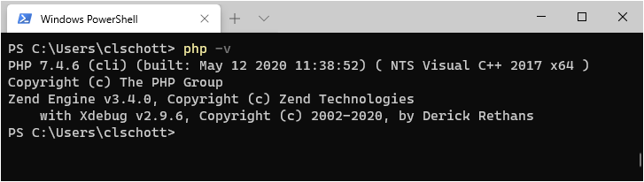
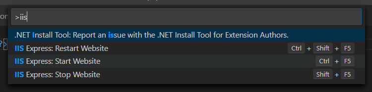
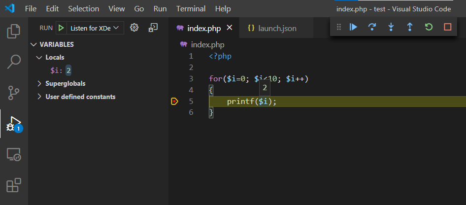
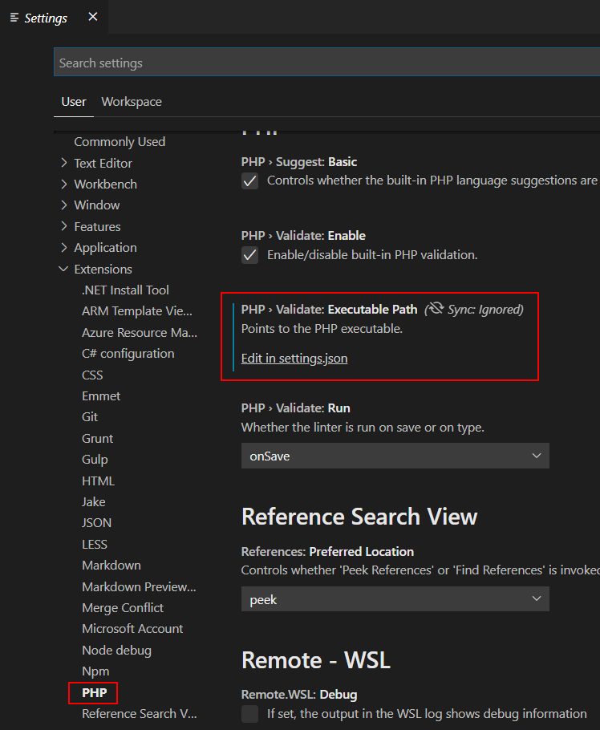

This post describes how to set up, run, and debug **PHP** code with **Visual Studio Code** running on Windows.

## What do we need?

Compared to some other popular programming languages for the Web, PHP is missing some tools, so I created a shopping list to make the experience more complete.

Basically what we need is:
* the PHP runtime itself,
* a modern code editor with syntax highlighting,
* a debugger connected to our code editor,
* and a (development) webserver.

## Runtime (PHP)

We start with the **PHP** runtime. The PHP runtime will pars en execute our `.php` files and outputs the HTML (or anything you want) back to you.

1. Download [PHP version 7.4](https://windows.php.net/download#php-7.4) (VC15 x64 Non Thread Safe) and extract the archive to `c:\php\`.
2. Add the folder `c:\php\` to your path, so we can easily access it. `setx path "%path%;C:\php\"`

  > Recent versions of PHP are built with Visual Studio 2019. You need to install the [Visual C++ Redistributable for Visual Studio 2019](https://visualstudio.microsoft.com/downloads/#microsoft-visual-c-redistributable-for-visual-studio-2019) before PHP can run.
  >
  > `winget install "Microsoft Visual C++ 2015-2019 Redistributable (x64)"`

3. Now we can run PHP `php -v` and see if it works. It should show you the version number and copyright information.

## Debugger (Xdebug)

To debug PHP code, we need to add an extension **Xdebug** to PHP.

1. Download [Xdebug 2.9](https://xdebug.org/download) for PHP 7.4 (VC15 64 bit) and place the DLL into the folder `C:\php\ext`.
2. In the folder `c:\php\` **rename** the file `php.ini-development` to `php.ini`.
3. Add to the following lines to the file `php.ini` to tell PHP to use Xdebug:

  ```
  zend_extension=C:\php\ext\php_xdebug-2.9.6-7.4-vc15-nts-x86_64.dll
  xdebug.remote_enable = 1
  xdebug.remote_autostart = 1
  ```

4. Check if Xdebug is part of PHP, use the `php -v` command again, and see if you get the response **with Xdebug v2.9.6**.

  

## Webserver (IIS Express)

When creating web applications/sites, we also need a webserver. PHP does not have a development web server, so we need to use something else to serve our pages. Under Windows, it is common to use Microsoft **Internet Information Services** (IIS). We are using the lightweight (nonproduction) version IIS Express.

1. Download [IIS 10 Express](https://www.microsoft.com/en-us/download/details.aspx?id=48264).
2. Start the setup and install it on your system
3. Run IIS for the first time and quit (we need the initial configuration files)

  ```cmd
  cd c:\Program Files\IIS Express\
  iisexpress
  Starting IIS Express ...
  Successfully registered URL "http://localhost:8080/" for site "WebSite1" application "/"
  Registration completed for site "WebSite1"
  IIS Express is running.
  Enter 'Q' to stop IIS Express
  ```

4. We need to tell IIS to use the PHP runtime (using fastCGI) and associate `.php` files with it. We also tell IIS to use `index.php` as a starting point:

  ```cmd
  appcmd set config /section:system.webServer/fastCGI /+[fullPath='"C:\php\php-cgi.exe"']
  appcmd set config /section:system.webServer/handlers /+[name='PHP_via_FastCGI',path='*.php',verb='*',modules='FastCgiModule',scriptProcessor='"C:\php\php-cgi.exe"',resourceType='Unspecified']
  appcmd set config /section:system.webServer/defaultDocument /+"files.[value='index.php']"
  ```

## Code editor (VSCode)

**Visual Studio Code** is a cross-platform, free, and opensource code editor. I use it for most of my projects. 

1. Download [Visual Studio Code](https://code.visualstudio.com/) or use WinGet `winget install "Visual Studio Code"`
2. Run the setup and install it on your system
3. Add the two following extensions to Visual Studio Code:
   * [IIS Express](https://marketplace.visualstudio.com/items?itemName=warren-buckley.iis-express)
   * [PHP Debug](https://marketplace.visualstudio.com/items?itemName=felixfbecker.php-debug)

4. In your Visual Studio Code **project**, go to the debugger and hit the little **gear icon** ⚙️ and choose **PHP**. A new launch configuration file is created for you `launch.json`. This will start listening on the specified port (by default 9000) for Xdebug. Every time you make a request with a browser to your web server, Xdebug will connect, and you can stop on breakpoints, exceptions, etc.





More information how to use the debugger in Visual Studio Code, you can read here [https://code.visualstudio.com/Docs/editor/debugging](https://code.visualstudio.com/Docs/editor/debugging)

## Visual Studio Code User Settings

To configure Visual Studio Code to use PHP, add the following line to the user configuration.

```json
{
  "php.validate.executablePath": "c:/php/php.exe"
}
```



You now ready to develop, run, and debug PHP code on Windows.