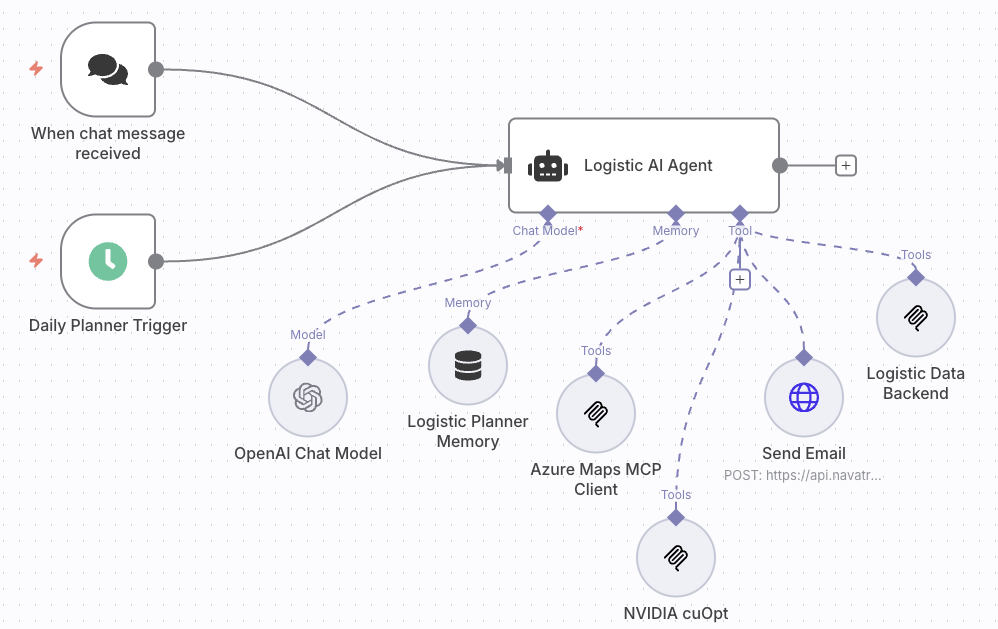

AI is no longer an abstract promise of the future. It’s here, embedded into enterprise workflows, products, and decision-making processes. From Microsoft Copilot to ChatGPT and domain-specific assistants, businesses are adopting AI at an unprecedented pace. But too often, "AI" is used as a catch-all term for a wide range of technologies. To lead the next transformation wave, organizations must move beyond generic AI adoption and toward *agentic AI*, a more autonomous, goal-driven form of AI that’s ready to take on real work.

Agentic AI brings intelligence into action. It refers to AI systems that don’t just respond, they act! These systems exhibit goal-directed behavior, operate autonomously, make decisions, use tools, and apply reasoning and planning across time and tasks. In essence, an *AI Agent* is a digital co-worker, one that doesn’t need micromanagement, doesn't take lunch breaks, and adapts to dynamic environments with memory and purpose.

This evolution is more than hype. It’s the operational shift from static machine learning models to AI-driven workflows that *reason*, *remember*, and *execute*.

## What Is an AI Agent, Technically?

At its core, an AI Agent is a form of intelligent orchestrator. Unlike traditional automation scripts or rule-based bots, an AI Agent is built with modular cognitive capabilities. It uses a Large Language Model (LLM), or for more resource-efficient use cases, a Small Language Model (SLM), as its reasoning engine. This 'brain' is surrounded by memory (both short-term and long-term), a set of tools (think APIs, databases, services), and a controller that manages objectives, context, and planning.

In this architecture, the agent receives a goal or task, either via human input, another system, or even another agent and autonomously decides how to accomplish it. That includes invoking tools through Model Context Protocol (MCP) servers, storing and retrieving information from (vector) databases, interacting with external APIs, and even collaborating with other AI Agents in what’s known as Agent-to-Agent (A2A) workflows.

This level of autonomy is not trivial. It requires careful design choices: prompt engineering, tool chaining, vector search optimization, and guardrails to ensure safety, compliance, and operational efficiency. These agents are not "one prompt away" systems, they are designed, configured, and iterated like software components. And yes, there are platforms that let non-technical users describe what they want and auto-generate a lightweight AI agent. But in my experience leading enterprise-scale transformations, these tools rarely deliver the robustness, observability, and cost-efficiency needed for production-grade systems.

# Agentic AI in Action

Let’s leave the abstract and dive into a real-world example: logistics (knowing me this should be not a surprise). Suppose you run a mid-sized delivery company with hundreds of daily shipments, multiple depots, and a fleet of trucks and drivers. Every evening, your dispatch team prepares the next day’s delivery plan; routes, assignments, departure times. It’s a repetitive, constraint-heavy problem. Now imagine replacing or augmenting that function with an AI Agent.

The AI Agent wakes up every evening with one objective: generate the most cost-efficient, constraint-satisfying delivery plan. It pulls data from internal systems: driver availability, vehicle health, customer delivery windows, and package locations. It uses tools like [Azure Maps](https://www.azuremaps.com/) and [NVIDIA cuOpt](https://clemens.ms/multi-itinerary-optimization/) to optimize routing based on real-time traffic, road conditions, and fuel efficiency. It then notifies customers of expected delivery times, and if something changes, driver calls in sick, a truck breaks down, or a high-priority shipment arrives late, it recalculates and adapts without needing manual intervention.

This isn’t just about automation. **It’s autonomy**. It’s a system that understands goals, reasons about alternatives, and executes actions independently. And the impact? Reduced operational overhead, improved delivery SLAs, and real-time resilience. That’s the promise of agentic AI and it’s already happening.

## Behind the Scenes

Memory is the difference between a chatbot and a cognitive agent. Without memory, an AI system is like a goldfish, it forgets everything after each prompt. To build agents that can handle dynamic workflows, context shifts, and strategic planning, we must give them memory, both episodic (short-term) and semantic (long-term).

This is where vector databases become critical. Unlike traditional databases, vector stores allow semantic retrieval. Text, images, code, or other high-dimensional data are encoded into vector embeddings, which can then be queried by similarity. In AI agents, this enables contextual recall: “What happened in the last planning session?”, “What did the customer ask three days ago?”, or “What were the top-performing routes last month?”

Even more importantly, vector databases allow grounding LLMs with external knowledge. One of the biggest weaknesses of LLMs is their tendency to hallucinate or forget facts. By querying a vector store and injecting relevant context into the prompt, agents can generate responses that are both accurate and relevant to the domain. This approach, often called *Retrieval-Augmented Generation (RAG)*, is essential for enterprise reliability.

## What this means for the Enterprise

Agentic AI is not a lab experiment. It’s a production-ready pattern that can improve cost-efficiency, accelerate decision-making, and unlock new capabilities across industries, from logistics and supply chain to customer service, healthcare, and compliance.

But building effective AI Agents is not just a matter of plugging an LLM into a workflow. It requires experience in systems design, cloud architecture, vector semantics, tool integration, and AI safety. As someone who has worked across both Microsoft’s Azure Maps platform and real-world customer implementations, I’ve seen firsthand what works and what doesn’t. AI Agents and agentic AI are not just buzzwords. They are the future of enterprise intelligence.