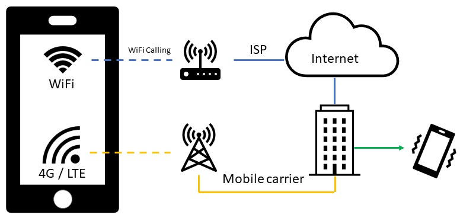
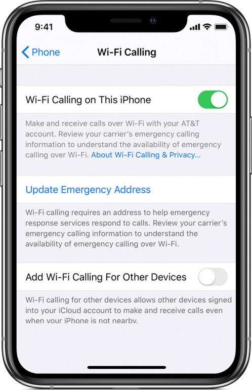

Modern buildings are well isolated, which isn't good if you are making a mobile phone call. Outside your house or office, the cellular signal is perfect, but inside it is another story, dropped calls, low-quality sound, etc. Even when your carrier has high coverage, there are situations inside buildings that prevent you from making a call.

Most mobile network providers (carriers) provide a solution for this, called **WiFi Calling**. By utilizing the existing WiFi network in your home or office, the mobile phone can make calls. The phone call is routed throw your Internet connection back to your carrier. Phone calls are not free and cost still money when WiFi Calling is enabled.

## WiFi Calling advantages

With WiFi Calling, you can make or receive a phone call if you have a WiFi connection in an area with little or no cellular coverage. When your carrier and smartphone support WiFi Calling, please enable it, it makes calling and texting in these modern buildings excellent again.

* Beter sound quality and stable connections.
* Quicker to connect (1 or 2 sec.)
* Simultaneously call and browse the Internet. (data connection remains intact.)
* Your phone selects automatically if WiFi Calling is available.

## How to enable WiFi Calling

You can enable WiFi Calling on most modern smartphones from Apple or Samsung. For Apple iPhones, IOS 12.1 is the minimal version that supports WiFi Calling. Under *Settings* -> *Phone* -> *Wi-Fi Calling*.

If your [carrier supports WiFi Calling on iCloud-connected devices](https://support.apple.com/en-us/HT204039), you can also make and receive WiFi calls on other devices. How cool is that!