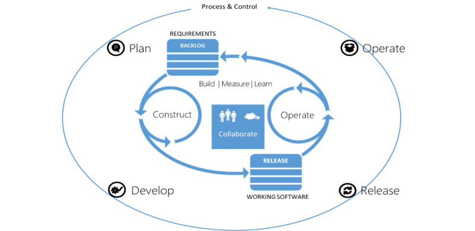
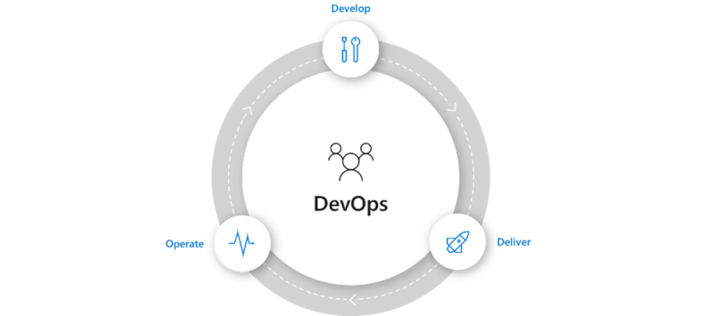
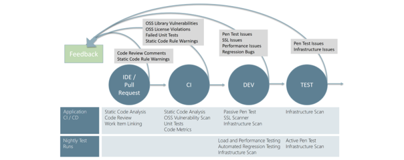
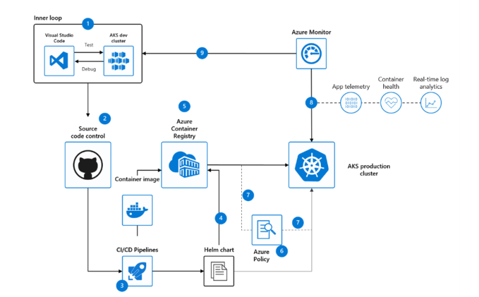

## Introduction

In today's increasingly demanding marketplace, companies are looking for ways to stay ahead of their competition. Development teams are faced with challenges preventing them from delivering solutions rapidly that meet the business's expectations. Therefore, companies need to evolve their **Application Lifecycle Management** (ALM) practices to integrate business, development, QA, and operations functions in an efficient cycle for greater agility in delivering continuous value.

Releasing high-quality software more frequently represents a substantial competitive advantage, and it means a significant reduction in the amount of wasted time and effort within a company.

## Application Lifecycle Management

A modern application life cycle helps empower teams to support a continuous delivery cadence that balances agility and quality while removing the traditional silos separating developers from operations and business stakeholders, improving communication and collaboration within development teams, and driving connections between applications and business outcomes.

[Modern ALM](https://docs.microsoft.com/en-us/azure/devops/user-guide/devops-alm-overview?view=azure-devops) entails planning, developing, releasing, and operating software. These steps repeat to become **Continuous Value Delivery**. Within the cycle of Continuous Value Delivery, we build software, measure its effectiveness for its intended goal, learn from its observed behavior, improve the software, and sharpen the business goals associated with it or the development process.

Modern ALM consists of four high-level phases:

1. **Plan** It starts with defining the business hypothesis, specifying its work items on the backlog in the planning phase. Criteria specify how the business value will be measured.
2. **Develop** Constructing and testing the software artifacts for delivering on the hypothesis during development. Metrics are implemented to measure value.
3. **Release** Continuously releasing incremental versions of the working software assets into production. Staged deployments are used to release new features to the end-users gradually.
4. **Operate** Capturing the learnings during the operating phase of the lifecycle

From both a team and artifact perspective, it is critical to work together across all stages of the lifecycle, continuously learning from previous deliveries by measuring application behavior, team, and delivery process performance.
 
## DevOps

DevOps is the union of **people**, **processes**, and **products** to enable continuous delivery of value to your end-users.

[DevOps](https://azure.microsoft.com/en-us/overview/what-is-devops/) enables formerly siloed roles (development, IT operations, quality engineering, and security) to coordinate and collaborate to produce better, more reliable products. By adopting a DevOps culture along with DevOps practices and tools, teams gain a common reference for a status of deliverables, the ability to better respond to customer needs, increased confidence in the applications they build, enjoy better, more accurate communication on project status, and achieve business goals faster.

### Continuous Integration (CI)

[Continuous Integration](https://docs.github.com/en/enterprise-server@3.0/actions/guides/about-continuous-integration) aims to prevent developers from stepping over each other's code and eliminating integration issues. Continuous Integration is a practice, *not a tool*. It requires a degree of commitment and discipline from your development team and increases awareness of who is doing what and the final product's quality.

#### Why Continuous Integration

* Harness collaboration
* Enable parallel development
* Minimize integration debt
* Act as a quality gate
* Automate Everything!

#### How Continuous Integration

* Are all the developers on the team checking into the trunk (also called Main branch) at least once a day? In other words, are they doing **trunk-based development** and working in small batches?
* Does every change to trunk kick off a **build process**, including running a set of automated tests to detect regressions?
* When the build and test process fails, does the **team fix the build** within a few minutes, either by fixing the breakage or reverting the change that caused the build to break?

**Version Control System (Git)**

* Application / Test Code
* Configuration
* Database Definition
* Seed / Test Data
* Build / Deployment Scripts
* Infrastructure as code (IaC)

**Branching Strategy**

* Have a [branching strategy](https://docs.microsoft.com/en-us/azure/devops/repos/git/git-branching-guidance?view=azure-devops)
* Keep changes small
* Commit frequently
* At least once per day for each developer

**Automated Build**

* Runs after every commit/check-in
* Checks quality of the commit (Shift-Left Testing)
* Separate Build machine (Build Server)
* Must run fast

### Continuous Delivery (CD)

Continuous Delivery is a software engineering approach in which teams produce software in short cycles, ensuring that the software can be reliably released at any time and, when releasing the software, doing so manually. It aims at building, testing, and releasing software with greater speed and frequency. The approach helps reduce the cost, time, and risk of delivering changes by allowing for more incremental updates to applications in production. A straightforward and repeatable deployment process is essential for continuous delivery.

**Continuous Deployment** (CD) is a software development method that releases or deploys software automatically into the production environment multiple times a day.

#### Why Continuous Delivery

* Quicker delivery of business value
* Faster business feedback
* Reduced risk to project schedules
* Less time spent supporting production deployment stabilization = increased time developing new features
* Increased confidence in the production readiness of the software
* More production-like test environments
* Error-free production deployments (no manual steps)

#### How Continuous Delivery

* Deployments are scripted or automated via an Automated Deployment tool.
* Automation of Build, test, deployment, database migration, and infrastructure (IaC)
* Automated Deployments are configurable, repeatable, and reliable
* Deployment automation artifacts are stored and maintained in the source control system, ensuring they evolve along with the application
* Use the same process for all deployments to all environments
* The automated deployment process includes automated smoke testing
* Practice CI, Configuration Management, and Automated Testing
* Involve everyone involved in delivery to work together throughout the software delivery lifecycle

> **Key Takeaway** To be successful in implementing continuous delivery, you have to act as a team. Trust and cooperation are the two main ingredients for success. You can start small, but cooperation with the rest of the organization is required to make it a success, and you will need to get everybody on board.

### Continuous Security

As the frequency of (production) deployments increases, this business agility cannot come at the expense of security. This begins with practices commonly referred to as [DevSecOps](https://docs.microsoft.com/en-us/azure/devops/migrate/security-validation-cicd-pipeline). DevSecOps incorporates the security team and their capabilities into your DevOps practices making security a responsibility of everyone on the team.

#### Why Continuous Security

Security needs to shift from an afterthought to being evaluated at every step of the process. Securing applications is a continuous process that encompasses secure infrastructure, designing an architecture with layered security, continuous security validation, and monitoring attacks. This approach aims to switch the conversation with the security team from approving each release to supporting the CI/CD process and monitoring and auditing the process at any time.

Azure Repos source control in [Azure DevOps](https://azure.microsoft.com/en-us/solutions/devops/), together with **branch policies**, provides a gated commit experience that can give this validation, only allowing code to be deployed after it clears security (which can be anything from static code analysis to security-specific test).

A **threat model** needs to be established to verify if technical implementation mitigated identified risks. Use tools and automation to identify and mitigate potential security issues early in the development process and review that threat model as development progresses – making security an integrated, continuous practice that goes hand in hand with development.

The practices used in DevOps provide an excellent opportunity to improve security. Practices such as automation, monitoring, collaboration, and fast and early feedback provide a great foundation to build security into DevOps processes.

Fast and early feedback can be achieved to have a CI-build run static code analysis tests to ensure that the code follows all maintenance and security rules.

High-level, "overview" tools like **Azure Security Center** provide DevOps teams end-to-end insights into the security posture of their (hybrid) infrastructure. It is a unified infrastructure security management system that strengthens your datacenters' security posture and provides advanced threat protection across your hybrid workloads in the cloud - whether they're in Azure or not - as well as on-premises. Low-level, "detail" tools like cloud-native monitoring solutions such as **Azure Monitor** and **Application Insights** enable end-to-end monitoring capabilities to DevOps teams from the Infrastructure to Application level. They can act as tripwires/sensors to provide alerting and auditing data for security assessments.

However, these tools are not complete without considering the implications of user/developer identity and access control. To mitigate the risks of excessive, unnecessary, or misused access permissions on resources **Azure Active Directory** (AD) **Privileged Identity Management** (PIM) should be used. When CI/CD requires the use of non-personal (or "service") accounts, proper governance needs to be implemented. Azure DevOps uses service connections to connect to a Microsoft Azure subscription. A service connection uses a service principal (cloud-native service account) in an Azure AD tenant. Service connections and their service principal can be programmatically created and configured during the creation of the Azure DevOps project.

When deploying or accessing Azure resources, a secure, policy-friendly alternative are **Managed Identities**, which can address several use cases:

* [What are managed identities for Azure resources](https://docs.microsoft.com/en-us/azure/active-directory/managed-identities-azure-resources/overview)
* [Why threat protection is critical to your Zero Trust security strategy](https://www.microsoft.com/security/blog/2021/02/08/why-threat-protection-is-critical-to-your-zero-trust-security-strategy/)
 
#### How Continuous Security

Implementing secure DevOps together with [Kubernetes on Azure](https://azure.microsoft.com/en-us/services/kubernetes-service/), you can achieve the balance between speed and security and deliver code faster at scale. Put guardrails around the development processes using CI/CD with dynamic policy controls and accelerate feedback loop with constant monitoring. Use Azure Pipelines to deliver fast while ensuring enforcement of critical policies with Azure Policy. Azure provides you real-time observability for your build and release pipelines and the ability to apply compliance audit and reconfigurations easily.

1. Developers rapidly iterate, test, and debug different parts of an application together in the same Kubernetes cluster.
2. Code is merged into a GitHub repository, after which Azure Pipelines run automated builds and tests.
3. Release pipeline automatically executes pre-defined deployment strategy with each code change.
4. Kubernetes clusters are provisioned using Helm charts that define the desired state of app resources and configurations.
5. Container image is pushed to Azure Container Registry.
6. Cluster operators define policies in Azure Policy to govern deployments to the AKS cluster and can leverage Active Directory Role-Based Access Control for fine-grained permissions.
7. Azure Policy audits requests from the pipeline at the AKS control plane level.
8. App telemetry, container health monitoring, and real-time log analytics are obtained using Azure Monitor.
9. Insights are used to address issues and fed into next sprint plans.

Control access to cluster resources using Kubernetes [role-based access control](https://docs.microsoft.com/en-us/azure/aks/azure-ad-rbac) and Azure Active Directory identities in Azure Kubernetes Service.

## Recommendations

1. **Standardize agile tools to support modern processes such as scrum and agile.** Azure Boards supports end-to-end traceability and deep integration between Boards, Repositories, and Pipelines.
2. **DevOps teams treat infrastructure as code and application code as equals.** Infrastructure as code and application code are stored in source control, with branch policies, and build and deployed with continuous integration continuous delivery pipelines. Use Azure Repos and Pipelines for both infrastructure as code and application code.
3. **Security is the responsibility of everyone in the DevOps team.** Security needs to shift from an afterthought to being evaluated at every step of the process using preapproved Security Frameworks and building blocks.
4. **Adopt Inner Source to enable collaboration and knowledge sharing.** Practicing InnerSource can significantly add value to an organization's development approach. Universal access to development code and documentation allows anyone to inspect and submit contributions.
5. **Adopt shift-left testing to fasten the feedback loop.** Automate testing and validate deliverables as early as possible in the process. All tests are automated—no manual actions are required for deployment to production.
6. **Provide autonomy to DevOps teams.** Autonomy for DevOps teams facilitates an Agile way of working because a DevOps team can deploy infrastructure and application code without IT becoming a man-in-the-middle. This autonomy leads to better security and operations because a DevOps team has end-to-end visibility over the whole landscape.